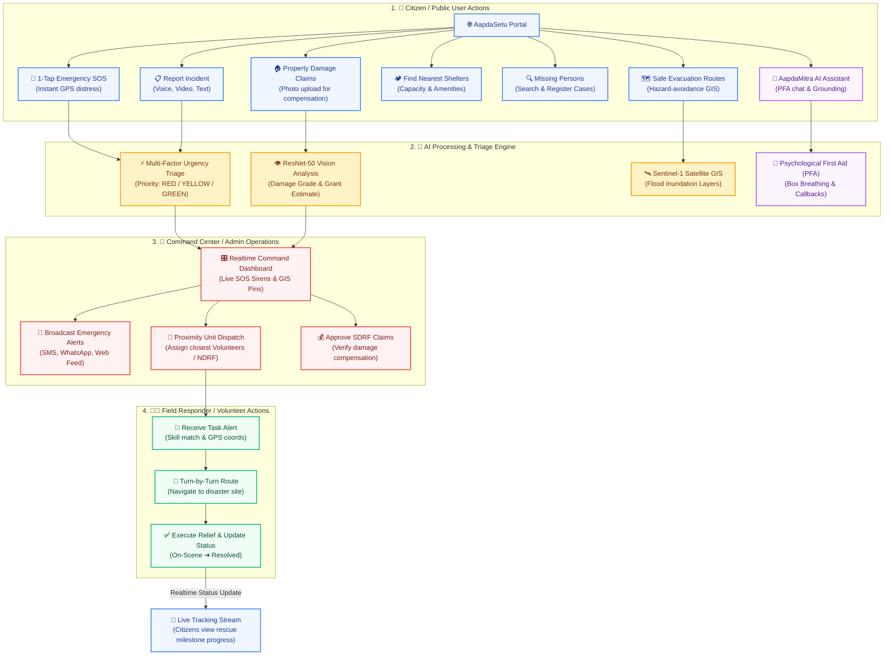
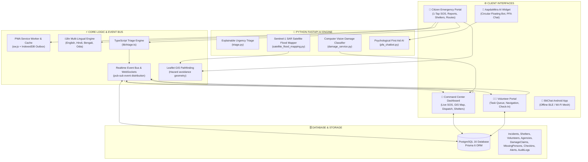
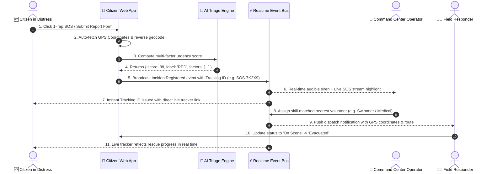
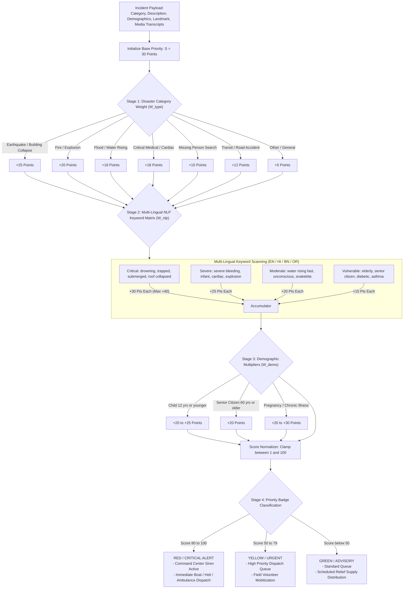

# 🛡️ AapdaSetu (आपदासेतु / આપદાસେતુ / ଆପଦାସେତୁ / आपदाসেতু)

> **The Ultimate Disaster Response, AI Triage, and Multi-Agency Incident Command Ecosystem.**  
> *Architected with React 19, TypeScript, Vite 6, Tailwind CSS, Leaflet.js GIS, Realtime Event Bus, Prisma 6 PostgreSQL, FastAPI AI Microservices, and Offline BLE Mesh Networking.*

[](https://github.com/MrinallSamal-byte/SIH)
[](https://github.com/MrinallSamal-byte/SIH)
[](https://github.com/MrinallSamal-byte/SIH)
[](LICENSE)

---

## 📑 Table of Contents
1. [🌐 Live Deployments & Repositories](#-live-deployments--repositories)
2. [📌 Executive Overview](#-executive-overview)
3. [🏗️ Master System Architecture & Flow Diagrams](#️-master-system-architecture--flow-diagrams)
4. [📱 Comprehensive Citizen (User) Features](#-comprehensive-citizen-user-features)
5. [🚨 Comprehensive Command Center (Admin) Features](#-comprehensive-command-center-admin-features)
6. [🧑‍🚒 Comprehensive Field Responder (Volunteer) Features](#-comprehensive-field-responder-volunteer-features)
7. [🧠 AI Microservice Engine & Algorithms](#-ai-microservice-engine--algorithms)
8. [📡 Offline PWA & Decentralized BLE Mesh](#-offline-pwa--decentralized-ble-mesh)
9. [🗄️ Database Architecture & Data Models](#️-database-architecture--data-models)
10. [🛠️ Technology Stack](#️-technology-stack)
11. [📁 Repository Directory Structure](#-repository-directory-structure)
12. [🚦 Getting Started & Local Development](#-getting-started--local-development)
13. [📜 License & Acknowledgments](#-license--acknowledgments)

---

## 🌐 Live Deployments & Repositories

- **Live Web Application:** [https://sih-ochre-xi.vercel.app/](https://sih-ochre-xi.vercel.app/)
- **Local Dev Server:** `http://localhost:5173/`
- **GitHub Repository:** [https://github.com/MrinallSamal-byte/SIH](https://github.com/MrinallSamal-byte/SIH)

---

## 📌 Executive Overview

During major natural catastrophes (cyclones, flash floods, earthquakes, industrial explosions), public response systems break down due to telecom network congestion, server crashes, lack of geo-spatial coordination, illiteracy, and language barriers.

**AapdaSetu (आपदासेतु)** solves the critical "last-mile" disaster response gap by combining:
1. **Zero-Authentication Citizen Portal:** Immediate, frictionless life-saving tools (1-Tap SOS, dynamic hazard pathfinding, voice/video incident reporting, shelter locator, missing persons registry, and anti-fraud property damage claims).
2. **AapdaMitra AI Crisis Lifeline:** 24/7 Psychological First Aid (PFA) and disaster survival assistant with interactive box breathing, grounding protocols, and automatic one-tap emergency callback dispatch.
3. **Multi-Agency Incident Command Center:** Real-time WebSocket command dashboard with audible siren alerts for `RED` critical incidents, skill-matched responder auto-dispatch, shelter resource tracking, and multi-channel broadcast messaging.
4. **Volunteer Responder Portal:** Mobile-optimized field triage dashboard with turn-by-turn GPS navigation to incident sites and milestone updating.
5. **FastAPI AI Microservices:** Automated multi-factor urgency scoring, Sentinel-1 SAR satellite radar flood mapping, and computer vision damage grading.
6. **Decentralized BLE Mesh App (`bitchat-android`):** Offline peer-to-peer mesh messaging for complete cellular blackout scenarios.

---

## 🏗️ Master System Architecture & Flow Diagrams

### 1. Complete Website Workflow & User Journey



---

### 2. Global Multi-Tier System Architecture



---

### 3. End-to-End Emergency SOS & Multi-Agency Dispatch Flow



---

### 4. Multi-Factor AI Urgency Triage Pipeline



---

## 📱 Comprehensive Citizen (User) Features

The citizen portal is completely **zero-authentication**—no sign-up, email, or password required.

| Feature & Route | Detailed Description & Capabilities | User Inputs & Automations | System Output & Value |
| :--- | :--- | :--- | :--- |
| **1-Tap Emergency SOS**<br>`#/sos` | One-touch instant distress trigger designed for extreme emergencies. Auto-detects GPS coordinates, calculates urgency, alerts the control room, and provides offline SMS fallback. | Auto-acquired GPS coordinates, accuracy radius (meters), physical landmark input. | Instant Tracking ID, live response link, emergency hotline fast-dial (112, 108, 1070). |
| **Intelligent Incident Report**<br>`#/report` | Multi-step structured emergency reporting for complex incidents. Supports 7 emergency categories, interactive landmark picker, media evidence, and demographic vulnerability flags. | Emergency type, GPS picker, reporter phone, live audio voice recording, live video recording, victim count, special conditions. | AI triage priority calculation, verified incident dossier, tracking ID generation. |
| **Live Incident Tracker**<br>`#/track` | Real-time tracking portal allowing victims and families to track the exact progress of their rescue in real time. | Incident Tracking ID (e.g. `SOS-7K2X9`). | Live milestone status (`Distress Registered` $\rightarrow$ `Dispatched` $\rightarrow$ `Resolved`), responder card, live ETA, GPS map telemetry. |
| **Nearby Shelter Finder**<br>`#/shelters` | Live relief camp locator sorted in real time by geodesic distance using the Haversine formula. Shows open bed availability and amenities. | GPS location, search query, facility filters (Medical Station, Food, Clean Water, Power Generator). | Distance in km, capacity/occupancy meter, status (Open/Full/Closed), one-tap phone call, turn-by-turn directions. |
| **Safe Evacuation Corridors**<br>`#/safe-routes` | Dynamic GIS navigation engine that computes safe walking evacuation corridors by detecting and avoiding Sentinel-1 SAR flood polygons and blocked infrastructure. | Starting GPS location, destination relief camp. | Comparison of direct route vs. AI safe detour, flood hazard boundary visualization, turn-by-turn walking steps. |
| **Missing Persons Registry**<br>`#/missing-persons` | Public search database and registration portal to help families find separated loved ones during chaotic evacuations. | Missing person name, approximate age, gender, last seen location, clothing description, photo upload. | Searchable public bulletin, match status (`Open`, `Matched`, `Resolved`), direct guardian contact trigger. |
| **Community Safety Check-in**<br>`#/check-in` | "I Am Safe" registry allowing citizens in disaster zones to mark themselves and family safe, reducing search team overhead. | Full name, phone number, district/sector, status (`Safe` / `Need Assistance`), personal message. | Public searchable safety board for relatives and relief agencies. |
| **SDRF Property Damage Claim**<br>`#/report-damage` | Crowdsourced structural damage assessment portal. Citizens upload photos of destroyed property to receive automated AI damage grading and SDRF compensation estimates. | Property owner name, contact number, address, infrastructure category, damaged property photo. | Perceptual hash deduplication check, AI damage severity grade (Grade 1/2/3), estimated SDRF relief grant (up to ₹1,20,000), claim ID. |
| **Public Warning Alerts**<br>`#/alerts` | Direct bulletin feed broadcasting official alerts from NDMA, SDMA, and District Disaster Management Authorities. | Category filters (`Critical`, `Warning`, `Advisories`). | Real-time warning banners, affected region badges, timestamped safety directives. |
| **AapdaMitra AI Crisis Lifeline**<br>`#/pfa-chat` & `ChatWidget` | 24/7 Psychological First Aid and survival assistant with 4-4-4 Box Breathing, 5-4-3-2-1 Sensory Grounding, and 1-tap callback dispatch. Available as a dedicated page and a glowing circular floating button. | Text or voice queries, quick disaster prompts. | Clean multi-lingual guidance without reasoning tokens, emergency callback trigger, hotline fast dial. |

---

## 🚨 Comprehensive Command Center (Admin) Features

The Command Center (`#/admin`) provides multi-agency incident command capabilities across 11 specialized views:

```
Command Center (/admin)
├── 📊 Overview & Real-Time KPIs
├── 🚨 Live SOS Emergency Stream (Audible Siren)
├── 📋 Incident Management & Dispatch Queue
├── 🗺️ Interactive GIS Command Map
├── 🏠 Shelter & Resource Inventory Management
├── 🏗️ SDRF Property Damage Assessment Review
├── 🔍 Missing Persons Moderation & Matching
├── 🧑‍🚒 Volunteer Fleet & Skill Tracking
├── 🏢 Multi-Agency Inter-Departmental Coordination
├── 📢 Emergency Multi-Channel Broadcaster (SMS/WhatsApp/Web)
├── 📈 Incident Analytics & Recharts Telemetry
├── 📜 Tamper-Evident Audit Trails & Security Logs
└── ⚙️ System Settings & API Gateway Integrations
```

### Admin Subsystem Capabilities:
1. **Live SOS Stream (`#/admin/live-sos`)**: Continuous WebSocket feed that triggers a synthesized dual-frequency (880Hz / 440Hz) audible siren whenever a `RED` (Score $\ge 80$) critical incident is registered.
2. **Incident Dispatch Queue (`#/admin/reports`)**: Filterable, sortable incident registry with status transitions (`pending` $\rightarrow$ `in_progress` $\rightarrow$ `resolved`), volunteer assignment modal with distance ranking, and CSV export.
3. **Interactive GIS Command Map**: Displays real-time incident clusters, volunteer locations, shelter occupancy, and Sentinel-1 SAR flood inundation polygons.
4. **Shelter & Resource Manager (`#/admin/shelters`)**: Real-time capacity adjustment, inventory tracking (food, clean water, medical supplies, fuel), and facility status toggles.
5. **Damage Assessment Approvals (`#/admin/damage-assessment`)**: AI-assisted claim review with anti-fraud duplicate detection metrics and SDRF compensation approval workflows.
6. **Volunteer Fleet Coordination (`#/admin/volunteers`)**: Responder skill matrix (`medical`, `search_rescue`, `driving`, `logistics`), GPS coordinates, and on-duty availability toggles.
7. **Multi-Agency Inter-Departmental Coordination (`#/admin/agencies`)**: Multi-agency dispatch management across NDRF, SDRF, Fire Department, Police, Hospitals, and NGOs.
8. **Emergency Communications Broadcaster (`#/admin/communications`)**: Geo-targeted emergency alerts distributed simultaneously across Web Push, Twilio SMS, and WhatsApp Cloud API.
9. **Analytics & Recharts Telemetry (`#/admin/analytics`)**: Interactive data visualizations showing emergency trends, priority distribution, resolution times, and regional heatmaps.
10. **Audit Logs & Security Trails (`#/admin/audit-logs`)**: Immutable timestamped action logs recording every administrative action, volunteer dispatch, and priority adjustment.

---

## 🧑‍🚒 Comprehensive Field Responder (Volunteer) Features

The Volunteer Portal (`#/volunteer`) provides field personnel with mobile-optimized tools:

| Feature & Route | Detailed Description & Capabilities |
| :--- | :--- |
| **Field Responder Dashboard**<br>`#/volunteer` | Real-time personal dashboard showing current duty status (`Available`, `On Duty`, `Offline`), active assigned emergency tasks, and quick response actions. |
| **Assigned Tasks & Navigation**<br>`#/volunteer/tasks` | Detailed task queue with victim contact details, GPS coordinates, triage urgency factor breakdown, embedded turn-by-turn map navigation, and milestone updates (`En Route` $\rightarrow$ `On Scene` $\rightarrow$ `Resolved`). |
| **Field Check-In & Geofencing**<br>`#/volunteer/checkin` | GPS-verified check-in enabling the control room to confirm responder safety, on-scene arrival, and shelter roster management. |
| **Volunteer Authentication**<br>`#/volunteer/login` | Secure credential verification for authorized emergency volunteers and relief workers. |

---

## 🧠 AI Microservice Engine & Algorithms

### 1. Multi-Factor Urgency Triage Algorithm (`triage.py` & `lib/triage.ts`)
$$P_{\text{total}} = \text{clamp}\left( 1, 100, S_{\text{base}} + W_{\text{type}} + \sum W_{\text{nlp}} + W_{\text{demo}} + W_{\text{gps}} \right)$$

- $S_{\text{base}} = 30$ (Base score)
- $W_{\text{type}}$: Earthquake ($+25$), Fire ($+20$), Flood ($+18$), Medical ($+18$), Missing ($+15$), Accident ($+12$), Other ($+5$).
- $\sum W_{\text{nlp}}$: Multi-lingual keyword weights (Drowning/Trapped = $+30$, Bleeding/Cardiac = $+25$, Rising Water/Unconscious = $+20$, Elderly/Diabetic = $+15$).
- $W_{\text{demo}}$: Infant/Child $\le 12$ ($+20$ to $+25$), Senior Citizen $\ge 60$ ($+20$), Pregnancy/Chronic ($+20$ to $+30$).
- $W_{\text{gps}}$: GPS accuracy verification bonus ($+5$).

### 2. Haversine Great-Circle Geodesic Distance Formula
$$d = 2R \cdot \arcsin \left( \sqrt{\sin^2\left(\frac{\Delta \text{lat}}{2}\right) + \cos(\text{lat}_1)\cos(\text{lat}_2)\sin^2\left(\frac{\Delta \text{lng}}{2}\right)} \right)$$
*(Where $R = 6371.0\text{ km}$, used for sorting nearest shelters and responders in milliseconds).*

### 3. Perceptual Hash (pHash) Anti-Fraud Duplicate Verification
$$D_H(H_1, H_2) = \sum_{i=1}^{64} (H_{1,i} \oplus H_{2,i}) < 5$$
*(Flags stolen or duplicate photos across damage claims submitted across districts).*

### 4. Sentinel-1 SAR Radar Satellite Flood Mapping (`satellite_flood_mapping.py`)
- Processes Sentinel-1 Synthetic Aperture Radar (SAR) imagery.
- Applies Otsu adaptive thresholding to detect water-covered surfaces and converts binary raster masks into GeoJSON MultiPolygon layers for Leaflet map pathfinding avoidance.

---

## 📡 Offline PWA & Decentralized BLE Mesh

1. **Progressive Web App (PWA) Engine:**
   - **Service Worker (`public/sw.js`):** Implements **Cache First** for assets/tiles and **Network First with Cache Fallback** for API data.
   - **IndexedDB Outbox Queue (`aapdasetu_offline_queue`):** Queues incident reports and SOS distress signals during complete cellular dropouts, automatically syncing them when connectivity returns.

2. **BitChat Android BLE Mesh (`bitchat-android`):**
   - Peer-to-peer mesh networking utilizing Bluetooth Low Energy (BLE) and Wi-Fi Aware.
   - Relays 256-byte encrypted emergency packets hop-by-hop across mobile nodes until an internet-connected gateway relays the signal to the AapdaSetu Command Center.

---

## 🗄️ Database Architecture & Data Models

Managed via **Prisma 6** with PostgreSQL 16:

```mermaid
erDiagram
    Incident ||--o| Volunteer : "assigned_volunteer_id"
    Incident ||--o| Agency : "assigned_agency_id"
    Shelter ||--o{ Resource : "shelter_id"
    Shelter ||--o{ Facility : "shelter_id"
    Admin ||--o{ AuditLog : "admin_id"

    Incident {
        uuid id PK
        string tracking_id UK
        enum type "fire, flood, medical, missing_person, earthquake, accident, other"
        enum status "pending, in_progress, resolved"
        int priority_score "1..100"
        enum priority_label "RED, YELLOW, GREEN"
        float latitude
        float longitude
        string landmark
        string reporter_name
        string reporter_phone
        string description
        jsonb triage_factors
        string media_url
        boolean is_one_tap_sos
        datetime created_at
    }

    Volunteer {
        uuid id PK
        string name
        string phone
        string email
        enum_array skills "medical, search_rescue, driving, logistics"
        float latitude
        float longitude
        enum status "available, on_duty, offline"
        datetime last_checkin
    }

    Shelter {
        uuid id PK
        string name
        string address
        string district
        float latitude
        float longitude
        int capacity
        int occupancy
        enum status "open, full, closed"
        string contact_phone
    }

    Facility {
        uuid id PK
        uuid shelter_id FK
        enum type "food, water, medical_station, power_generator"
        boolean available
    }

    Resource {
        uuid id PK
        uuid shelter_id FK
        string name
        enum category "food, water, medical, clothing, fuel"
        int quantity
        string unit
    }

    Agency {
        uuid id PK
        string name
        enum type "fire_department, police, ndrf, sdrf, hospital, ngo"
        string contact_phone
        int active_personnel
    }

    DamageClaim {
        uuid id PK
        string claim_id UK
        string owner_name
        string owner_phone
        string property_address
        string district
        enum classification "MINOR_DAMAGE, MODERATE_DAMAGE, SEVERE_COLLAPSE, TOTAL_DESTRUCTION"
        float estimated_compensation
        string photo_url
        string phash
        datetime created_at
    }

    SafetyCheckin {
        uuid id PK
        string full_name
        string phone
        string district
        enum status "safe, need_assistance"
        string message
        datetime created_at
    }

    MissingPerson {
        uuid id PK
        string full_name
        int age
        string gender
        string last_seen_location
        string clothes_description
        string contact_phone
        string photo_url
        enum status "open, matched, resolved"
        datetime created_at
    }

    Alert {
        uuid id PK
        string title
        string message
        enum severity "info, warning, critical"
        enum channel "sms, whatsapp, public, all"
        string affected_region
        datetime created_at
    }

    AuditLog {
        uuid id PK
        string admin_email
        string action
        string entity_type
        string entity_id
        jsonb metadata
        datetime created_at
    }
```



---

## 🛠️ Technology Stack

| Layer | Technologies | Purpose |
| :--- | :--- | :--- |
| **Frontend Framework** | React 19, TypeScript, Vite 6 | High-speed client SPA with rapid hot module replacement |
| **Styling & UI Tokens** | Tailwind CSS 3.4, Lucide React | Glassmorphism, dark/light theme, accessible micro-interactions |
| **GIS & Maps** | Leaflet.js 1.9, React-Leaflet | Real-time map rendering, marker clustering, hazard avoidance polygons |
| **Data Visualizations** | Recharts 3 | Responsive interactive charts for command center analytics |
| **Realtime Engine** | Realtime Event Bus, WebSockets | Instant pub-sub synchronization across citizens, admins, and responders |
| **Backend & ORM** | Node.js, Express, TypeScript, Prisma 6 | Enterprise REST API endpoints with PostgreSQL persistence |
| **Database** | PostgreSQL 16 | Relational data persistence with UUID primary keys and compound indexes |
| **AI Microservices** | Python 3.10+, FastAPI, PyTorch, OpenCV, OpenRouter | Explainable Triage, PFA Chatbot, SAR Flood Mapping & Image Damage Classifier |
| **PWA & Offline** | Web App Manifest, Service Worker (`sw.js`), IndexedDB | Offline asset caching and queued incident submission |
| **SOA Mesh App** | Kotlin, Jetpack Compose, BLE, Wi-Fi Aware | Offline peer-to-peer mesh messaging for zero-network environments |

---

## 📁 Repository Directory Structure

```
SIH-DM/
├── frontend-aapdasetu/                 # Primary React 19 + TypeScript + Vite Web Application
│   ├── public/                         # Web manifest, icons, and Service Worker (sw.js)
│   ├── src/
│   │   ├── api/                        # API clients, OpenRouter AI adapters, and mock data
│   │   ├── components/                 # Reusable UI components (AapdaSetuLogo, ChatWidget, Modal, Map)
│   │   ├── layouts/                    # MainLayout, AdminLayout, VolunteerLayout
│   │   ├── lib/                        # Helpers, i18n dictionary (EN/HI/BN/OR), triage engine, event bus
│   │   ├── pages/
│   │   │   ├── admin/                  # 11 Command Center views (LiveSOS, Shelters, Reports, etc.)
│   │   │   ├── citizen/                # Citizen views (SOS, Home, Report, SafeRoutes, PfaChat, etc.)
│   │   │   └── volunteer/              # Volunteer views (Dashboard, AssignedTasks, CheckIn)
│   │   ├── types.ts                    # Central TypeScript interfaces and data models
│   │   ├── App.tsx                     # Route switchboard
│   │   └── main.tsx                    # Vite entry point
│   ├── package.json
│   └── vite.config.ts
│
├── backend-aapdasetu/                  # Node.js + Express + Prisma 6 PostgreSQL Backend
│   ├── prisma/                         # Prisma schema (schema.prisma) and seed data
│   ├── src/                            # Controllers, services, routes, middleware, and realtime hub
│   ├── fastapi-service/                # Integrated Python FastAPI service for damage and triage ML
│   └── package.json
│
├── apps/
│   └── ai-engine/                      # Standalone Python AI Microservice Engine
│       └── app/
│           ├── main.py                 # FastAPI microservice router
│           ├── triage.py               # Explainable SOS urgency scoring engine
│           ├── damage_assessment.py    # Photo anti-fraud & structural damage grading
│           ├── pfa_chatbot.py          # Psychological First Aid bot engine
│           └── satellite_flood_mapping.py # SAR Sentinel-1 satellite radar flood mapper
│
├── bitchat-android/                    # Offline BLE / Wi-Fi Aware Android Mesh App
│   ├── app/                            # Kotlin, Jetpack Compose, BLE mesh network protocol
│   ├── wear/                           # Wear OS companion app
│   └── README.md                       # Comprehensive SOA Mesh documentation
│
├── README.md                           # Master system documentation
├── flow.md                             # 12 detailed operational workflows & sequence diagrams
├── tech.md                             # Technical architecture, algorithms, and data contracts
├── projectrequirement.md               # Scope and master feature matrix
└── LICENSE                             # MIT License
```

---

## 🚦 Getting Started & Local Development

### Prerequisites
- **Node.js**: v18.0.0 or higher
- **npm**: v9.0.0 or higher
- **Python**: v3.10 or higher
- **PostgreSQL**: v15.0 or higher *(Optional for local database mode)*

### 1. Web Application (`frontend-aapdasetu`)
```bash
cd frontend-aapdasetu
npm install
npm run dev      # Starts Vite dev server on http://localhost:5173
```
- **Citizen Portal**: `http://localhost:5173/`
- **1-Tap SOS**: `http://localhost:5173/#/sos`
- **Command Center**: `http://localhost:5173/#/admin`
- **Volunteer Portal**: `http://localhost:5173/#/volunteer`

### 2. Backend API Service (`backend-aapdasetu`)
```bash
cd backend-aapdasetu
npm install
npx prisma generate
npm run dev      # Starts Express backend on http://localhost:3000
```

### 3. Standalone Python AI Microservice (`apps/ai-engine`)
```bash
cd apps/ai-engine
python3 -m venv venv
source venv/bin/activate
pip install -r requirements.txt
python app/main.py   # Starts FastAPI microservices on http://localhost:8000
```

### 4. Offline Mesh Android App (`bitchat-android`)
```bash
cd bitchat-android
./gradlew assembleDebug   # Builds debug APK for offline BLE mesh testing
adb install -r app/build/outputs/apk/debug/app-debug.apk
```

---

## 📜 License & Acknowledgments

- Developed under the **Smart India Hackathon (SIH) Disaster Management Initiative**.
- Engineered with humanitarian dedication to protecting lives, streamlining multi-agency rescue efforts, and accelerating disaster relief worldwide.
- Open-source under the [MIT License](LICENSE).
