# 🛡️ AapdaSetu (आपदासेतु) — Offline-First Disaster Management & Emergency Response Ecosystem

> **A Next-Generation, Software-Only Disaster Response & Humanitarian Relief Platform**
> *Enabling Peer-to-Peer Bluetooth Mesh SOS Syncing, Explainable AI Triage, Disaster-Aware Safe Routing, Low-Bandwidth Telemedicine, and Multi-Agency Incident Command.*

[](https://github.com/MrinallSamal-byte/SIH)
[](https://github.com/MrinallSamal-byte/SIH)
[](https://github.com/MrinallSamal-byte/SIH)
[](https://github.com/MrinallSamal-byte/SIH)
[](LICENSE)
[](https://huggingface.co/Divyanshu-Kumar19/aapdasetu-damage-assessment)

> **🤗 AI Damage-Assessment Model:** the trained ResNet50 checkpoint (`best.pt`) and all evaluation artifacts are hosted on Hugging Face — [Divyanshu-Kumar19/aapdasetu-damage-assessment](https://huggingface.co/Divyanshu-Kumar19/aapdasetu-damage-assessment). The service code that loads it lives in [`ai-service/`](ai-service/README.md).

---

> **📎 How to read this document.** This README covers two things at once, kept clearly separate throughout: the full **vision** for AapdaSetu (all 20 features, as pitched), and the **actual state of the code in this repository today**. Every diagram, feature, and API in the "vision" parts is tagged so you always know which one you're looking at. Start with **🔍 Current Implementation Status** right below for the honest, module-by-module summary.

## 📌 Executive Summary

During major disasters (floods, earthquakes, cyclones), traditional emergency response apps fail due to **cellular network collapse**, **control room overload**, **outdated mapping**, and **illiteracy barriers**.

**AapdaSetu (आपदासेतु)** is a unified, software-only disaster management architecture engineered for high-density, low-infrastructure environments. It bridges the critical "last-mile" rescue gap by establishing an **offline-first peer-to-peer (P2P) mesh network**, an **AI-driven priority triage engine**, **voice-first multi-lingual interfaces**, and a **multi-agency unified command center**.

---

## 🔍 Current Implementation Status — Read This First

The repository contains real, runnable code for most of the 20 features below — but almost everything runs as an **isolated, in-memory simulation**. Nothing here talks to a real database, a real message queue, a real ML model, or a real telecom API yet. Here's the honest module-by-module summary:

| Module | What it actually is | Status |
|---|---|---|
| `apps/api-gateway` | A real, working Express + WebSocket server (14 REST routes). This is the only piece that behaves like a live backend. | ✅ Runs as a server — but stores everything in a plain in-process `Map`/arrays, so **all data is lost on every restart** |
| `apps/mobile-app` | Plain Node.js scripts run with `node src/index.js`. There is no React Native project — no `App.tsx`, no `android/`/`ios/` folders, no RN dependency anywhere. | 🧪 A scripted, one-shot console demo, not an app |
| `apps/ai-engine` | A Python script (`main.py`) that calls its own functions and prints the results, then exits. There is no `FastAPI()` app object anywhere in the file, despite the header comment describing one. | 🧪 A one-shot console demo, not a live API server |
| `apps/routing-service` | A single class (`OSRMDisasterRoutingEngine`) with no server or entry point of its own — just imported directly by other modules. | 🔌 Library code, not an independent service |
| `apps/web-dashboard` | One static `index.html` with inline CSS/JS and CDN-loaded Leaflet. There is no `admin-dashboard/` or `volunteer-portal/` app — this single file is the entire web UI. | 🧪 Renders 4 hardcoded mock incidents by default; connects to the gateway over WebSocket **if you start it**, but only reacts to 2 of the 5 message types the gateway can send |
| `bitchat/` | The real, unmodified, open-source **BitChat** iOS/macOS app (Swift, Noise Protocol, Nostr relays, public domain). | 🔌 Vendored for reference — not imported or called by anything under `apps/` |
| PostgreSQL, PostGIS, Redis, Docker | Referenced throughout the diagrams and the original "Getting Started" section. | 🚫 None of these exist in this repository — no `docker-compose.yml`, no `database/` folder, no `.env`, no ORM/driver in any `package.json` or `requirements.txt` |

**The one thing that genuinely works end-to-end today:** start `api-gateway`, open `web-dashboard/index.html` in a browser, then send a `POST /api/sos` request. The dashboard's WebSocket client is listening and will drop the new SOS card straight into the queue with a live priority badge — no extra wiring needed. See **[Getting Started](#-getting-started--local-development)** below for exact commands.

Everything else — mobile → gateway sync, gateway → AI engine calls, gateway → shelter-QR-service calls — is built as separate, working pieces that **aren't wired to each other yet**. That's not a criticism of the code quality (the logic in each piece is genuinely reasonable for a hackathon timeline); it's just the part that was missing from this README before.

---

## 🧩 How It Actually Works Today

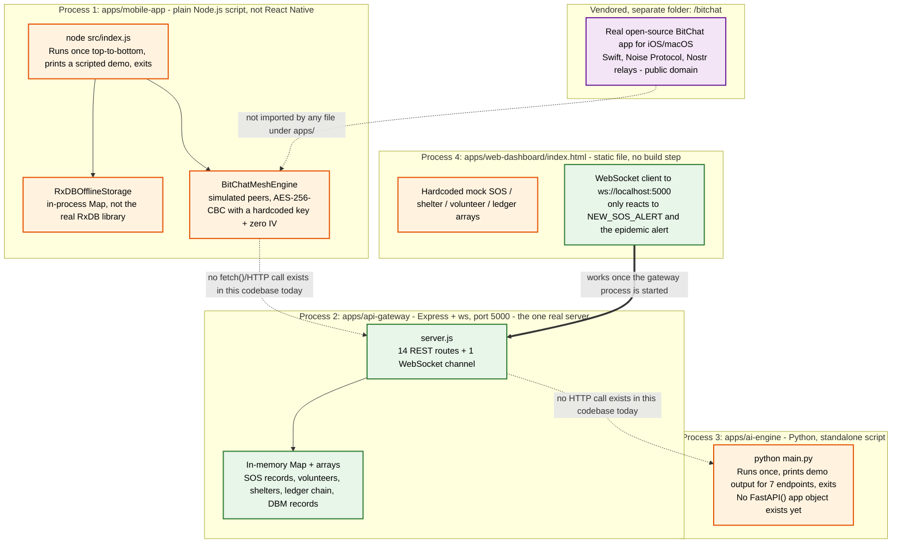

**The real triage algorithm** (the "AI" in "Explainable AI Triage"), exactly as it runs today:

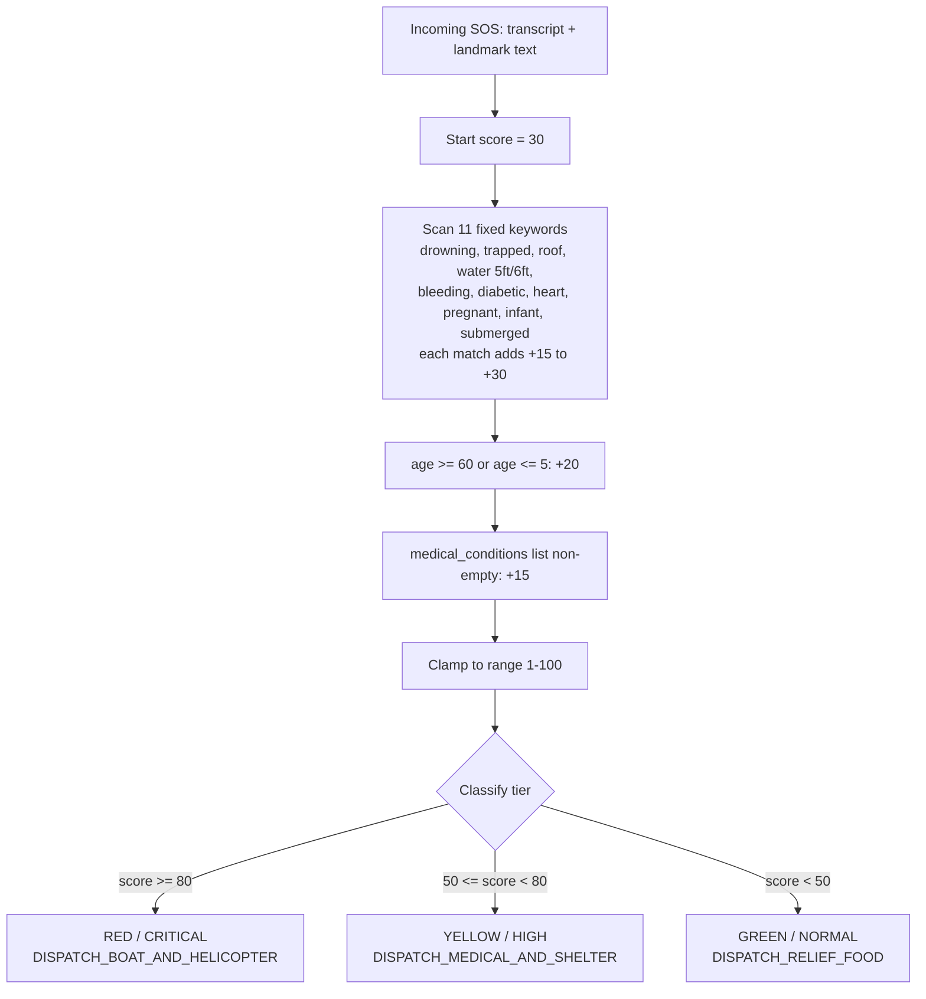

This exact scoring logic exists **twice, independently** — once in `server.js` (`calculateAITriageScore`, JavaScript) and once in `ai-engine/app/triage.py` (`evaluate_sos_urgency`, Python). They are never both called in the same request; `POST /api/sos` only ever runs the JavaScript copy. There is no NLP model, no ML classifier, and no call out to Whisper/Bhashini anywhere in the repo — "voice input" is a text string typed or hardcoded into the script, not audio.

---

## 📊 Data Model

### As-Built: What's Actually Running Today (In-Memory, Not Persisted)

This reflects the real object shapes used by the code right now. None of it survives a process restart, and — as shown below — several of these stores don't talk to each other at all.

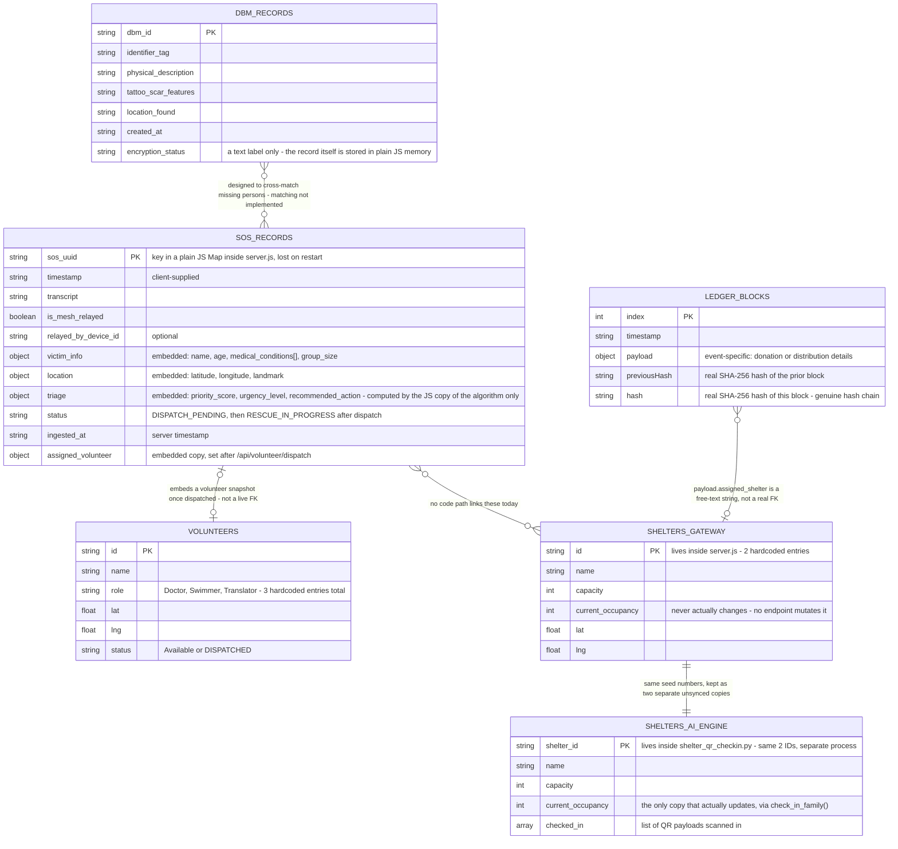

**Not shown above because nothing stores them:** DBT payout audits, EWS alert dispatch results, grievance records, livestock reports, epidemic surveillance reports, telemedicine sessions, voice-NLP results, and face-match results are all **computed and returned directly in the API response, then discarded** — none of them are appended to any array, Map, or file. There is currently no way to list "all grievances filed" or "all DBT payouts issued," because nothing keeps that list.

### 🎯 Target Production Schema (Planned — Not Yet Implemented)

*This is the schema the diagrams and tech-stack table below assume. It's a solid design for the next milestone — none of these tables exist yet; there's no `database/` folder, no migrations, and no Postgres connection anywhere in this repo.*

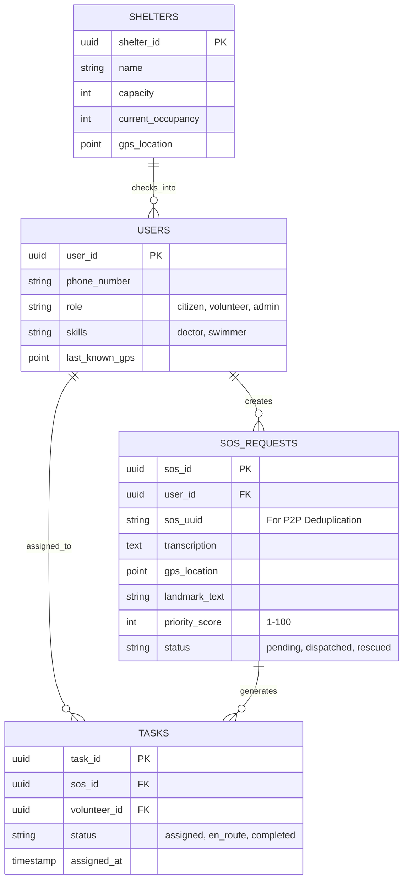

---

## 🏗️ Target Architecture & Subsystem Flowcharts (Design Reference — Not Yet Built)

> Everything in this section describes the **intended full build-out**, matching the original pitch. It is the blueprint AapdaSetu is designed toward, not a snapshot of what runs today — see the two sections above for that.

### 1. High-Level System Architecture

*Shows how Project 1 (Mobile P2P App), Project 2 (Web Platform & Backend), and External Integrations are meant to connect.*

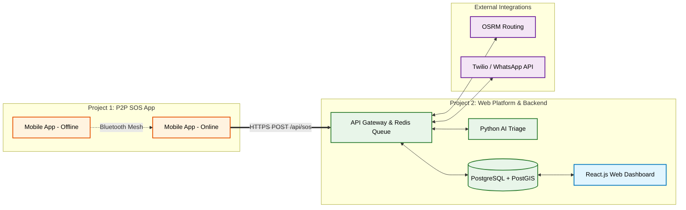

### 2. Sequence Diagram: The "Offline-to-Online" SOS Lifecycle

*Shows the intended chronological steps of an SOS request end-to-end. Today, only the `Peer->>API` step onward is real — the mesh hop before it happens entirely inside one script and never actually calls this API.*

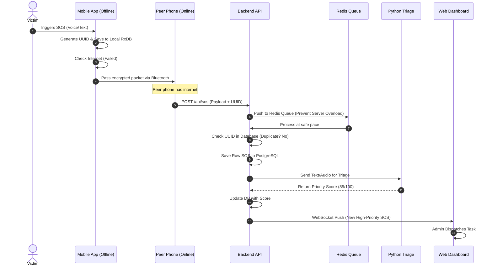

### 3. AI Triage & Priority Engine Pipeline

*The target design for the triage engine. The real, current logic is the much simpler diagram in "How It Actually Works Today" above — no NLP model runs yet.*

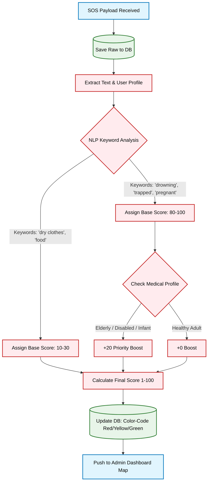

### 4. Volunteer Skill-Matching & Dispatch Flow

*The target design. Today, `/api/volunteer/dispatch` just assigns whichever volunteer is first in a hardcoded 3-person array — no skill filter, no distance ranking, no heartbeat timer exist in the code yet.*

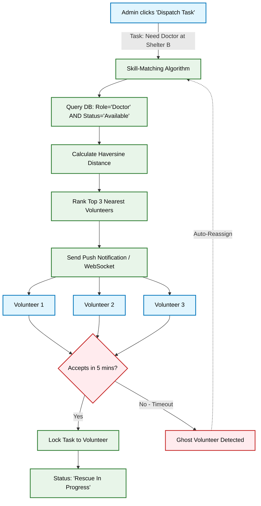

<details open>
<summary><b>📐 5. Detailed End-to-End System Architecture & Data Flow (Click to Collapse/Expand)</b></summary>
<br/>

```mermaid
flowchart TD
    subgraph P1["Project 1: React Native P2P Mobile App (Edge Client)"]
        User["🆘 Citizen"] -- "Voice / Text Input" --> AppUI["📱 App Interface"]
        AppUI --> EdgeGPS{"📡 GPS Acquired?"}
        EdgeGPS -- "No" --> ManualLand["📝 Prompt for Landmark Text"]
        EdgeGPS -- "Yes" --> GenID["🔑 Generate Unique SOS UUID"]
        ManualLand --> GenID
        GenID --> Foreground["⚙️ Start Foreground Service"]
        Foreground --> LocalDB[("💾 Save to RxDB Local DB")]
        LocalDB --> CheckNet{"🌐 Internet Available?"}
        CheckNet -- "YES" --> APIPost["🚀 Send POST /api/sos"]
        CheckNet -- "NO - Total Offline" --> MeshNet["📡 P2P Bluetooth Mesh Search"]
        MeshNet -. "Pass UUID + Packet" .-> PeerPhone(("📱 Nearby Peer Device"))
        PeerPhone -- "Peer has Internet" --> APIPost
    end

    APIPost ==>|"🔒 Encrypted HTTPS Payload"| APIGateway

    subgraph P2["Project 2: Web Platform, AI Microservices & Cloud Backend"]
        APIGateway["🌐 Node.js API Gateway"] --> RedisQueue[("⚡ Redis Message Queue")]
        RedisQueue --> Processor["⚙️ Node.js Processor"]
        Processor --> Dedup{"🔍 UUID Exists in DB?"}
        Dedup -- "YES" --> Drop["🗑️ Drop Duplicate silently"]
        Dedup -- "NO" --> SaveDB["💾 Save to PostgreSQL"]
        SaveDB --> AITriage["🧠 Python FastAPI: AI Triage"]
        AITriage --> Database[("🗄️ PostgreSQL + PostGIS")]
        Database --> AdminDash["🚨 Admin Command Center - React.js"]
        AdminDash --> SkillMatch["🎯 Skill-Matching Engine"]
        SkillMatch --> VolunteerPortal["🧑‍🚒 Volunteer Portal - PWA"]
        VolunteerPortal --> Heartbeat{"⏱️ Volunteer Accepts & Pings?"}
        Heartbeat -- "No response in 5 mins" --> Reassign["🔄 Auto-Reassign to Next Volunteer"]
        Reassign --> SkillMatch
        Heartbeat -- "Yes" --> RescueOps["🚑 Execute Rescue via OSRM Safe Route"]
        RescueOps -.-> APIGateway
    end

    classDef p1 fill:#fff3e0,stroke:#e65100,stroke-width:2px,color:#000000;
    classDef p2 fill:#e1f5fe,stroke:#0277bd,stroke-width:2px,color:#000000;
    classDef api fill:#e8f5e9,stroke:#2e7d32,stroke-width:2px,color:#000000;
    classDef edge fill:#ffebee,stroke:#c62828,stroke-width:2px,color:#000000;
    classDef db fill:#f3e5f5,stroke:#6a1b9a,stroke-width:2px,color:#000000;
    classDef ai fill:#fff9c4,stroke:#fbc02d,stroke-width:2px,color:#000000;

    class AppUI,GenID,MeshNet,PeerPhone,APIPost p1;
    class EdgeGPS,ManualLand,Foreground,CheckNet,RedisQueue,Dedup,Drop edge;
    class LocalDB,SaveDB,Database db;
    class APIGateway,Processor api;
    class AITriage ai;
    class AdminDash,VolunteerPortal,RescueOps p2;
```
</details>

<details open>
<summary><b>📡 6. Interactive Sequence Diagram: Offline P2P Mesh SOS Relaying</b></summary>
<br/>

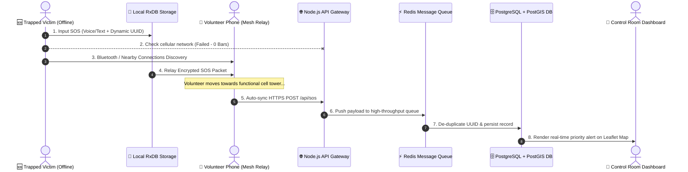
</details>

<details open>
<summary><b>🧠 7. Interactive Flowchart: Explainable AI Urgency Triage & Priority Scoring</b></summary>
<br/>

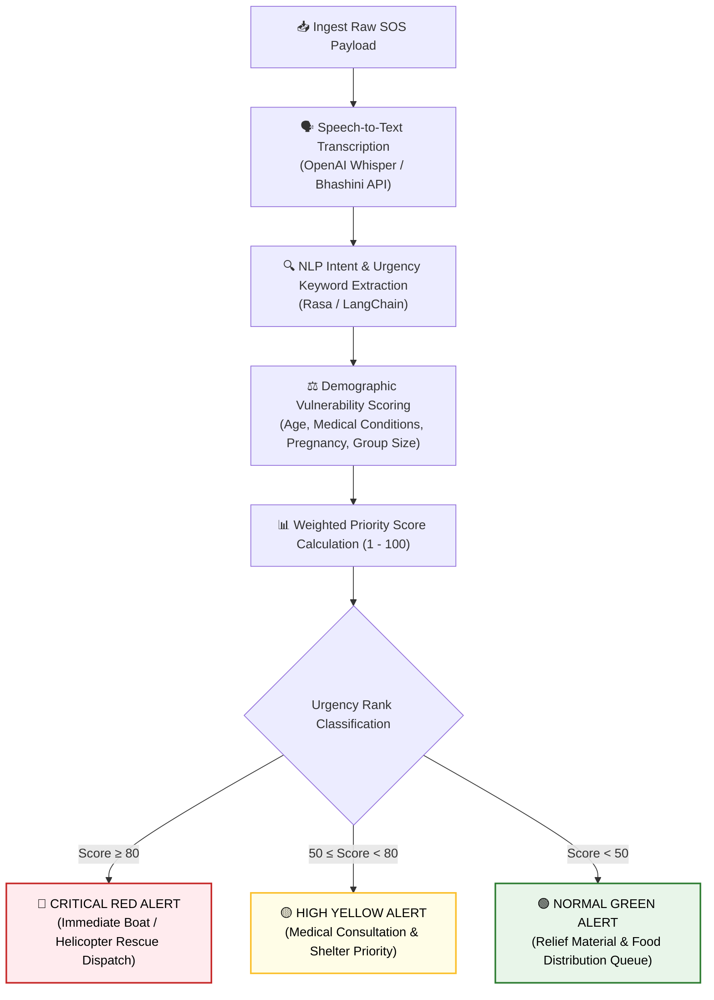
</details>

<details open>
<summary><b>🎯 8. Interactive Sequence Diagram: Rescuer Skill-Match & 5-Minute Heartbeat Loop</b></summary>
<br/>

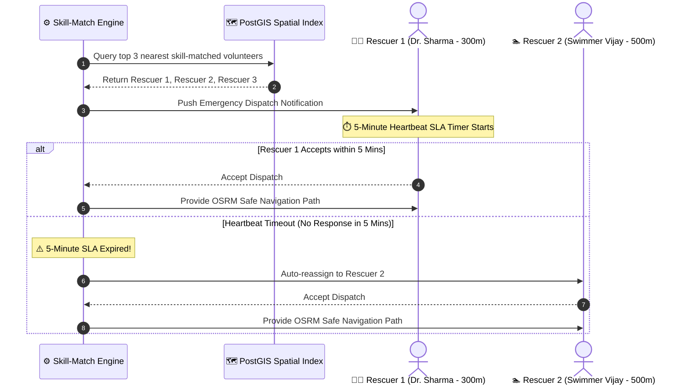
</details>

<details open>
<summary><b>🗺️ 9. Interactive Flowchart: Disaster-Aware Dynamic OSRM Safe Pathfinding</b></summary>
<br/>

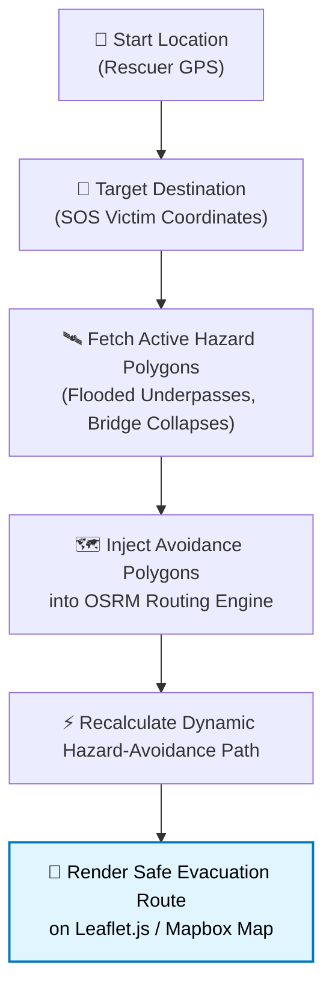
</details>

---

## 🌟 Comprehensive 20-Feature Deep-Dive

> [!IMPORTANT]
> All 20 features are designed as a unified platform with a **Core Spine** (Phase 1) and **Modular Plugins** (Phases 2-4).

> **Status legend:** ✅ Implemented — real logic runs. 🧪 Simulated — returns a plausible fake result; no real backing integration. 🔌 Built but disconnected — works in isolation, nothing in the running system calls it yet. 🚫 Designed only — no corresponding code exists yet.

### 🚀 Core Platform Features (Phase 1–3 Execution)

#### 1. Peer-to-Peer Offline SOS Sync (Bluetooth/Wi-Fi Mesh)
- **Problem**: Disaster zones experience total cellular blackout; cloud-dependent apps fail.
- **Solution**: Stores SOS packets in local database (`RxDB`). If no internet is detected, the app uses **Google Nearby Connections API** / **Web Bluetooth API** to discover nearby devices and hop encrypted packets across phones until a device with cellular connectivity relays them to the control room.
- **Edge Case**: Victim trapped under rubble with zero connectivity; a volunteer 100m away with weak signal auto-relays the SOS.
- **Tech Stack**: React Native, RxDB (IndexedDB / SQLite), Web Bluetooth / Nearby Connections API.
- **Actual status**: 🧪 `RxDBOfflineStorage.js` and `BitChatMeshEngine.js` are real, runnable JS classes — encryption and relay logic genuinely execute — but peer discovery is scripted by hand in `index.js`, not real BLE scanning; the encryption key is a hardcoded string with a static zero IV; and the real vendored `bitchat/` Swift app (which does implement genuine Noise Protocol handshakes) isn't imported anywhere in this flow.

#### 2. Explainable AI Triage & Priority Engine
- **Problem**: Control rooms receive 10,000+ simultaneous calls, creating deadly dispatch bottlenecks.
- **Solution**: Backend algorithm automatically parses incoming text/voice transcripts and victim demographic data (age, disability, pregnancy) to assign a dynamic urgency priority score (1–100).
- **Edge Case**: Prevents life-threatening requests (e.g., drowning, diabetic shock) from getting buried under lower-priority relief requests.
- **Tech Stack**: Python (FastAPI), Scikit-Learn / TensorFlow, NLP Keyword Weighting.
- **Actual status**: ✅ The scoring logic genuinely runs on every `POST /api/sos` call (see the real diagram above) — but it's a fixed keyword-weight sum, not an NLP/ML model, and it exists as two independent copies (JS in the gateway, Python in the AI engine) that are never both invoked together.

#### 3. Voice-First NLP Interface for Zero-Literacy Users
- **Problem**: 26% of India's population faces literacy challenges; panic hinders complex app navigation.
- **Solution**: Completely voice-driven UI. The victim speaks naturally (e.g., *"मदद करो, मैं छत पर फंसा हूँ"*). Speech is transcribed, intent extracted, and SOS created without button interactions.
- **Edge Case**: Elderly or panic-stricken citizens unable to touch or navigate menus.
- **Tech Stack**: OpenAI Whisper AI / Bhashini API (Speech-to-Text), Rasa / LangChain (Intent Extraction).
- **Actual status**: 🧪 `VoiceNLPService.processVoiceAudio()` takes a **text string**, not audio, and extracts entities with plain substring/regex checks (e.g. looking for the literal text "6 फीट"). No speech-to-text engine runs anywhere in the repo.

#### 4. Disaster-Aware Dynamic Routing Engine
- **Problem**: Standard GPS maps guide citizens into newly flooded underpasses or collapsed bridges.
- **Solution**: Ingests crowdsourced and verified hazard polygons. The routing engine dynamically recalculates the safest evacuation path to shelters, circumscribing hazard zones.
- **Edge Case**: Preventing evacuees from driving into active flood zones due to outdated mapping data.
- **Tech Stack**: OSRM (Open Source Routing Machine), Leaflet.js, Turf.js spatial calculation.
- **Actual status**: 🧪 `osrmRouting.js` checks whether a hazard polygon's *name* literally contains the string `"Sector V Flooded Underpass"` and, if so, returns one hardcoded bypass route. No real OSRM server is called, and no geometry/ray-casting math exists despite the code comment saying so.

#### 5. Low-Bandwidth WebRTC Telemedicine
- **Problem**: Isolated medical emergencies (snakebites, child delivery) cannot wait for physical rescue.
- **Solution**: In-app WebRTC video/audio streaming fallback, strictly optimized for 2G network bitrates with preliminary AI symptom triage.
- **Edge Case**: Remote medical consultation on sub-50 kbps connection speeds.
- **Tech Stack**: Jitsi Meet WebRTC API, Socket.io, Node.js queue dispatcher.
- **Actual status**: 🧪 `telemedicineService.js` returns a `meet.jit.si` URL string and a bitrate label based on the `network_quality` you pass in. No WebRTC session, Jitsi SDK, or Socket.io connection is actually created.

#### 6. On-Device Facial Matching for Missing Persons
- **Problem**: Paper missing-person lists across dozens of shelters take weeks to cross-reference.
- **Solution**: Runs lightweight neural facial recognition locally on-device. Photos are converted to vector embeddings and compared via Cosine Similarity without needing cloud databases.
- **Edge Case**: Reuniting separated children with families offline without cloud access or privacy leaks.
- **Tech Stack**: Face-API.js / InsightFace (ONNX Runtime), Vector Cosine Distance.
- **Actual status**: ✅🧪 The cosine-similarity comparison math in `OnDeviceFaceMatching.js` is real and correct — but the "embedding" it compares is a deterministic sine-wave function of the photo ID's string length, not output from any real face-recognition model.

#### 7. Dynamic QR Code Shelter Check-In System
- **Problem**: Paper shelter registers get lost, causing chaotic overcrowding and uncounted victims.
- **Solution**: Citizen app generates a dynamic encrypted Family QR code. Shelter admins scan it using a PWA tablet app to instantly update live capacity and registry records.
- **Edge Case**: Tracking split families across multiple shelters in real-time.
- **Tech Stack**: React PWA, `qrcode.react`, HTML5 Camera API.
- **Actual status**: ✅🔌 `shelter_qr_checkin.py` is the most complete module in the repo — real SHA-256 QR IDs, real capacity checks, real duplicate-scan rejection, real occupancy updates. But there's no `/api/shelter/...` route in the gateway and no scanning UI, so it's only reachable by running the AI-engine demo script directly — nothing in the live gateway or dashboard calls it.

#### 8. Multi-Channel Geofenced Early Warning System (EWS)
- **Problem**: Alerts broadcasted on social media fail to reach fishermen at sea or rural villagers without smartphones.
- **Solution**: Cron jobs pull official weather/cyclone alerts (IMD/INCOIS APIs). PostGIS identifies all registered citizens inside the hazard polygon and triggers automated App Push, SMS, WhatsApp, and IVR Voice Calls.
- **Edge Case**: Warning non-smartphone users via automated voice call (IVR) on basic feature phones.
- **Tech Stack**: PostGIS, Node.js Cron, Twilio API (SMS/IVR), Meta WhatsApp Cloud API.
- **Actual status**: 🧪 `ewsAlertService.js` returns fabricated "X notifications sent" strings for whichever channels you ask for. No Twilio, WhatsApp Cloud API, or cron job exists; the `hazard_polygon` parameter is accepted but never actually used to filter anyone geographically.

#### 9. Crowdsourced AI Damage Assessment (Anti-Fraud)
- **Problem**: Manual property damage assessment for government aid takes 6–8 months and is prone to corruption.
- **Solution**: Citizens submit photo evidence of damaged property. The system extracts EXIF metadata (GPS, timestamp) to verify authenticity, checks perceptual hashes (pHash) against duplicate uploads, and uses vision AI to grade structural damage (Minor, Major, Fully Destroyed).
- **Edge Case**: Detecting fraudulent or recycled internet photos of past disaster damage.
- **Tech Stack**: ExifReader, pHash library, ResNet50 (PyTorch / TensorFlow).
- **Actual status**: 🧪 `damage_assessment.py` compares GPS numbers you hand it directly (no real EXIF file parsing), checks the photo's hash against one hardcoded fake duplicate value, and grades damage by matching keywords like `"collapsed"` in the **filename you type**. No ResNet50 or any vision model runs.

#### 10. Algorithmic Skill-Matching Volunteer Engine
- **Problem**: Thousands of volunteers arrive on-site, but skilled personnel (doctors, swimmers) are assigned to manual labor.
- **Solution**: Matches verified volunteer skill profiles against incoming emergency demands. Automatically dispatches tasks to the top 3 nearest, available, skill-matched volunteers using spatial proximity.
- **Edge Case**: Rapidly dispatching a certified diver to a submergence call within 300 meters.
- **Tech Stack**: PostgreSQL + PostGIS, Haversine formula, Node.js dispatch engine.
- **Actual status**: 🧪 `POST /api/volunteer/dispatch` assigns whichever volunteer happens to be first in a hardcoded 3-person array. There is no skill filtering, no Haversine distance calculation, no ranking, and no 5-minute heartbeat/reassignment timer despite both being diagrammed above.

---

### 🛡️ Advanced Disaster Modules (Phase 4 Infrastructure)

#### 11. AI-Powered Psychological First Aid (PFA) Chatbot
- **Problem**: Trauma, panic, and PTSD are rampant during disasters, leading to irrational victim behavior.
- **Solution**: An empathetic AI companion integrated into the app that guides trapped victims through breathing exercises, survival instructions, and grounding techniques while awaiting rescue.
- **Tech Stack**: Llama 3 / GPT-4 via LangChain, Rasa dialogue state engine.
- **Actual status**: 🧪 `pfa_chatbot.py` has three canned, keyword-triggered replies (panic/water/default). No LLM call, no Llama 3, no LangChain, no Rasa runs anywhere in the repo.

#### 12. Automated Direct Benefit Transfer (DBT) Pipeline
- **Problem**: Government compensation payout takes months due to physical paperwork and bureaucratic delays.
- **Solution**: Links verified AI damage assessment files directly to digital audit pipelines for one-click admin approval and mock Aadhaar e-KYC / bank disbursement.
- **Tech Stack**: Node.js workflow engine, PDFKit, Aadhaar e-KYC API mock layer.
- **Actual status**: 🧪 `dbtPipeline.js`'s "e-KYC verification" is a check that the Aadhaar number is 12 characters long; the payout figure is read straight from whatever `damage_assessment` object you pass in. No PDF is generated (`pdfkit` isn't even a dependency) and nothing is persisted.

#### 13. Multi-Agency Unified Command Dashboard (Incident Command System - ICS)
- **Problem**: NDRF, Military, Navy, and NGOs operate in silos without centralized spatial visibility.
- **Solution**: A unified GIS dashboard giving each agency color-coded sectors, resource counters, and active mission tracking to prevent duplicate resource deployment.
- **Tech Stack**: React.js, Redux Toolkit, Leaflet.js / Mapbox GL, PostGIS spatial boundaries.
- **Actual status**: 🧪 `web-dashboard/index.html` draws two hardcoded polygons ("NDRF Sector A", "NGO Sector B") with static popup text. There's no React, no Redux, no accounts, no RBAC, and no per-agency data model.

#### 14. Cryptographic Aid & Donation Tracker
- **Problem**: Donors lose trust due to lack of transparency in relief material distribution.
- **Solution**: A transparent cryptographic hash-chain tracking donations from financial contribution to vendor purchase and final shelter QR check-in scan.
- **Tech Stack**: Cryptographic SHA-256 Ledger / Polygon L2 Smart Contracts, Web3.js.
- **Actual status**: ✅ `cryptographicLedger.js` genuinely computes a SHA-256 hash chain — each block's hash really does depend on the previous block's hash, so tampering would break the chain. It's real cryptography, just held in a plain in-memory array (not on any blockchain, and lost on restart).

#### 15. AI-Routed Grievance Redressal & Anti-Corruption Module
- **Problem**: Disaster victims face discrimination or bribery demands during relief distribution.
- **Solution**: Multi-channel complaint reporting (App, WhatsApp, IVR) parsed by NLP classifiers and routed directly to senior district officers with strict SLA escalation timers.
- **Tech Stack**: HuggingFace Transformers, Twilio API, Automated SLA Escalation Cron.
- **Actual status**: 🧪 `grievanceEscalation.js` returns a static SLA record (2 hours for "corruption," 6 hours otherwise) with a fixed authority string. There's no NLP classifier (`transformers` isn't a dependency anywhere), no cron job, and no persistence — filed grievances aren't stored, so there's no way to list them later.

#### 16. Satellite Imagery AI Flood Mapping
- **Problem**: Ground visibility is zero during severe inundation; rescue teams cannot pinpoint submerged villages.
- **Solution**: Ingests open-source Sentinel-1 SAR (Synthetic Aperture Radar) satellite data. A computer vision model extracts water boundaries to generate real-time flood extent GeoJSON overlays.
- **Tech Stack**: Python Sentinel Hub API, PyTorch U-Net Segmentation, GeoJSON.
- **Actual status**: 🧪 `satellite_flood_mapping.py` returns one hardcoded GeoJSON polygon for any district name you pass in. No Sentinel Hub API call and no image-segmentation model exist in the repo.

#### 17. Digital Dead Body Management (DBM) Forensic Registry
- **Problem**: Unidentified victims are buried in mass graves without forensic identification or family closure.
- **Solution**: Encrypted registry where rescue teams upload physical feature data (tattoos, scars, birthmarks). Vector search auto-matches entries against missing-person queries.
- **Tech Stack**: Milvus Vector DB, E2EE (End-to-End Encryption), React Native image blurring.
- **Actual status**: ✅🧪 `forensicDBMRegistry.js` genuinely appends structured records to an in-memory array with real timestamps and IDs — but there's no vector database, no matching logic against missing-person records, and `encryption_status` is a text label, not actual encryption of the stored data.

#### 18. Accessibility & Sign Language Engine
- **Problem**: Hearing-impaired and vision-impaired citizens cannot hear emergency sirens or read complex maps.
- **Solution**: Software overlay converting textual emergency warnings into 3D Indian Sign Language (ISL) avatar animations, coupled with screen-reader optimizations.
- **Tech Stack**: Web Speech API, 3D Avatar Rendering, ARIA Accessibility Standard.
- **Actual status**: 🧪 `SignLanguageEngine.js` maps a handful of keywords to gesture-ID strings like `ISL_GESTURE_FLOOD_RISING`. No 3D avatar, video, or Web Speech API call actually renders anything.

#### 19. Animal & Livestock Rescue Parallel System
- **Problem**: Farmers refuse to evacuate without their livestock, putting themselves and rescuers at extreme risk.
- **Solution**: Dedicated animal SOS reporting tag allowing farmers to pinpoint tied or trapped livestock, enabling animal rescue teams to coordinate evacuation and fodder supply.
- **Tech Stack**: PostgreSQL spatial tagging, WhatsApp Bot intake, Leaflet cluster maps.
- **Actual status**: 🧪 `livestockRescueService.js` builds and returns one formatted report object per call. Nothing is stored, so there's no list of open livestock reports, no map clustering, and no WhatsApp bot.

#### 20. Crowdsourced Epidemic & WASH Surveillance Heatmap
- **Problem**: Post-flood waterborne diseases (cholera, typhoid) cause severe post-disaster mortality.
- **Solution**: Shelter health symptom tracker. Aggregates health reports to project early disease outbreaks on a GIS heatmap when cases breach statistical thresholds.
- **Tech Stack**: Mapbox GL Heatmap, Statistical Outbreak Threshold Engine.
- **Actual status**: 🧪 `epidemicSurveillance.js` applies one threshold rule (≥5 total cases, or a manual flag) and broadcasts a `RED_ALERT` string over WebSocket, which the dashboard turns into a plain browser `alert()` popup. Nothing is persisted and there's no actual heatmap layer (Mapbox GL isn't loaded anywhere in `web-dashboard`).

---

## 🛠️ Technology Stack

### Target Stack (Design Reference)

| Category | Technology | Purpose |
| :--- | :--- | :--- |
| **Mobile App (Edge)** | React Native, RxDB, SQLite | Offline-first P2P Mobile Client |
| **P2P Mesh Transfer** | Google Nearby Connections, Web Bluetooth | Zero-Internet SOS Relaying |
| **Web Dashboards** | React.js, Redux, Leaflet.js, Mapbox GL | Admin Command & Volunteer Portal |
| **API Gateway** | Node.js, Express.js | High-throughput API routing & sync |
| **Message Queue** | Redis, BullMQ | Asynchronous payload queueing |
| **AI Microservices** | Python, FastAPI, PyTorch, Scikit-Learn | Triage scoring, Vision & NLP models |
| **Primary Database** | PostgreSQL + PostGIS | Relational & Spatial GIS Queries |
| **Vector Database** | Milvus / Face-API Vector Index | Facial & forensic feature search |
| **Speech & NLP** | OpenAI Whisper, Bhashini API, Rasa | Multi-lingual STT & Intent Parsing |
| **Routing Engine** | OSRM (Open Source Routing Machine) | Disaster-aware safe pathfinding |
| **Telemedicine** | Jitsi WebRTC, Socket.io | Low-bandwidth audio/video calls |
| **Communications** | Twilio (SMS/IVR), Meta WhatsApp Cloud API | Multi-channel Early Warnings |

### What's Actually Installed Today

| App | Declared dependencies | Notably absent |
| :--- | :--- | :--- |
| `api-gateway` | `express`, `cors`, `ws` | No DB driver, no Redis client, no queue library |
| `mobile-app` | `crypto` (an npm package — unnecessary, since `crypto` is already a Node.js built-in module) | No `react-native`, no `rxdb`, no Bluetooth/Nearby Connections library |
| `ai-engine` | `fastapi`, `uvicorn`, `pydantic` | None are actually invoked by `main.py`; no `torch`, `tensorflow`, `scikit-learn`, `whisper`, or `transformers` |
| `routing-service` | *(no `package.json`)* | Not a standalone service — imported directly as a class |
| `web-dashboard` | Leaflet, loaded via CDN `<script>` tag | No `package.json`, no build step, no React/Redux/Mapbox GL |

---

## 📁 Repository Structure

```
SIH-DM/
├── apps/
│   ├── mobile-app/               # "Project 1" - in reality, a plain Node.js script, not React Native
│   │   ├── src/
│   │   │   ├── database/RxDBOfflineStorage.js   # Map()-based stand-in, not the real RxDB library
│   │   │   ├── mesh/BitChatMeshEngine.js        # simulated BLE mesh peers, in-process only
│   │   │   ├── services/                        # VoiceNLPService, OnDeviceFaceMatching, SignLanguageEngine, SOSBuilder
│   │   │   └── index.js                         # scripted demo entry point (`npm start` -> node src/index.js)
│   │   └── package.json                         # one dependency: "crypto" (unnecessary - it's a Node built-in)
│   │
│   ├── api-gateway/               # Express + ws server - the one real, live server in this repo
│   │   ├── src/
│   │   │   ├── server.js                        # 14 REST routes + WebSocket, port 5000, in-memory Map "database"
│   │   │   └── services/                        # dbtPipeline, cryptographicLedger, grievanceEscalation,
│   │   │                                         # forensicDBMRegistry, livestockRescueService,
│   │   │                                         # epidemicSurveillance, ewsAlertService, telemedicineService
│   │   └── package.json                         # express, cors, ws
│   │
│   ├── ai-engine/                 # Python - standalone demo script, not a running FastAPI server yet
│   │   ├── app/
│   │   │   ├── main.py                          # request router + demo runner (no FastAPI() app object)
│   │   │   ├── triage.py                        # independent duplicate of server.js's scoring logic
│   │   │   ├── damage_assessment.py
│   │   │   ├── pfa_chatbot.py
│   │   │   ├── satellite_flood_mapping.py
│   │   │   └── shelter_qr_checkin.py            # the only place shelter occupancy actually mutates -
│   │   │                                         # not reachable from api-gateway or the dashboard
│   │   └── requirements.txt                     # fastapi, uvicorn, pydantic (unused by the current script)
│   │
│   ├── routing-service/           # not an independent service - a class imported by server.js and mobile-app
│   │   └── src/osrmRouting.js
│   │
│   └── web-dashboard/             # the entire web UI - "admin-dashboard" / "volunteer-portal" don't exist as folders
│       └── index.html             # static file: Leaflet + vanilla JS + inline CSS, hardcoded mock data,
│                                   # partial WebSocket client
│
├── bitchat/                       # vendored, unmodified copy of the real open-source BitChat iOS/macOS app
│   └── ...                        # Swift, Xcode project, its own README/docs/WHITEPAPER - public domain,
│                                   # not imported by anything under apps/
│
├── The AapdaSetu Software-Only Master.txt   # original 20-feature master plan (prose) - left as-is
└── README.md                                # this file
```

**Referenced elsewhere in this document but not present in the repository:** `database/` (Postgres/PostGIS migrations), top-level `docs/`, `diagram.svg`, `admin-dashboard/`, `volunteer-portal/`, `docker-compose.yml`, and any `.env`. Setting these up is the first item in **Known Gaps** below.

---

## 🚦 Getting Started & Local Development

### Run What Exists Today

**Prerequisites:** Node.js v18+, Python 3.10+. (Postgres, Redis, and Docker are **not** required for anything below — see the next subsection for why they're listed elsewhere in this document.)

**1. API Gateway — the one real server**
```bash
cd apps/api-gateway
npm install
npm start
# Express + WebSocket server on http://localhost:5000 and ws://localhost:5000
```
Try the real endpoint immediately:
```bash
curl -X POST http://localhost:5000/api/sos \
  -H "Content-Type: application/json" \
  -d '{"sos_uuid":"demo-1","transcript":"water 6ft, trapped on roof","victim_info":{"age":70,"medical_conditions":["Diabetic"]},"location":{"latitude":22.5726,"longitude":88.3639,"landmark":"Test"}}'
```

**2. Web Dashboard**
Open `apps/web-dashboard/index.html` directly in a browser (or serve it statically, e.g. `npx serve apps/web-dashboard`). It shows 4 hardcoded demo incidents immediately. If the API Gateway from step 1 is already running, it will also connect over WebSocket and append any new SOS you `curl` in, live.

**3. Mobile "app" demo script**
```bash
cd apps/mobile-app
npm install
npm start
# runs node src/index.js: prints a scripted walkthrough of all 20 features, then exits
# Note: this does NOT call the API Gateway above - it's a self-contained, in-process demo.
```

**4. AI Engine demo script**
```bash
cd apps/ai-engine
pip install -r requirements.txt
cd app
python main.py
# prints demo output for all 7 AI endpoints, then exits
# Note: despite the file header, there is no live FastAPI server here yet - see Known Gaps below.
```

**5. `bitchat/` — vendored reference app (optional, macOS + Xcode only)**
```bash
open bitchat/bitchat.xcodeproj
```
This is the real open-source BitChat app, included for reference. It is not currently wired into `apps/mobile-app`.

### Provisioning Target Production Infrastructure (Roadmap — Not Yet in This Repo)

The tech-stack table and the target ERD above assume PostgreSQL + PostGIS, Redis, and a live FastAPI service sitting behind the gateway. None of that infrastructure is set up in this repository yet: there is no `docker-compose.yml`, no `database/` folder, and no `.env`. Standing these up — and pointing `server.js` at them instead of its in-memory `Map` — is the top item in **Known Gaps** below.

---

## 🔌 Core API Specification (Accurate, As Implemented)

All 14 routes below are real and live in `apps/api-gateway/src/server.js` once you run `npm start`. The table lists each route, which feature it backs, and what actually happens when you call it.

| # | Route | Feature(s) | What actually happens |
| :-- | :-- | :-- | :-- |
| 1 | `POST /api/sos` | 1, 2 | Rejects if `sos_uuid` is missing (`400`); drops silent duplicates (`200`, `DUPLICATE_DROPPED`); otherwise runs the in-process JS triage function, stores the record in the gateway's `Map`, and broadcasts `NEW_SOS_ALERT` over WebSocket (`201`, `INGESTED_AND_TRIAGED`) |
| 2 | `GET /api/sos` | — | Returns every record currently in the `Map`: `{ count, data: [...] }` |
| 3 | `POST /api/voice/process` | 3 | Keyword/regex extraction on a **text** field; no audio accepted |
| 4 | `POST /api/routing/safe-path` | 4 | Hardcoded bypass route if the one seeded hazard polygon's name matches a string check |
| 5 | `POST /api/telemedicine/session` | 5 | Returns a Jitsi Meet URL string; no call is created |
| 6 | `POST /api/face/match` | 6 | Real cosine-similarity math; embeddings are placeholder sine-wave vectors, not real face data |
| 7 | `POST /api/ews/alert` | 8 | Returns fabricated "sent" counts; no Twilio/WhatsApp call; broadcasts `EWS_ALERT_BROADCAST` over WebSocket |
| 8 | `POST /api/volunteer/dispatch` | 10 | Assigns the first `Available` volunteer from the hardcoded 3-person array; broadcasts `RESCUE_DISPATCHED` |
| 9 | `POST /api/dbt/payout` | 12 | Mock Aadhaar check (`length === 12`); payout amount taken from whatever `damage_assessment` you pass in; not persisted |
| 10 | `POST /api/ledger/donation` | 14 | Appends a real SHA-256-chained block to the in-memory ledger |
| 11 | `POST /api/grievance` | 15 | Returns a static SLA record (2h or 6h); not persisted |
| 12 | `POST /api/forensic/dbm` | 17 | Appends a record to an in-memory array with a real timestamp/ID |
| 13 | `POST /api/livestock` | 19 | Returns a formatted report object; not persisted |
| 14 | `POST /api/epidemic/report` | 20 | Simple threshold rule (≥5 cases or a flag); not persisted; broadcasts `EPIDEMIC_SURVEILLANCE_ALERT` |
| WS | `ws://localhost:5000` | — | On connect, sends one `INITIAL_STATE` message with the full current `database`/`volunteers`/`shelters`/`ledger`. The dashboard client only actually *handles* `NEW_SOS_ALERT` and the epidemic alert today — it ignores `INITIAL_STATE`, `RESCUE_DISPATCHED`, and `EWS_ALERT_BROADCAST` |

**Note on the two triage implementations:** the `triage` object embedded in `/api/sos` responses (JS, `server.js`) only contains `priority_score`, `urgency_level`, and `recommended_action`. The Python version (`triage.py`, currently unreachable via HTTP) additionally returns `extracted_keywords` and echoes back `sos_uuid`. They are not the same object shape.

### 1. Ingest Emergency SOS — Request

```json
{
  "sos_uuid": "e7072f6c-9e55-43fa-b1a7-43c2ca3369fc",
  "timestamp": "2026-07-27T23:11:34Z",
  "location": {
    "latitude": 22.5726,
    "longitude": 88.3639,
    "landmark": "Near Salt Lake Sector V Petrol Pump"
  },
  "victim_info": {
    "name": "Ramesh Kumar",
    "age": 62,
    "medical_conditions": ["Diabetes", "Heart Condition"],
    "group_size": 4
  },
  "transcript": "पानी 5 फीट तक भर गया है, 3 लोग छत पर हैं",
  "is_mesh_relayed": true,
  "relayed_by_device_id": "DEV_88912_MESH"
}
```

### Real responses (as returned by `server.js` today)

Success (`201`):
```json
{
  "status": "INGESTED_AND_TRIAGED",
  "sos_uuid": "e7072f6c-9e55-43fa-b1a7-43c2ca3369fc",
  "triage": {
    "priority_score": 95,
    "urgency_level": "RED",
    "recommended_action": "DISPATCH_BOAT_AND_HELICOPTER"
  }
}
```

Duplicate (`200`):
```json
{ "status": "DUPLICATE_DROPPED", "sos_uuid": "e7072f6c-9e55-43fa-b1a7-43c2ca3369fc" }
```

Missing `sos_uuid` (`400`):
```json
{ "error": "Missing required field: sos_uuid" }
```

---

## 🎯 Development Roadmap & Phased Execution

```
  Phase 1: Core Spine
  ├── 1. Peer-to-Peer Bluetooth SOS Mesh Sync .......... 🧪 simulated relay logic, no real BLE
  ├── 2. RxDB Offline Storage & Synchronization ......... 🧪 Map-based stand-in, no sync target
  ├── 3. Node.js Gateway & PostgreSQL Database Setup .... ✅ Gateway is real / 🚫 Postgres not set up
  └── 4. Leaflet.js Real-Time Admin Command Map ......... ✅ map renders / 🔌 only 2 of 5 live event types wired

  Phase 2: Smart AI & Routing Layers
  ├── 1. Voice-First NLP Interface (Whisper / STT) ...... 🧪 text keyword matching, no speech-to-text
  ├── 2. Explainable AI Triage Scoring Engine (FastAPI) . ✅ scoring logic is real / 🚫 not exposed as a live API
  └── 3. OSRM Hazard-Avoidance Routing Engine ........... 🧪 one hardcoded route, no OSRM call

  Phase 3: Coordination & Recovery Modules
  ├── 1. Dynamic QR Code Shelter Check-in PWA ........... ✅ check-in logic is real / 🔌 not wired to the gateway
  ├── 2. On-Device Missing Persons Facial Matching ...... ✅ math is real / 🧪 embeddings are placeholders
  ├── 3. Algorithmic Skill-Matching Volunteer Engine .... 🧪 first-available assignment only
  └── 4. Low-Bandwidth WebRTC Telemedicine ............... 🧪 returns a URL string only

  Phase 4: Advanced Disaster Infrastructure
  ├── 1. Sentinel-1 Satellite AI Flood Mapping .......... 🧪 one hardcoded polygon
  ├── 2. Cryptographic Relief Aid Tracker ................ ✅ real SHA-256 hash chain, in-memory only
  ├── 3. AI Direct Benefit Transfer (DBT) Payout Pipeline 🧪 mock e-KYC, no persistence
  └── 4. Epidemic & WASH Outbreak Heatmap ................ 🧪 threshold rule only, no heatmap UI
```

---

## ⚠️ Known Gaps & Suggested Next Steps to Productionize

1. **Wire the mobile client to the gateway.** Add a real `fetch()`/`axios` call from `mobile-app` to `POST http://<gateway-host>:5000/api/sos` when a peer device has internet, instead of only logging that it *would* relay to the cloud.
2. **Replace the in-memory stores with a real database.** `server.js`'s `database`/`volunteers`/`shelters` and `ShelterQRService.shelters` don't survive a restart or scale past one process. Standing up Postgres + PostGIS (matching the target schema above) via Prisma/Knex/Sequelize would also let you merge the two divergent shelter datasets into one source of truth.
3. **Connect the API Gateway to the AI Engine.** Pick one triage implementation (JS or Python), wrap `main.py` in an actual `FastAPI()` app with real `@app.post` routes and `uvicorn.run(...)`, and have the gateway call it over HTTP instead of running its own local copy.
4. **Fix the mesh encryption.** `BitChatMeshEngine.encryptPacket()` uses one hardcoded shared secret and a static all-zero IV with AES-256-CBC — every device shares the same key, and identical payloads produce identical ciphertext. The vendored `bitchat/` app already implements real Noise Protocol handshakes; that design is worth reusing before relying on this for real SOS traffic.
5. **Implement real skill-matching in `/api/volunteer/dispatch`.** Add the role filter, Haversine distance ranking, and 5-minute heartbeat/reassignment timer that the diagrams already describe.
6. **Persist the "fire and forget" endpoints.** DBT payouts, grievances, EWS alerts, livestock reports, epidemic reports, and telemedicine sessions are computed and returned but never stored — add them to the database from #2 so they can be listed and audited later.
7. **Wire the dashboard to the full WebSocket protocol.** `web-dashboard/index.html` only reacts to `NEW_SOS_ALERT` and the epidemic alert; add handlers for `INITIAL_STATE`, `RESCUE_DISPATCHED`, and `EWS_ALERT_BROADCAST` so the shelters/volunteers/ledger panels reflect live server state instead of their hardcoded mock arrays.
8. **Decide the mobile app's real target.** It's currently plain Node.js scripts, not a React Native project. Either scaffold a real RN app around this logic, or relabel it clearly as a backend-side simulation to avoid confusion.
9. **Give `routing-service` and `ai-engine` their own entry points.** Neither has a `package.json`/server file of its own today — add one so each can genuinely run as an independent service, matching the architecture diagrams.
10. **Small hygiene fix:** drop the `crypto` npm package from `mobile-app/package.json` — Node's built-in `crypto` module already provides everything `require('crypto')` needs, no install required.

---

## 📜 License & Acknowledgments

- Built under the **Smart India Hackathon (SIH) Disaster Management Initiative**.
- Designed for humanitarian disaster relief and emergency response worldwide.
- Open-source under the [MIT License](LICENSE).
- The `bitchat/` folder vendors the real, open-source **[BitChat](https://github.com/permissionlesstech/bitchat)** iOS/macOS app (Bluetooth mesh + Nostr messaging), released into the public domain under the Unlicense. It is included as a reference implementation and is **not original work of this project** — full credit to its authors. See `bitchat/LICENSE` and `bitchat/WHITEPAPER.md` for details.
