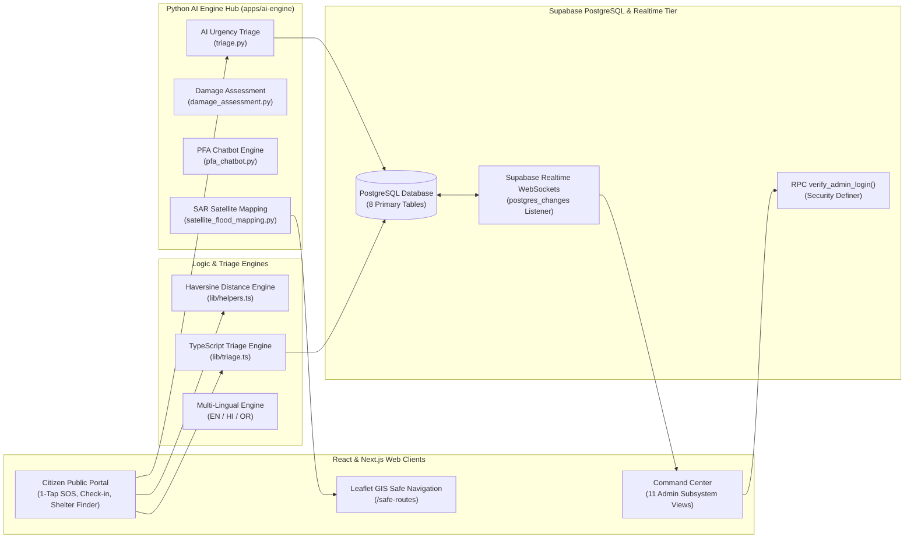
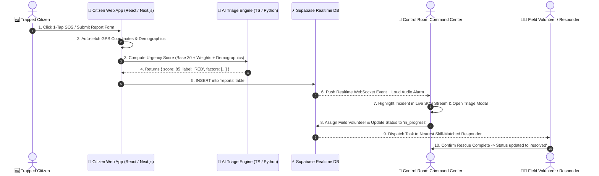
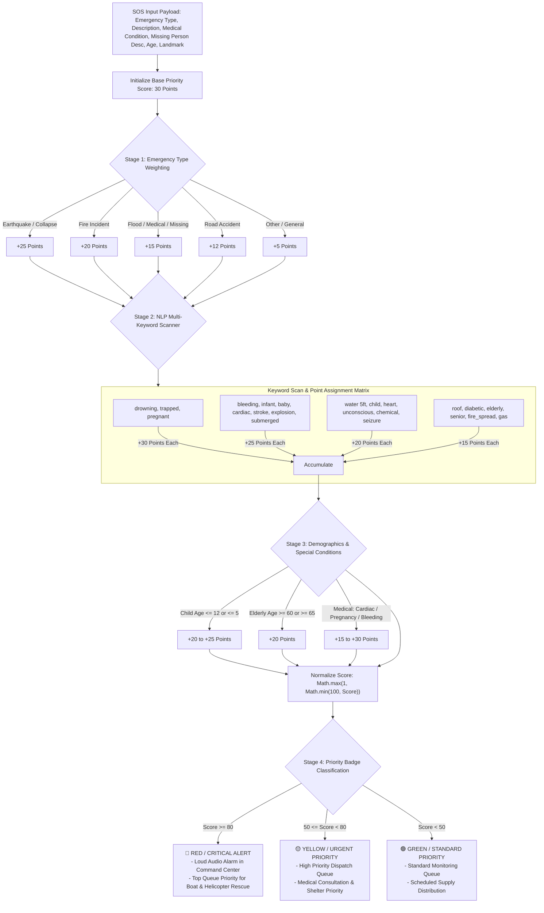
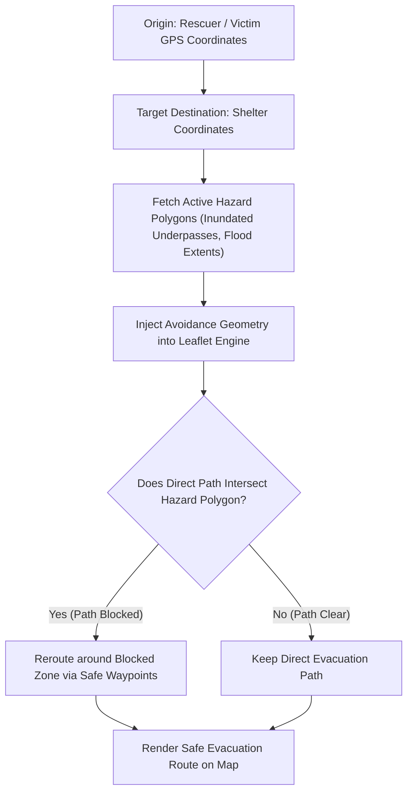
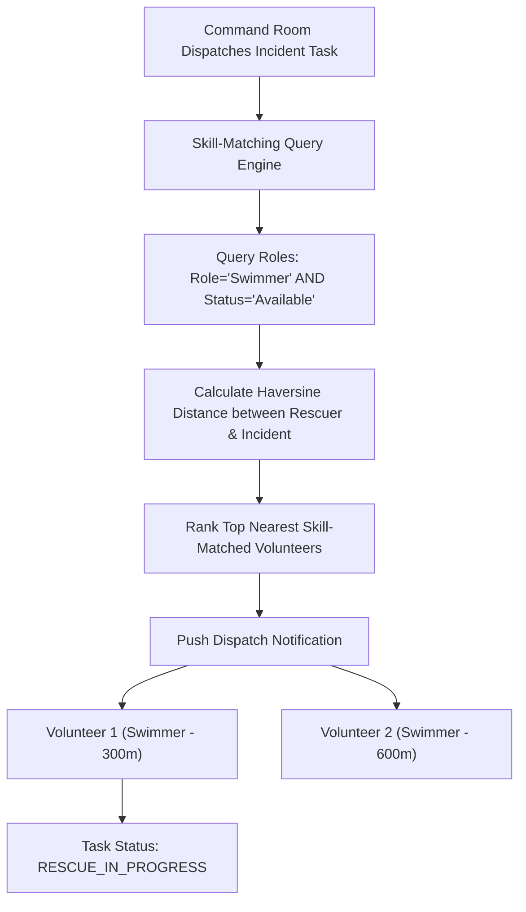
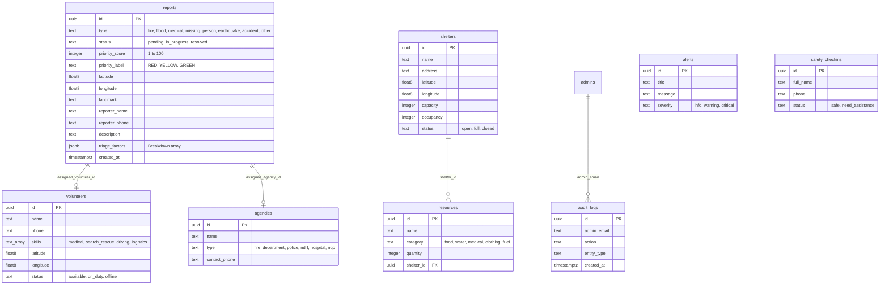

# 🛡️ AapdaSetu (आपदासेतु / આપદાસેતુ) — Disaster Response & AI Triage Ecosystem

> **A Next-Generation Web Platform & AI Engine for Real-Time Humanitarian Relief, Emergency Response, and Multi-Agency Incident Command.**  
> *Built with React 19, Next.js 13, Vite, Tailwind CSS, Leaflet.js, Supabase Realtime WebSockets, and a Python FastAPI AI Microservice Engine.*

[](https://github.com/MrinallSamal-byte/SIH)
[](https://github.com/MrinallSamal-byte/SIH)
[](LICENSE)

---

## 📌 Executive Summary

During major natural disasters (floods, cyclones, earthquakes), traditional response applications fail due to cellular network blackouts, control room overload, outdated navigation, and illiteracy barriers.

**AapdaSetu (आपदासेतु)** is a unified, web-based disaster management platform engineered for high-density, low-infrastructure environments. It bridges the critical "last-mile" rescue gap by combining:
1. **React Web Application (`frontend-AapdaSetu`)**: High-speed Vite client with Leaflet.js interactive maps, hazard route planning, and emergency forms.
2. **Next.js & Supabase Engine (`SOS-project with bolt`)**: Production-ready command center platform with 1-Tap SOS, 11 modular admin views, Supabase PostgreSQL RLS, and WebSockets real-time streaming.
3. **Python AI Microservice Engine (`apps/ai-engine`)**: FastAPI service providing automated emergency triage, SAR satellite flood mapping, anti-fraud damage assessment, and Psychological First Aid (PFA) chatbot grounding.

> [!IMPORTANT]
> **Zero User-Side Authentication Policy:** AapdaSetu is architected for zero-friction emergency accessibility during catastrophic disasters. There is **no user-side authentication or login required** for citizens or victims to trigger emergency SOS alerts, track incident status, view safe evacuation routes, receive early warnings, interact with the PFA AI chatbot, or submit safety check-ins. All emergency features are immediately accessible out-of-the-box.

---

## 🏗️ High-Level Architecture & System Flow Diagrams

### 1. Global End-to-End Multi-Stack System Architecture



---

### 2. Sequence Diagram: End-to-End Emergency SOS & Dispatch Lifecycle



---

### 3. AI Urgency Triage & Priority Scoring Pipeline



---

### 4. Disaster-Aware Dynamic Pathfinding (Leaflet.js Hazard Avoidance)



---

### 5. Rescuer Skill-Matching & Dispatch Pipeline



---

### 6. Relational Database ERD Schema



---

## 🛠️ Technology Stack

| Domain | Technology | Purpose |
| :--- | :--- | :--- |
| **Next.js Command Stack** | Next.js 13 (App Router), TypeScript | Full-featured command center client with SSR & hash router |
| **Vite Web Frontend** | React 19, Vite 8 | High-performance SPA client framework & rapid HMR |
| **Styling & UI** | Tailwind CSS 3.4, shadcn/ui, Radix UI | Modern dark mode, glassmorphic UI & custom design tokens |
| **Database & Realtime** | Supabase (PostgreSQL + WebSockets) | Database storage, RLS security policies, & real-time push |
| **Analytics** | Recharts | Dynamic interactive data visualizations & charts |
| **Animations** | Framer Motion 11 | Smooth micro-animations & modal transitions |
| **GIS Mapping** | Leaflet.js 1.9 | Real-time map rendering, hazard polygon display & route planning |
| **AI Engine Hub** | Python 3.10+, FastAPI | SOS Urgency Triage, PFA Chatbot, Damage Assessment & SAR Flood Mapping |

---

## 🌟 Key Functional Features

1. **🚨 1-Tap SOS Emergency Button:** Zero-friction distress trigger capturing live browser GPS coordinates.
2. **📝 Multi-Step Emergency Report Form:** Comprehensive intake supporting medical conditions, missing person details, landmark landmarks, and audio/video media uploads.
3. **🔍 Incident Tracking ID Lookup (`report-tracker.tsx`):** Real-time status lookup using emergency incident tracking IDs.
4. **🧠 Real-time AI Triage Scoring:** Dual TypeScript and Python triage matrix assigning `RED`, `YELLOW`, or `GREEN` priority badges.
5. **✅ Safety Status Check-ins:** Allows citizens in affected zones to check in as "Safe" or "Need Assistance".
6. **🏠 Nearby Shelter Finder:** Real-time distance calculation to open relief shelters using the Haversine geo-spatial formula.
7. **📢 Public Warning Alerts:** Broadcast feed pushed directly from the Command Center.
8. **🌐 Multi-lingual Engine:** Instant language switching across **English**, **Hindi (हिंदी)**, and **Odia (ଓଡ଼ିଆ)**.
9. **🎛️ Command Center (11 Views):** Overview, Live SOS Stream with real-time sound alarms, Incident Reports, Missing Persons, Volunteers, Shelters, Agencies, Communications, Recharts Analytics, Audit Logs, and Settings.
10. **🤖 Python AI Microservices (`apps/ai-engine`):**
    - `triage.py`: Explainable SOS urgency scoring.
    - `damage_assessment.py`: Anti-fraud property damage photo validation & pHash duplicate detection.
    - `pfa_chatbot.py`: Psychological First Aid with 4-second breathing and 5-4-3-2-1 grounding exercises.
    - `satellite_flood_mapping.py`: SAR Sentinel-1 satellite radar metadata processing generating GeoJSON flood polygons.

---

## 📁 Repository Directory Structure

```
SIH-DM/
├── frontend-AapdaSetu/                 # Primary React 19 + Vite Web Application
│   ├── src/
│   │   ├── components/                 # UI components (Navbar, Footer, Sidebar)
│   │   ├── layouts/                    # Main, Citizen, Admin, & Volunteer layout wrappers
│   │   ├── pages/                      # Feature pages (SOS, Alerts, Routes, Damage, etc.)
│   │   ├── App.jsx                     # Top-level routing switchboard
│   │   └── main.jsx                    # Vite application entry point
│   ├── package.json
│   └── vite.config.js
│
├── apps/
│   └── ai-engine/                      # Python AI Microservice Engine
│       └── app/
│           ├── main.py                 # AI Microservice integration harness & router
│           ├── triage.py               # Explainable SOS urgency scoring engine
│           ├── damage_assessment.py    # Photo anti-fraud & damage grading
│           ├── pfa_chatbot.py          # Psychological First Aid bot engine
│           └── satellite_flood_mapping.py # SAR satellite flood polygon generator
│
├── README.md                           # Master system documentation
├── flow.md                             # System workflow and architecture documentation
├── projectrequirement.md               # Scope and master feature matrix
├── tech.md                             # Technical architecture stack guide
└── LICENSE                             # MIT License
```

---

## 🚦 Getting Started & Local Development

### Prerequisites
- **Node.js**: v18.0.0 or higher
- **Python**: v3.10 or higher
- **npm**: v9.0.0 or higher

### 1. Web Application (`frontend-AapdaSetu`)
```bash
cd frontend-AapdaSetu
npm install
npm run dev      # Starts dev server on http://localhost:5173
```

### 2. Command Center Platform (`SOS-project with bolt/project`)
```bash
cd "../SOS-project with bolt/project"
npm install
npm run dev      # Starts dev server on http://localhost:3000
```
- Citizen Portal: `http://localhost:3000/`
- Admin Command Center: `http://localhost:3000/#admin`

### 3. Python AI Engine (`apps/ai-engine`)
```bash
cd apps/ai-engine
python app/main.py   # Executes AI microservice integration harness
```

---

## 📜 License & Acknowledgments

- Built under the **Smart India Hackathon (SIH) Disaster Management Initiative**.
- Designed for humanitarian disaster relief and emergency response worldwide.
- Open-source under the [MIT License](LICENSE).
