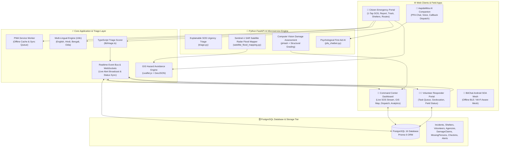
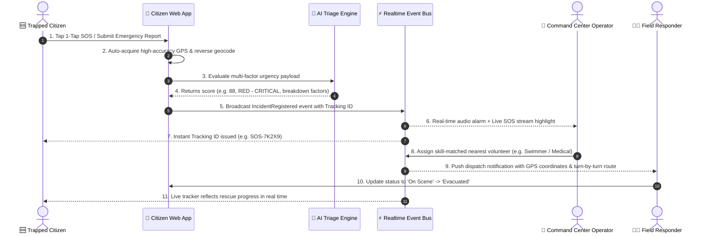
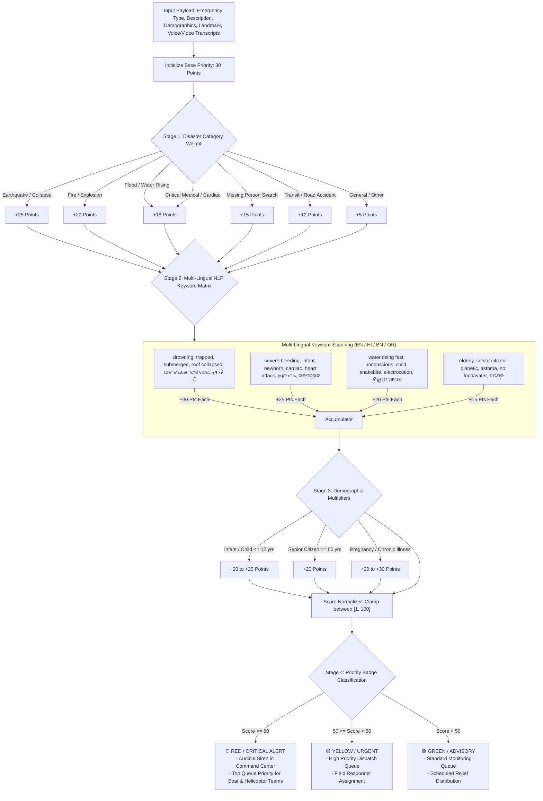
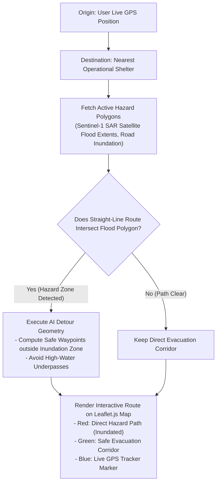
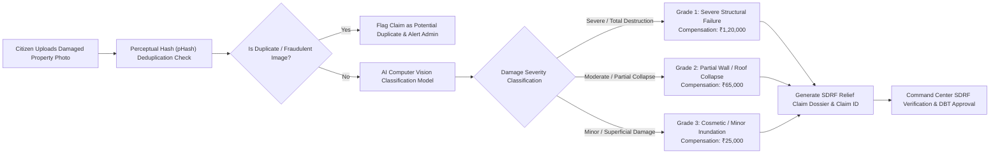
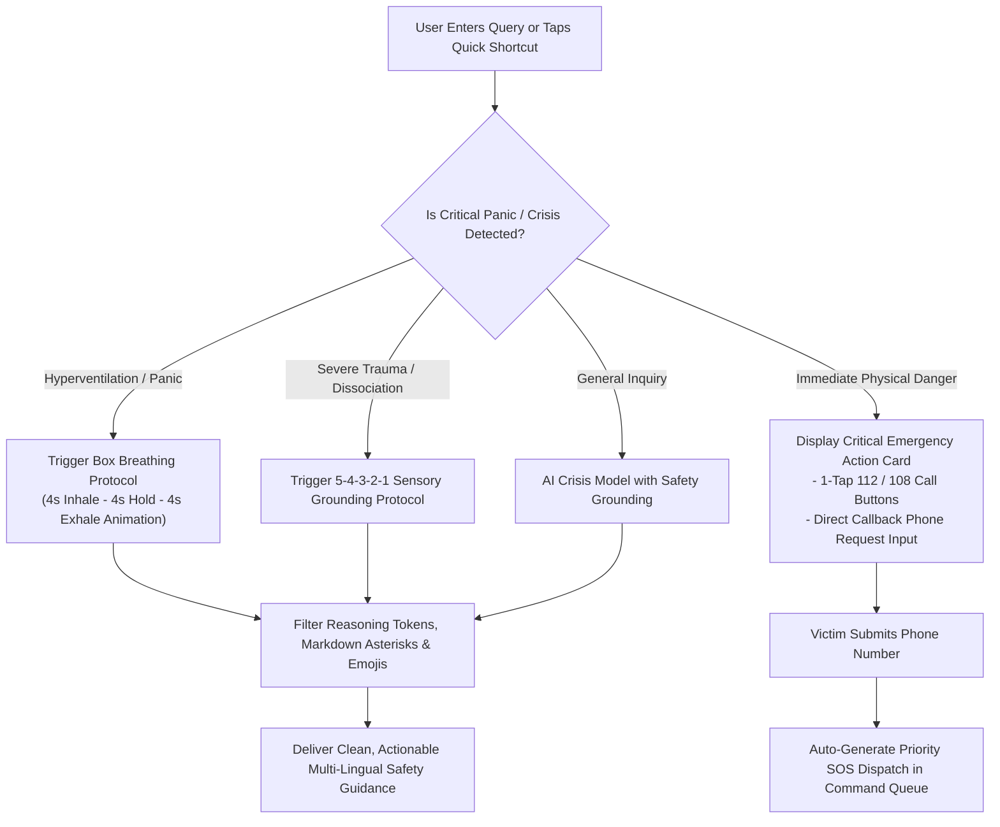

# 🛡️ AapdaSetu (आपदासेतु / આપદાસେતુ / ଆପଦାସେତୁ) — Disaster Response & AI Triage Ecosystem

> **A Comprehensive, Real-Time Humanitarian Relief, Emergency Response, and Multi-Agency Incident Command Platform.**  
> *Built with React 19, TypeScript, Vite, Tailwind CSS, Leaflet.js GIS, Realtime Event Bus, Prisma 6 PostgreSQL, FastAPI AI Microservices, and Offline BLE Mesh Support.*

[](https://github.com/MrinallSamal-byte/SIH)
[](https://github.com/MrinallSamal-byte/SIH)
[](https://github.com/MrinallSamal-byte/SIH)
[](LICENSE)

---

## 🌐 Live Deployment & Repositories

- **Live Web Application:** [https://sih-ochre-xi.vercel.app/](https://sih-ochre-xi.vercel.app/)
- **GitHub Repository:** [https://github.com/MrinallSamal-byte/SIH](https://github.com/MrinallSamal-byte/SIH)

---

## 📌 Executive Summary

During catastrophic natural disasters (floods, cyclones, earthquakes, building collapses), traditional emergency hotlines and web portals fail due to telecommunication congestion, illiteracy barriers, lack of geo-spatial intelligence, and centralized server bottlenecks.

**AapdaSetu (आपदासेतु)** is a unified disaster management and humanitarian relief ecosystem designed specifically for high-density, resource-constrained, and low-infrastructure environments. It bridges the critical "last-mile" rescue gap by seamlessly integrating:

1. **Citizen Emergency Portal (`frontend-aapdasetu`)**: Zero-authentication, high-accessibility mobile-first web app supporting 1-Tap SOS, voice/video incident reporting, live incident tracking, safe evacuation pathfinding, nearby relief shelter discovery, missing persons registry, and SDRF property damage assessment.
2. **AapdaMitra AI Crisis Lifeline (`ChatWidget` & `/pfa-chat`)**: 24/7 AI-powered disaster survival companion and Psychological First Aid (PFA) assistant with stress-reducing box breathing exercises, anti-reasoning output filters, and automatic one-tap emergency callback dispatch.
3. **Multi-Agency Command Center (`/admin/*`)**: Real-time incident command dashboard featuring live audio alarms for critical RED alerts, interactive GIS Leaflet mapping, skill-matched volunteer auto-dispatch, shelter capacity tracking, SDRF relief claim review, and multi-channel broadcast messaging.
4. **Volunteer Responder Portal (`/volunteer/*`)**: Dedicated field responder interface for viewing assigned rescue tasks, accessing turn-by-turn navigation to incident sites, updating rescue status milestones, and managing shelter rosters.
5. **AI Microservice Engine (`apps/ai-engine` & `fastapi-service`)**: FastAPI microservices delivering explainable multi-factor SOS urgency scoring, SAR satellite radar flood mapping, and anti-fraud computer vision property damage classification.
6. **Decentralized Offline Mesh (`bitchat-android`)**: Zero-infrastructure BLE (Bluetooth Low Energy) and Wi-Fi Aware peer-to-peer mesh communication for off-grid student campuses and isolated disaster zones.

> [!IMPORTANT]
> **Zero User-Side Authentication Policy:** To guarantee zero-friction access during life-or-death emergencies, **no login or account creation is required** for citizens to trigger SOS alerts, track rescue progress, search missing family members, check in as safe, find relief camps, or receive survival guidance.

---

## 🏗️ System Architecture & Workflow Diagrams

### 1. High-Level Multi-Tier Ecosystem Architecture



---

### 2. End-to-End Emergency SOS & Rescue Dispatch Lifecycle



---

### 3. Multi-Factor AI Urgency Triage Pipeline



---

### 4. Disaster-Aware Dynamic GIS Pathfinding & Hazard Avoidance



---

### 5. AI Property Damage Assessment & SDRF Relief Claim Workflow



---

### 6. Psychological First Aid (AapdaMitra AI) Conversational Workflow



---

### 7. Relational Database Schema (Prisma 6 PostgreSQL)

```mermaid
erDiagram
    Incident ||--o| Volunteer : "assigned_volunteer_id"
    Incident ||--o| Agency : "assigned_agency_id"
    Shelter ||--o{ Resource : "shelter_id"
    Shelter ||--o{ Facility : "shelter_id"
    Admin ||--o{ AuditLog : "admin_id"

    Incident {
        uuid id PK
        string tracking_id UK
        enum type "fire, flood, medical, missing_person, earthquake, accident, other"
        enum status "pending, in_progress, resolved"
        int priority_score "1..100"
        enum priority_label "RED, YELLOW, GREEN"
        float latitude
        float longitude
        string landmark
        string reporter_name
        string reporter_phone
        string description
        jsonb triage_factors
        string media_url
        boolean is_one_tap_sos
        datetime created_at
    }

    Volunteer {
        uuid id PK
        string name
        string phone
        string email
        enum_array skills "medical, search_rescue, driving, logistics"
        float latitude
        float longitude
        enum status "available, on_duty, offline"
        datetime last_checkin
    }

    Shelter {
        uuid id PK
        string name
        string address
        string district
        float latitude
        float longitude
        int capacity
        int occupancy
        enum status "open, full, closed"
        string contact_phone
    }

    Facility {
        uuid id PK
        uuid shelter_id FK
        enum type "food, water, medical_station, power_generator"
        boolean available
    }

    Resource {
        uuid id PK
        uuid shelter_id FK
        string name
        enum category "food, water, medical, clothing, fuel"
        int quantity
        string unit
    }

    Agency {
        uuid id PK
        string name
        enum type "fire_department, police, ndrf, sdrf, hospital, ngo"
        string contact_phone
        int active_personnel
    }

    SafetyCheckin {
        uuid id PK
        string full_name
        string phone
        string district
        enum status "safe, need_assistance"
        string message
        datetime created_at
    }

    MissingPerson {
        uuid id PK
        string full_name
        int age
        string gender
        string last_seen_location
        string clothes_description
        string contact_phone
        string photo_url
        enum status "open, matched, resolved"
        datetime created_at
    }

    DamageClaim {
        uuid id PK
        string claim_id UK
        string owner_name
        string owner_phone
        string property_address
        string district
        enum classification "MINOR_DAMAGE, MODERATE_DAMAGE, SEVERE_COLLAPSE, TOTAL_DESTRUCTION"
        float estimated_compensation
        string photo_url
        string phash
        datetime created_at
    }

    Alert {
        uuid id PK
        string title
        string message
        enum severity "info, warning, critical"
        enum channel "sms, whatsapp, public, all"
        string affected_region
        datetime created_at
    }

    AuditLog {
        uuid id PK
        string admin_email
        string action
        string entity_type
        string entity_id
        jsonb metadata
        datetime created_at
    }
```



---

## 🌟 Feature Breakdown by Portal

### 1. Citizen Emergency Portal (Zero-Auth)
- **1-Tap Emergency SOS (`/sos`)**: Immediate one-click distress broadcasting capturing browser GPS coordinates with accuracy radius, landmark notes, and offline SMS fallback.
- **Incident Reporting (`/report`)**: Intuitive multi-step report submission with photo, audio voice-recording, and video upload capabilities.
- **Incident Tracking (`/track`)**: Real-time status tracker by tracking ID with milestone timeline progression (`Distress Registered` -> `Response Dispatched` -> `Evacuated & Resolved`).
- **Nearby Shelter Finder (`/shelters`)**: Haversine distance-sorted relief camps showing live bed availability, facility badges, and one-touch calling.
- **Safe Evacuation Corridors (`/safe-routes`)**: Interactive Leaflet maps rendering dynamic detour routes avoiding flooded zones and damaged infrastructure.
- **Missing Persons Registry (`/missing-persons`)**: Searchable public bulletin database with image matching and guardian contact triggers.
- **Community Safety Check-in (`/check-in`)**: Public "I Am Safe" registry reducing search team overhead.
- **SDRF Property Damage Claim (`/report-damage`)**: Automated damage claim filing with instant AI damage classification and relief grant estimation.
- **Public Warning Bulletins (`/alerts`)**: Live feeds from NDMA, SDMA, and District Incident Commands.
- **Circular Floating AapdaMitra AI Button (`ChatWidget`)**: Ergonomic floating circular robot button with ambient glow positioned safely above mobile navigation bars.

### 2. Command Center & Admin Dashboard (`/admin/*`)
- **Real-Time Overview (`/admin`)**: Metric KPI summary cards, incident priority charts, and rapid triage shortcuts.
- **Live SOS Triage Stream (`/admin/live-sos`)**: Continuous WebSocket feed with loud sound alarms for critical RED distress alerts.
- **Incident Dossiers & Dispatch (`/admin/reports`)**: Comprehensive incident management, volunteer assignment, and status updates.
- **Shelter & Resource Manager (`/admin/shelters`)**: Camp capacity adjustment, inventory tracking, and facility status toggles.
- **Damage Assessment Approvals (`/admin/damage-assessment`)**: AI-assisted claim review with fraud detection and compensation disbursement.
- **Volunteer Fleet Tracking (`/admin/volunteers`)**: Responder skill matrix, GPS location, and duty roster.
- **Agency Coordination (`/admin/agencies`)**: Multi-departmental task allocation across NDRF, SDRF, Fire, Police, and NGOs.
- **Emergency Broadcast Center (`/admin/communications`)**: Geo-targeted alerts distributed across Public Web, SMS, and WhatsApp.
- **Analytics & Trends (`/admin/analytics`)**: Interactive Recharts data visualizations showing emergency trends and resolution times.
- **Audit Trails (`/admin/audit-logs`)**: Tamper-evident activity logs recording every administrative action.

### 3. Volunteer Portal (`/volunteer/*`)
- **Field Responder Dashboard (`/volunteer/dashboard`)**: Current duty status switcher, active emergency task queue, and quick-dispatch actions.
- **Assigned Tasks & Turn-by-Turn GPS (`/volunteer/tasks`)**: Victim contact details, triage severity factors, and embedded mapping navigation.
- **Field Check-In (`/volunteer/checkin`)**: Geofenced GPS check-in to confirm responder safety and arrival on scene.

---

## 🛠️ Technology Stack

| Layer | Technologies | Purpose |
| :--- | :--- | :--- |
| **Frontend Framework** | React 19, TypeScript, Vite 6 | High-speed SPA client with lightning-fast HMR |
| **Styling & Design System** | Tailwind CSS, Lucide React, Glassmorphism | Responsive dark/light theme, custom accessible design tokens |
| **GIS & Mapping** | Leaflet.js 1.9, React-Leaflet | Dynamic hazard polygons, marker clustering & route visualization |
| **State & Realtime** | Realtime Event Bus, WebSockets, Custom Hooks | Instant synchronization between citizen reports and command center |
| **Backend & ORM** | Node.js, Express, TypeScript, Prisma 6 | Robust REST API endpoints with PostgreSQL database |
| **Database** | PostgreSQL 16 | Relational data persistence with UUID primary keys and indexes |
| **AI Microservices** | Python 3.10+, FastAPI, PyTorch, OpenCV, OpenRouter | Urgency Triage, PFA Chatbot, SAR Flood Mapping & Image Damage Classification |
| **PWA & Offline** | Web App Manifest, Service Worker (`sw.js`), Cache API | Offline asset caching and queued incident submission |
| **SOA Mesh App** | Kotlin, Jetpack Compose, BLE, Wi-Fi Aware | Offline peer-to-peer mesh messaging for network-free disaster zones |

---

## 📁 Repository Directory Structure

```
SIH-DM/
├── frontend-aapdasetu/                 # Primary React 19 + TypeScript + Vite Web Application
│   ├── public/                         # Web manifest, icons, and Service Worker (sw.js)
│   ├── src/
│   │   ├── api/                        # API clients, OpenRouter AI adapters, and mock data
│   │   ├── components/                 # Reusable UI components (AapdaSetuLogo, ChatWidget, Modal, Map)
│   │   ├── layouts/                    # MainLayout, AdminLayout, VolunteerLayout
│   │   ├── lib/                        # Helpers, i18n dictionary (EN/HI/BN/OR), triage engine, event bus
│   │   ├── pages/
│   │   │   ├── admin/                  # 11 Command Center views (LiveSOS, Shelters, Reports, etc.)
│   │   │   ├── citizen/                # Citizen views (SOS, Home, Report, SafeRoutes, PfaChat, etc.)
│   │   │   └── volunteer/              # Volunteer views (Dashboard, AssignedTasks, CheckIn)
│   │   ├── types.ts                    # Central TypeScript interfaces and data models
│   │   ├── App.tsx                     # Route switchboard
│   │   └── main.tsx                    # Vite entry point
│   ├── package.json
│   └── vite.config.ts
│
├── backend-aapdasetu/                  # Node.js + Express + Prisma 6 PostgreSQL Backend
│   ├── prisma/                         # Prisma schema (schema.prisma) and seed data
│   ├── src/                            # Controllers, services, routes, middleware, and realtime hub
│   ├── fastapi-service/                # Integrated Python FastAPI service for damage and triage ML
│   └── package.json
│
├── apps/
│   └── ai-engine/                      # Standalone Python AI Microservice Engine
│       └── app/
│           ├── main.py                 # FastAPI microservice router
│           ├── triage.py               # Explainable SOS urgency scoring engine
│           ├── damage_assessment.py    # Photo anti-fraud & structural damage grading
│           ├── pfa_chatbot.py          # Psychological First Aid bot engine
│           └── satellite_flood_mapping.py # SAR Sentinel-1 satellite radar flood mapper
│
├── bitchat-android/                    # Offline BLE / Wi-Fi Aware Android Mesh App
│   ├── app/                            # Kotlin, Jetpack Compose, BLE mesh network protocol
│   ├── wear/                           # Wear OS companion app
│   └── README.md                       # Comprehensive SOA Mesh documentation
│
├── README.md                           # Master system documentation
├── flow.md                             # System workflow and architecture documentation
├── projectrequirement.md               # Scope and master feature matrix
└── LICENSE                             # MIT License
```

---

## 🚦 Getting Started & Local Development

### Prerequisites
- **Node.js**: v18.0.0 or higher
- **npm**: v9.0.0 or higher
- **Python**: v3.10 or higher
- **PostgreSQL**: v15.0 or higher *(Optional for local database mode)*

### 1. Web Application (`frontend-aapdasetu`)
```bash
cd frontend-aapdasetu
npm install
npm run dev      # Starts Vite dev server on http://localhost:5173
```
- **Citizen Portal**: `http://localhost:5173/`
- **1-Tap SOS**: `http://localhost:5173/#/sos`
- **Command Center**: `http://localhost:5173/#/admin`
- **Volunteer Portal**: `http://localhost:5173/#/volunteer`

### 2. Backend API Service (`backend-aapdasetu`)
```bash
cd backend-aapdasetu
npm install
npx prisma generate
npm run dev      # Starts Express backend on http://localhost:3000
```

### 3. Standalone Python AI Microservice (`apps/ai-engine`)
```bash
cd apps/ai-engine
python3 -m venv venv
source venv/bin/activate
pip install -r requirements.txt
python app/main.py   # Starts FastAPI microservices on http://localhost:8000
```

### 4. Offline Mesh Android App (`bitchat-android`)
```bash
cd bitchat-android
./gradlew assembleDebug   # Builds debug APK for offline BLE mesh testing
adb install -r app/build/outputs/apk/debug/app-debug.apk
```

---

## 📜 License & Acknowledgments

- Developed under the **Smart India Hackathon (SIH) Disaster Management Initiative**.
- Built with humanitarian commitment to saving lives and coordinating rapid disaster relief worldwide.
- Open-source under the [MIT License](LICENSE).
