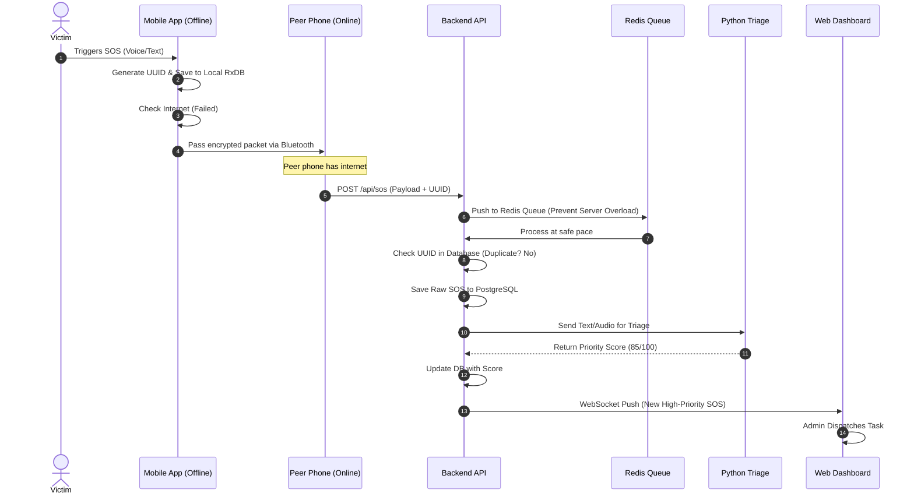
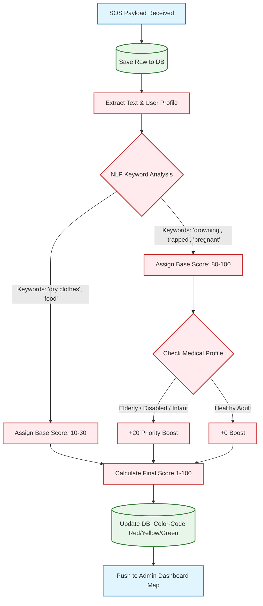
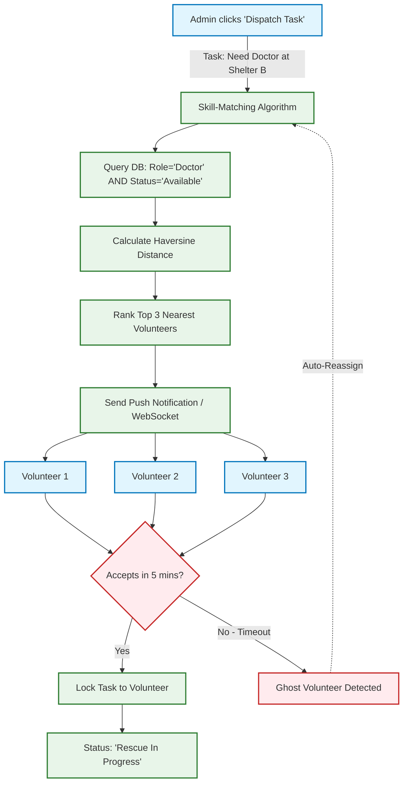
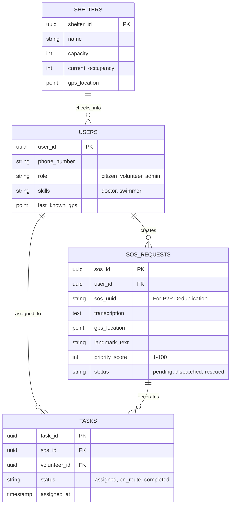
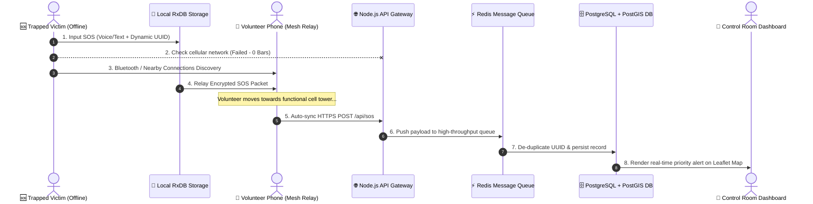
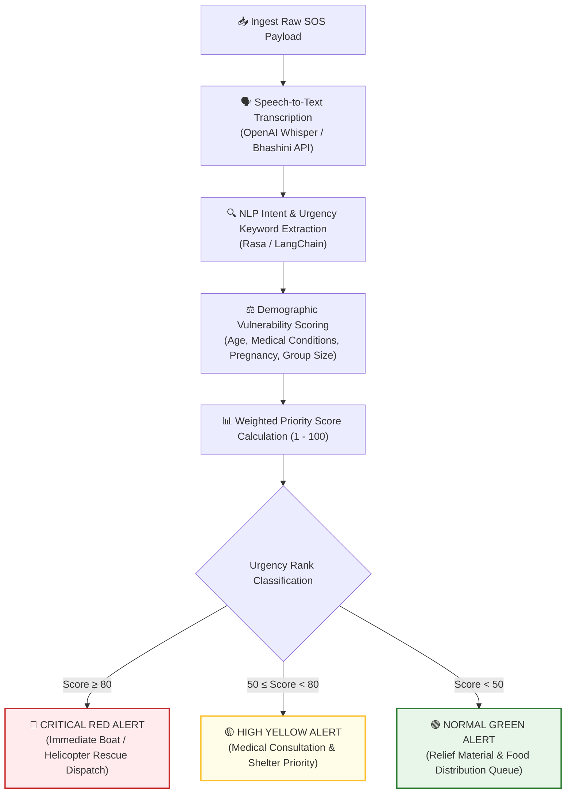
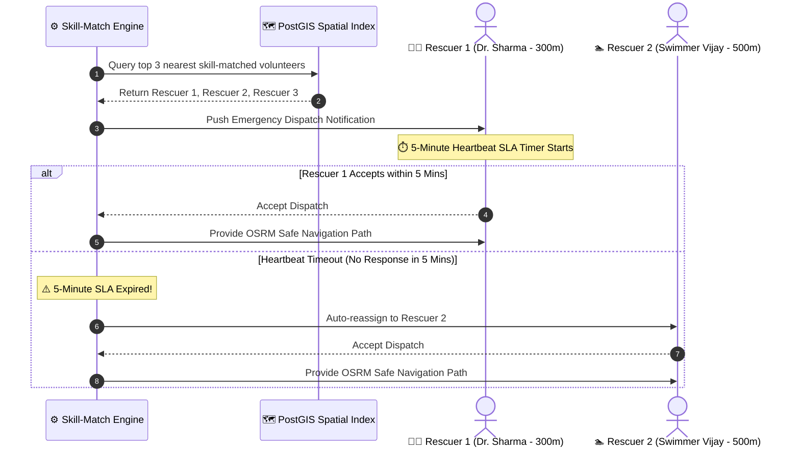
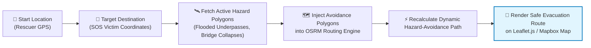

```mermaid
flowchart LR
    subgraph P1["Project 1: React Native P2P Mobile App (Edge Client)"]
        User["🆘 Citizen"] -- "Voice / Text Input" --> AppUI["📱 App Interface"]
        AppUI --> EdgeGPS{"📡 GPS Acquired?"}
        EdgeGPS -- "No" --> ManualLand["📝 Prompt for Landmark Text"]
        EdgeGPS -- "Yes" --> GenID["🔑 Generate Unique SOS UUID"]
        ManualLand --> GenID
        GenID --> Foreground["⚙️ Start Foreground Service"]
        Foreground --> LocalDB[("💾 Save to RxDB Local DB")]
        LocalDB --> CheckNet{"🌐 Internet Available?"}
        CheckNet -- "YES" --> APIPost["🚀 Send POST /api/sos"]
        CheckNet -- "NO - Total Offline" --> MeshNet["📡 P2P Bluetooth Mesh Search"]
        MeshNet -. "Pass UUID + Packet" .-> PeerPhone(("📱 Nearby Peer Device"))
        PeerPhone -- "Peer has Internet" --> APIPost
    end

    APIPost ==>|"🔒 Encrypted HTTPS Payload"| APIGateway

    subgraph P2["Project 2: Web Platform, AI Microservices & Cloud Backend"]
        APIGateway["🌐 Node.js API Gateway"] --> RedisQueue[("⚡ Redis Message Queue")]
        RedisQueue --> Processor["⚙️ Node.js Processor"]
        Processor --> Dedup{"🔍 UUID Exists in DB?"}
        Dedup -- "YES" --> Drop["🗑️ Drop Duplicate silently"]
        Dedup -- "NO" --> SaveDB["💾 Save to PostgreSQL"]
        SaveDB --> AITriage["🧠 Python FastAPI: AI Triage"]
        AITriage --> Database[("🗄️ PostgreSQL + PostGIS")]
        Database --> AdminDash["🚨 Admin Command Center - React.js"]
        AdminDash --> SkillMatch["🎯 Skill-Matching Engine"]
        SkillMatch --> VolunteerPortal["🧑‍🚒 Volunteer Portal - PWA"]
        VolunteerPortal --> Heartbeat{"⏱️ Volunteer Accepts & Pings?"}
        Heartbeat -- "No response in 5 mins" --> Reassign["🔄 Auto-Reassign to Next Volunteer"]
        Reassign --> SkillMatch
        Heartbeat -- "Yes" --> RescueOps["🚑 Execute Rescue via OSRM Safe Route"]
        RescueOps -.-> APIGateway
    end

    classDef p1 fill:#fff3e0,stroke:#e65100,stroke-width:2px;
    classDef p2 fill:#e1f5fe,stroke:#0277bd,stroke-width:2px;
    classDef api fill:#e8f5e9,stroke:#2e7d32,stroke-width:2px;
    classDef edge fill:#ffebee,stroke:#c62828,stroke-width:2px;
    classDef db fill:#f3e5f5,stroke:#6a1b9a,stroke-width:2px;
    classDef ai fill:#fff9c4,stroke:#fbc02d,stroke-width:2px;

    class AppUI,GenID,MeshNet,PeerPhone,APIPost p1;
    class EdgeGPS,ManualLand,Foreground,CheckNet,RedisQueue,Dedup,Drop edge;
    class LocalDB,SaveDB,Database db;
    class APIGateway,Processor api;
    class AITriage ai;
    class AdminDash,VolunteerPortal,RescueOps p2;
```

# 🛡️ AapdaSetu (आपदासेतु) — Offline-First Disaster Management & Emergency Response Ecosystem

> **A Next-Generation, Software-Only Disaster Response & Humanitarian Relief Platform**  
> *Enabling Peer-to-Peer Bluetooth Mesh SOS Syncing, Explainable AI Triage, Disaster-Aware Safe Routing, Low-Bandwidth Telemedicine, and Multi-Agency Incident Command.*

[](https://github.com/MrinallSamal-byte/SIH)
[](https://github.com/MrinallSamal-byte/SIH)
[](https://github.com/MrinallSamal-byte/SIH)
[](LICENSE)

---

## 📌 Executive Summary

During major disasters (floods, earthquakes, cyclones), traditional emergency response apps fail due to **cellular network collapse**, **control room overload**, **outdated mapping**, and **illiteracy barriers**.

**AapdaSetu (आपदासेतु)** is a unified, software-only disaster management architecture engineered for high-density, low-infrastructure environments. It bridges the critical "last-mile" rescue gap by establishing an **offline-first peer-to-peer (P2P) mesh network**, an **AI-driven priority triage engine**, **voice-first multi-lingual interfaces**, and a **multi-agency unified command center**.

---

## 🏗️ Interactive Architectural Overview & Subsystem Flowcharts

### 1. High-Level System Architecture

*Shows how Project 1 (Mobile P2P App), Project 2 (Web Platform & Backend), and External Integrations connect.*


---

### 2. Sequence Diagram: The "Offline-to-Online" SOS Lifecycle

*This diagram shows the exact chronological steps of an SOS request, proving to reviewers how the offline P2P handoff and duplicate prevention work.*



---

### 3. AI Triage & Priority Engine Pipeline

*Use this to explain how the system prevents control room overload by automatically sorting 10,000+ requests.*



---

### 4. Volunteer Skill-Matching & Dispatch Flow

*This diagram explains Feature 10 (Algorithmic Skill-Matching) and the "Ghost Volunteer" edge-case handling.*



---

### 5. Database Entity Relationship Diagram (ERD)

*This is crucial for your backend developers. It shows the core tables required for PostgreSQL/PostGIS.*



---

<details open>
<summary><b>📐 6. Detailed End-to-End System Architecture & Data Flow (Click to Collapse/Expand)</b></summary>
<br/>


</details>

<details open>
<summary><b>📡 2. Interactive Sequence Diagram: Offline P2P Mesh SOS Relaying</b></summary>
<br/>


</details>

<details open>
<summary><b>🧠 3. Interactive Flowchart: Explainable AI Urgency Triage & Priority Scoring</b></summary>
<br/>


</details>

<details open>
<summary><b>🎯 4. Interactive Sequence Diagram: Rescuer Skill-Match & 5-Minute Heartbeat Loop</b></summary>
<br/>


</details>

<details open>
<summary><b>🗺️ 5. Interactive Flowchart: Disaster-Aware Dynamic OSRM Safe Pathfinding</b></summary>
<br/>


</details>

---

## 🌟 Comprehensive 20-Feature Deep-Dive

> [!IMPORTANT]
> All 20 features are designed as a unified platform with a **Core Spine** (Phase 1) and **Modular Plugins** (Phases 2-4).

### 🚀 Core Platform Features (Phase 1–3 Execution)

#### 1. Peer-to-Peer Offline SOS Sync (Bluetooth/Wi-Fi Mesh)
- **Problem**: Disaster zones experience total cellular blackout; cloud-dependent apps fail.
- **Solution**: Stores SOS packets in local database (`RxDB`). If no internet is detected, the app uses **Google Nearby Connections API** / **Web Bluetooth API** to discover nearby devices and hop encrypted packets across phones until a device with cellular connectivity relays them to the control room.
- **Edge Case**: Victim trapped under rubble with zero connectivity; a volunteer 100m away with weak signal auto-relays the SOS.
- **Tech Stack**: React Native, RxDB (IndexedDB / SQLite), Web Bluetooth / Nearby Connections API.

#### 2. Explainable AI Triage & Priority Engine
- **Problem**: Control rooms receive 10,000+ simultaneous calls, creating deadly dispatch bottlenecks.
- **Solution**: Backend algorithm automatically parses incoming text/voice transcripts and victim demographic data (age, disability, pregnancy) to assign a dynamic urgency priority score (1–100).
- **Edge Case**: Prevents life-threatening requests (e.g., drowning, diabetic shock) from getting buried under lower-priority relief requests.
- **Tech Stack**: Python (FastAPI), Scikit-Learn / TensorFlow, NLP Keyword Weighting.

#### 3. Voice-First NLP Interface for Zero-Literacy Users
- **Problem**: 26% of India's population faces literacy challenges; panic hinders complex app navigation.
- **Solution**: Completely voice-driven UI. The victim speaks naturally (e.g., *"मदद करो, मैं छत पर फंसा हूँ"*). Speech is transcribed, intent extracted, and SOS created without button interactions.
- **Edge Case**: Elderly or panic-stricken citizens unable to touch or navigate menus.
- **Tech Stack**: OpenAI Whisper AI / Bhashini API (Speech-to-Text), Rasa / LangChain (Intent Extraction).

#### 4. Disaster-Aware Dynamic Routing Engine
- **Problem**: Standard GPS maps guide citizens into newly flooded underpasses or collapsed bridges.
- **Solution**: Ingests crowdsourced and verified hazard polygons. The routing engine dynamically recalculates the safest evacuation path to shelters, circumscribing hazard zones.
- **Edge Case**: Preventing evacuees from driving into active flood zones due to outdated mapping data.
- **Tech Stack**: OSRM (Open Source Routing Machine), Leaflet.js, Turf.js spatial calculation.

#### 5. Low-Bandwidth WebRTC Telemedicine
- **Problem**: Isolated medical emergencies (snakebites, child delivery) cannot wait for physical rescue.
- **Solution**: In-app WebRTC video/audio streaming fallback, strictly optimized for 2G network bitrates with preliminary AI symptom triage.
- **Edge Case**: Remote medical consultation on sub-50 kbps connection speeds.
- **Tech Stack**: Jitsi Meet WebRTC API, Socket.io, Node.js queue dispatcher.

#### 6. On-Device Facial Matching for Missing Persons
- **Problem**: Paper missing-person lists across dozens of shelters take weeks to cross-reference.
- **Solution**: Runs lightweight neural facial recognition locally on-device. Photos are converted to vector embeddings and compared via Cosine Similarity without needing cloud databases.
- **Edge Case**: Reuniting separated children with families offline without cloud access or privacy leaks.
- **Tech Stack**: Face-API.js / InsightFace (ONNX Runtime), Vector Cosine Distance.

#### 7. Dynamic QR Code Shelter Check-In System
- **Problem**: Paper shelter registers get lost, causing chaotic overcrowding and uncounted victims.
- **Solution**: Citizen app generates a dynamic encrypted Family QR code. Shelter admins scan it using a PWA tablet app to instantly update live capacity and registry records.
- **Edge Case**: Tracking split families across multiple shelters in real-time.
- **Tech Stack**: React PWA, `qrcode.react`, HTML5 Camera API.

#### 8. Multi-Channel Geofenced Early Warning System (EWS)
- **Problem**: Alerts broadcasted on social media fail to reach fishermen at sea or rural villagers without smartphones.
- **Solution**: Cron jobs pull official weather/cyclone alerts (IMD/INCOIS APIs). PostGIS identifies all registered citizens inside the hazard polygon and triggers automated App Push, SMS, WhatsApp, and IVR Voice Calls.
- **Edge Case**: Warning non-smartphone users via automated voice call (IVR) on basic feature phones.
- **Tech Stack**: PostGIS, Node.js Cron, Twilio API (SMS/IVR), Meta WhatsApp Cloud API.

#### 9. Crowdsourced AI Damage Assessment (Anti-Fraud)
- **Problem**: Manual property damage assessment for government aid takes 6–8 months and is prone to corruption.
- **Solution**: Citizens submit photo evidence of damaged property. The system extracts EXIF metadata (GPS, timestamp) to verify authenticity, checks perceptual hashes (pHash) against duplicate uploads, and uses vision AI to grade structural damage (Minor, Major, Fully Destroyed).
- **Edge Case**: Detecting fraudulent or recycled internet photos of past disaster damage.
- **Tech Stack**: ExifReader, pHash library, ResNet50 (PyTorch / TensorFlow).

#### 10. Algorithmic Skill-Matching Volunteer Engine
- **Problem**: Thousands of volunteers arrive on-site, but skilled personnel (doctors, swimmers) are assigned to manual labor.
- **Solution**: Matches verified volunteer skill profiles against incoming emergency demands. Automatically dispatches tasks to the top 3 nearest, available, skill-matched volunteers using spatial proximity.
- **Edge Case**: Rapidly dispatching a certified diver to a submergence call within 300 meters.
- **Tech Stack**: PostgreSQL + PostGIS, Haversine formula, Node.js dispatch engine.

---

### 🛡️ Advanced Disaster Modules (Phase 4 Infrastructure)

#### 11. AI-Powered Psychological First Aid (PFA) Chatbot
- **Problem**: Trauma, panic, and PTSD are rampant during disasters, leading to irrational victim behavior.
- **Solution**: An empathetic AI companion integrated into the app that guides trapped victims through breathing exercises, survival instructions, and grounding techniques while awaiting rescue.
- **Tech Stack**: Llama 3 / GPT-4 via LangChain, Rasa dialogue state engine.

#### 12. Automated Direct Benefit Transfer (DBT) Pipeline
- **Problem**: Government compensation payout takes months due to physical paperwork and bureaucratic delays.
- **Solution**: Links verified AI damage assessment files directly to digital audit pipelines for one-click admin approval and mock Aadhaar e-KYC / bank disbursement.
- **Tech Stack**: Node.js workflow engine, PDFKit, Aadhaar e-KYC API mock layer.

#### 13. Multi-Agency Unified Command Dashboard (Incident Command System - ICS)
- **Problem**: NDRF, Military, Navy, and NGOs operate in silos without centralized spatial visibility.
- **Solution**: A unified GIS dashboard giving each agency color-coded sectors, resource counters, and active mission tracking to prevent duplicate resource deployment.
- **Tech Stack**: React.js, Redux Toolkit, Leaflet.js / Mapbox GL, PostGIS spatial boundaries.

#### 14. Cryptographic Aid & Donation Tracker
- **Problem**: Donors lose trust due to lack of transparency in relief material distribution.
- **Solution**: A transparent cryptographic hash-chain tracking donations from financial contribution to vendor purchase and final shelter QR check-in scan.
- **Tech Stack**: Cryptographic SHA-256 Ledger / Polygon L2 Smart Contracts, Web3.js.

#### 15. AI-Routed Grievance Redressal & Anti-Corruption Module
- **Problem**: Disaster victims face discrimination or bribery demands during relief distribution.
- **Solution**: Multi-channel complaint reporting (App, WhatsApp, IVR) parsed by NLP classifiers and routed directly to senior district officers with strict SLA escalation timers.
- **Tech Stack**: HuggingFace Transformers, Twilio API, Automated SLA Escalation Cron.

#### 16. Satellite Imagery AI Flood Mapping
- **Problem**: Ground visibility is zero during severe inundation; rescue teams cannot pinpoint submerged villages.
- **Solution**: Ingests open-source Sentinel-1 SAR (Synthetic Aperture Radar) satellite data. A computer vision model extracts water boundaries to generate real-time flood extent GeoJSON overlays.
- **Tech Stack**: Python Sentinel Hub API, PyTorch U-Net Segmentation, GeoJSON.

#### 17. Digital Dead Body Management (DBM) Forensic Registry
- **Problem**: Unidentified victims are buried in mass graves without forensic identification or family closure.
- **Solution**: Encrypted registry where rescue teams upload physical feature data (tattoos, scars, birthmarks). Vector search auto-matches entries against missing-person queries.
- **Tech Stack**: Milvus Vector DB, E2EE (End-to-End Encryption), React Native image blurring.

#### 18. Accessibility & Sign Language Engine
- **Problem**: Hearing-impaired and vision-impaired citizens cannot hear emergency sirens or read complex maps.
- **Solution**: Software overlay converting textual emergency warnings into 3D Indian Sign Language (ISL) avatar animations, coupled with screen-reader optimizations.
- **Tech Stack**: Web Speech API, 3D Avatar Rendering, ARIA Accessibility Standard.

#### 19. Animal & Livestock Rescue Parallel System
- **Problem**: Farmers refuse to evacuate without their livestock, putting themselves and rescuers at extreme risk.
- **Solution**: Dedicated animal SOS reporting tag allowing farmers to pinpoint tied or trapped livestock, enabling animal rescue teams to coordinate evacuation and fodder supply.
- **Tech Stack**: PostgreSQL spatial tagging, WhatsApp Bot intake, Leaflet cluster maps.

#### 20. Crowdsourced Epidemic & WASH Surveillance Heatmap
- **Problem**: Post-flood waterborne diseases (cholera, typhoid) cause severe post-disaster mortality.
- **Solution**: Shelter health symptom tracker. Aggregates health reports to project early disease outbreaks on a GIS heatmap when cases breach statistical thresholds.
- **Tech Stack**: Mapbox GL Heatmap, Statistical Outbreak Threshold Engine.

---

## 🛠️ Complete Technology Stack

| Category | Technology | Purpose |
| :--- | :--- | :--- |
| **Mobile App (Edge)** | React Native, RxDB, SQLite | Offline-first P2P Mobile Client |
| **P2P Mesh Transfer** | Google Nearby Connections, Web Bluetooth | Zero-Internet SOS Relaying |
| **Web Dashboards** | React.js, Redux, Leaflet.js, Mapbox GL | Admin Command & Volunteer Portal |
| **API Gateway** | Node.js, Express.js | High-throughput API routing & sync |
| **Message Queue** | Redis, BullMQ | Asynchronous payload queueing |
| **AI Microservices** | Python, FastAPI, PyTorch, Scikit-Learn | Triage scoring, Vision & NLP models |
| **Primary Database** | PostgreSQL + PostGIS | Relational & Spatial GIS Queries |
| **Vector Database** | Milvus / Face-API Vector Index | Facial & forensic feature search |
| **Speech & NLP** | OpenAI Whisper, Bhashini API, Rasa | Multi-lingual STT & Intent Parsing |
| **Routing Engine** | OSRM (Open Source Routing Machine) | Disaster-aware safe pathfinding |
| **Telemedicine** | Jitsi WebRTC, Socket.io | Low-bandwidth audio/video calls |
| **Communications** | Twilio (SMS/IVR), Meta WhatsApp Cloud API | Multi-channel Early Warnings |

---

## 📁 Repository Structure

```
AapdaSetu/
├── apps/
│   ├── mobile-app/          # Project 1: React Native P2P App
│   │   ├── src/
│   │   │   ├── components/  # UI components (Voice Recorder, Map View, QR Generator)
│   │   │   ├── database/    # RxDB schemas & local sync configuration
│   │   │   ├── mesh/        # Bluetooth & Nearby Connections P2P Mesh drivers
│   │   │   ├── services/    # GPS tracking & Foreground service background workers
│   │   │   └── screens/     # Citizen SOS, Rescuer Map, Missing Persons
│   │   ├── package.json
│   │   └── App.tsx
│   │
│   ├── api-gateway/         # Node.js / Express Ingestion Gateway
│   ├── ai-engine/           # Python FastAPI Triage & NLP Service
│   ├── admin-dashboard/     # React.js Multi-Agency Command Center (ICS)
│   ├── volunteer-portal/    # React PWA Volunteer Task Portal
│   └── routing-service/     # OSRM custom spatial polygon avoidance service
│
├── database/                # PostgreSQL schemas & PostGIS migration scripts
├── docs/                    # Architecture diagrams & API documentation
├── diagram.svg              # Complete System Flow Diagram
├── The AapdaSetu Software-Only Master.txt # Master Plan Specifications
└── README.md                # Project README
```

---

## 🚦 Getting Started & Local Development

### Prerequisites
- **Node.js**: v18.x or higher
- **Python**: v3.10 or higher
- **PostgreSQL**: v15 with PostGIS extension
- **Redis**: v7.x
- **Docker & Docker Compose** (Recommended)

### 1. Database & Infrastructure Setup
```bash
# Clone the repository
git clone https://github.com/MrinallSamal-byte/SIH.git
cd SIH

# Spin up PostgreSQL + PostGIS & Redis via Docker
docker-compose up -d postgres redis
```

### 2. Node.js API Gateway Setup
```bash
cd apps/api-gateway
npm install
npm run dev
# Server listening on http://localhost:5000
```

### 3. Python AI Triage Engine Setup
```bash
cd apps/ai-engine
python -m venv venv
source venv/bin/activate  # On Windows: venv\Scripts\activate
pip install -r requirements.txt
uvicorn main:app --reload --port 8000
# AI Engine listening on http://localhost:8000
```

### 4. Admin Command Center Web App
```bash
cd apps/admin-dashboard
npm install
npm run dev
# Dashboard available on http://localhost:3000
```

### 5. React Native Mobile App Setup
```bash
cd apps/mobile-app
npm install
npx react-native run-android  # Or run-ios
```

---

## 🔌 Core API Specifications

### 1. Ingest Emergency SOS
- **Endpoint**: `POST /api/sos`
- **Payload**:
```json
{
  "sos_uuid": "e7072f6c-9e55-43fa-b1a7-43c2ca3369fc",
  "timestamp": "2026-07-27T23:11:34Z",
  "location": {
    "latitude": 22.5726,
    "longitude": 88.3639,
    "landmark": "Near Salt Lake Sector V Petrol Pump"
  },
  "victim_info": {
    "name": "Ramesh Kumar",
    "age": 62,
    "medical_conditions": ["Diabetes", "Heart Condition"],
    "group_size": 4
  },
  "transcript": "पानी 5 फीट तक भर गया है, 3 लोग छत पर हैं",
  "is_mesh_relayed": true,
  "relayed_by_device_id": "DEV_88912_MESH"
}
```
- **Response**:
```json
{
  "status": "QUEUED",
  "message": "SOS received and pushed to processing queue",
  "sos_uuid": "e7072f6c-9e55-43fa-b1a7-43c2ca3369fc"
}
```

### 2. AI Triage Output Schema
- **Endpoint**: `POST /api/triage/score`
- **Response**:
```json
{
  "sos_uuid": "e7072f6c-9e55-43fa-b1a7-43c2ca3369fc",
  "priority_score": 94.5,
  "urgency_level": "CRITICAL_RED",
  "extracted_keywords": ["water 5ft", "trapped on roof", "elderly"],
  "recommended_action": "DISPATCH_BOAT_AND_MEDICAL"
}
```

---

## 🎯 Development Roadmap & Phased Execution

```
  Phase 1: Core Spine (Offline SOS + P2P Mesh + Gateway + Admin Map)
  ├── 1. Peer-to-Peer Bluetooth SOS Mesh Sync
  ├── 2. RxDB Offline Storage & Synchronization
  ├── 3. Node.js Gateway & PostgreSQL Database Setup
  └── 4. Leaflet.js Real-Time Admin Command Map

  Phase 2: Smart AI & Routing Layers
  ├── 1. Voice-First NLP Interface (Whisper / STT)
  ├── 2. Explainable AI Triage Scoring Engine (FastAPI)
  └── 3. OSRM Hazard-Avoidance Routing Engine

  Phase 3: Coordination & Recovery Modules
  ├── 1. Dynamic QR Code Shelter Check-in PWA
  ├── 2. On-Device Missing Persons Facial Matching
  ├── 3. Algorithmic Skill-Matching Volunteer Engine
  └── 4. Low-Bandwidth WebRTC Telemedicine

  Phase 4: Advanced Disaster Infrastructure
  ├── 1. Sentinel-1 Satellite AI Flood Mapping
  ├── 2. Cryptographic Relief Aid Tracker
  ├── 3. AI Direct Benefit Transfer (DBT) Payout Pipeline
  └── 4. Epidemic & WASH Outbreak Heatmap
```

---

## 📜 License & Acknowledgments

- Built under the **Smart India Hackathon (SIH) Disaster Management Initiative**.
- Designed for humanitarian disaster relief and emergency response worldwide.
- Open-source under the [MIT License](LICENSE).
