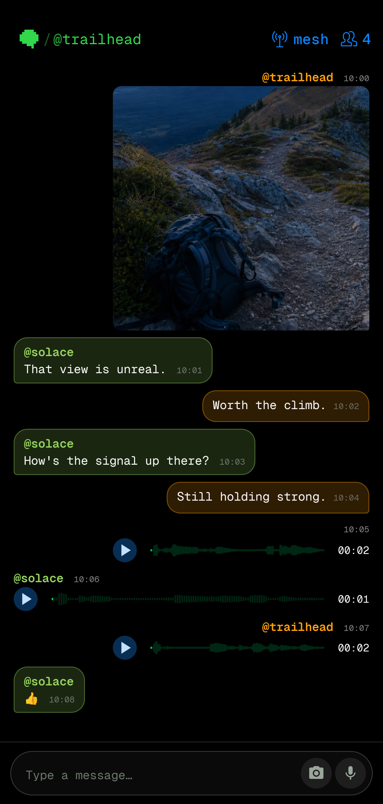
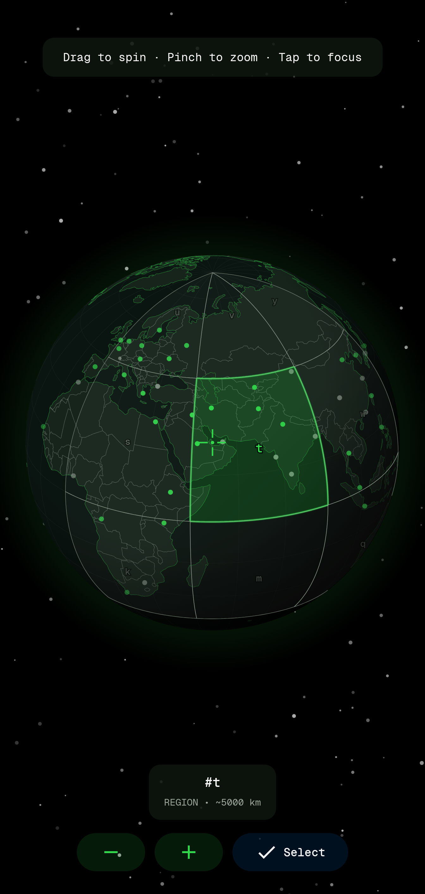
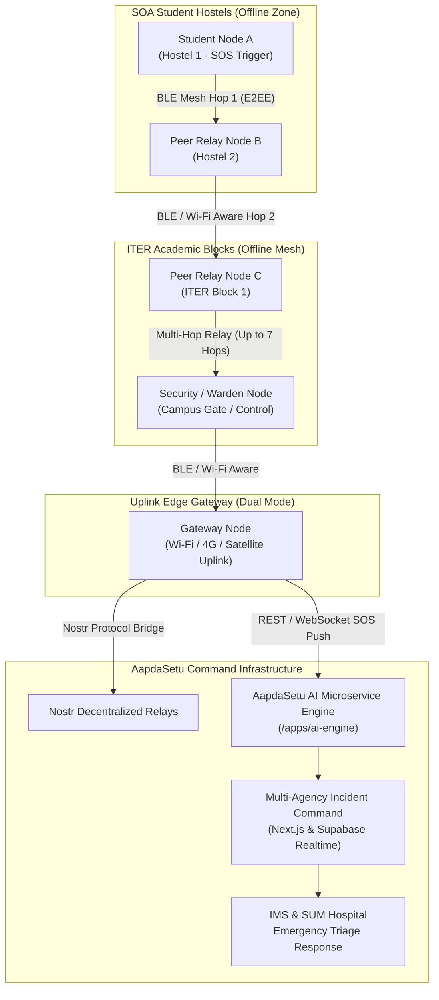

# SOA Mesh for Android

A decentralized peer-to-peer messaging application for Siksha 'O' Anusandhan (SOA) Campus featuring dual transport architecture: local Bluetooth Low Energy (BLE) and Wi-Fi Aware mesh networks for offline communication, and internet-based Nostr protocol for extended reach. Zero accounts, zero phone numbers, and zero central servers required.

This is the Android implementation of SOA Mesh, fully protocol-compatible with the iOS version for cross-platform campus mesh communication and integrated with the **AapdaSetu** Disaster Response Ecosystem.

---

## See it in action

<table>
  <tr>
    <th>Offline Mesh Conversation</th>
    <th>Geohash Location Picker</th>
  </tr>
  <tr>
    <td></td>
    <td></td>
  </tr>
</table>

---

## Overview and Campus Context

During severe emergencies (cyclones, monsoon flash floods, structural power failure) or severe cellular congestion across high-density educational environments like the **Siksha 'O' Anusandhan (SOA) Campus** (including ITER academic blocks, student hostels, research facilities, and IMS & SUM Hospital), public cellular networks often become unusable.

**SOA Mesh** provides an autonomous communication layer directly between smartphones. Devices automatically discover each other over Bluetooth Low Energy (BLE) and Wi-Fi Aware, creating a resilient local mesh that forwards messages across hops without internet connectivity or cell towers.

When network connectivity or satellite uplinks become available on any device in the mesh, that device acts as a gateway, bridging messages via the **Nostr protocol** and streaming emergency alerts directly to the **AapdaSetu Incident Command Center**.

---

## Key Features

- **Dual Transport Architecture**: Bluetooth LE mesh and Wi-Fi Aware for offline local communication; Nostr protocol over internet for global fallback.
- **Decentralized Multi-Hop Mesh**: Automatic peer discovery and multi-hop message relay over Bluetooth LE (up to 7 hops).
- **End-to-End Encryption**: Noise Protocol Framework (XX pattern, X25519 + ChaCha20-Poly1305 + BLAKE2s) for all direct private messages over the mesh with forward secrecy.
- **SOA Campus Channels**: Topic-based group messaging for campus departments and emergency teams (`#soa-emergency`, `#iter-campus`, `#hostel-alerts`, `#sum-hospital-triage`, `#volunteer-rescue`).
- **Channel Security**: Topic channels support optional password protection using Argon2id key derivation and AES-256-GCM authenticated encryption.
- **Location-Based Geohash Channels**: Geographic chat rooms using geohash coordinates over Nostr relays when internet is accessible.
- **Intelligent Message Routing**: Automatically selects the optimal transport with message queuing and background retry when peers are unreachable.
- **Zero-Authentication Policy**: No phone numbers, email addresses, or registrations required. Immediate access during emergencies.
- **Emergency Panic Wipe**: Triple-tap gesture to instantly purge all cryptographic keys, cached channel messages, and local data from device storage.
- **Offline APK Sharing (Hotspot Mode)**: Built-in local Wi-Fi hotspot server allowing peers to download and install the application directly without Google Play or internet access.
- **Tor Network Integration**: Built-in Rust-based Arti Tor client for private, metadata-resistant Nostr relay connections.
- **Wear OS Support**: Companion Wear OS module (`:wear`) for delivering vibration alerts and notifications to smartwatches.
- **Cross-Platform Compatibility**: Full binary protocol compatibility with SOA Mesh on iOS and macOS.

---

## Campus Architecture and Emergency Flow



---

## Technical Stack and Architecture

### Offline Bluetooth Mesh
- Direct peer-to-peer discovery within Bluetooth range and multi-hop relay through nearby devices.
- Noise Protocol sessions with forward secrecy; peer identities derived from cryptographic static keys.
- Compact binary packet format with fragmentation reassembly, TTL routing, and deduplication buffers.
- Adaptive duty cycling and connection pooling for battery efficiency.
- Persistent `MeshForegroundService` maintains mesh operation within Android background execution limits.

### Internet Nostr Transport
- Global reach via decentralized Nostr relays and geohash-based location channels.
- Private message fallback to Nostr for mutual contacts when out of direct radio range.
- Ephemeral keys generated per geohash area.

### Android Application Stack
- **Language and UI**: Kotlin, Jetpack Compose, Material 3, MVVM Architecture.
- **Concurrency**: Coroutines and Kotlin Flow for reactive networking and state synchronization.
- **Core Components**:
  - `MeshForegroundService`: Persistent foreground connectivity.
  - `BluetoothMeshService`: BLE GATT client and server transport.
  - `WifiAwareMeshService`: High-throughput Wi-Fi Aware transport.
  - `UnifiedMeshService`: Dynamic transport arbitration.
  - `NoiseSessionManager`: Cryptographic handshakes and session state.
  - `MessageRouter`: Message queuing, outbox retry, and routing logic.
  - `HotspotActivity`: Offline local APK distribution server.

---

## Building and Installation

### Prerequisites
- Android Studio (Koala, Ladybug, or newer)
- Android SDK (API 26+ / Android 8.0 Oreo or higher)
- JDK 17 or JDK 21 LTS

### 1. Build Debug APK

```bash
cd bitchat-android
./gradlew assembleDebug
```

The compiled APK will be located at:
```
app/build/outputs/apk/debug/app-debug.apk
```

### 2. Install on Connected Device

```bash
adb install -r app/build/outputs/apk/debug/app-debug.apk
```

### 3. Permissions
The application requests the following standard runtime permissions:
- **Bluetooth / Nearby Devices**: Required for BLE mesh advertising, scanning, and GATT connections.
- **Location**: Required by Android OS for BLE scanning and geohash channel resolution.
- **Notifications**: Required to keep the foreground mesh service persistent.
- **Battery Optimization Exemption**: Recommended to ensure background mesh relaying is not interrupted by Android Doze.

---

## Testing

```bash
# Run unit tests
./gradlew test

# Run code analysis and linting
./gradlew lint

# Run instrumented tests on connected device or emulator
./gradlew connectedAndroidTest
```

---

## Integration with AapdaSetu Ecosystem

| Component | Function | Path |
| :--- | :--- | :--- |
| **SOA Mesh (Android)** | Offline BLE and Wi-Fi Aware peer-to-peer messaging | [`bitchat-android/`](file:///home/mrinall-samal/Project-v2/SIH/bitchat-android) |
| **SOA Mesh (iOS / macOS)** | Native Swift peer-to-peer Apple client | [`bitchat/`](file:///home/mrinall-samal/Project-v2/SIH/bitchat) |
| **AapdaSetu Web Client** | Citizen portal, 1-Tap SOS, GIS navigation | [`frontend-AapdaSetu/`](file:///home/mrinall-samal/Project-v2/SIH/frontend-AapdaSetu) |
| **AapdaSetu AI Engine** | Priority triage, PFA chatbot, SAR flood mapping | [`apps/ai-engine/`](file:///home/mrinall-samal/Project-v2/SIH/apps/ai-engine) |
| **Command Center** | Multi-agency incident dispatch & real-time monitoring | [`SOS-project with bolt/`](file:///home/mrinall-samal/Project-v2/SIH) |

---

## License

This project is released into the public domain under the terms in [`LICENSE.md`](LICENSE.md).
