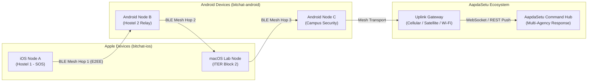

# SOA Mesh for iOS and macOS

A decentralized peer-to-peer messaging application for iOS and macOS featuring dual transport architecture: local Bluetooth Low Energy (BLE) mesh networks for offline communication, and internet-based Nostr protocol for global reach. Zero accounts, zero phone numbers, and zero central servers required.

This is the native Apple platform client of the **SOA Mesh** ecosystem, fully protocol-compatible with the Android version for cross-platform campus mesh communication and integrated with the **AapdaSetu** Disaster Response Ecosystem.

---

## Overview and Campus Context

During catastrophic natural events (cyclones, monsoon flash floods, structural collapse) or sudden power grid blackouts across high-density university campuses like **Siksha 'O' Anusandhan (SOA) / ITER**, standard cellular networks and campus Wi-Fi infrastructure frequently fail due to physical damage or overload.

**SOA Mesh for iOS and macOS (`bitchat`)** is a resilient, native Apple client designed to establish autonomous, off-grid peer-to-peer (P2P) communication. It operates seamlessly over Bluetooth Low Energy (BLE) without cellular networks, internet connections, or centralized account servers.

The application is binary-protocol compatible with **SOA Mesh for Android (`bitchat-android`)**, enabling iPhone, iPad, Mac, and Android users across SOA campus hostels, classrooms, and medical facilities to form a unified multi-hop mesh network.

---

## Cross-Platform Mesh Interoperability



---

## Key Features

- **Multi-Hop Bluetooth LE Mesh Network**: Direct device-to-device packet forwarding up to 7 hops across nearby iOS, macOS, and Android devices with dynamic TTL routing and packet deduplication.
- **End-to-End Cryptography**: Direct 1-on-1 messages are encrypted using the Noise Protocol Framework (Noise_XX_25519_ChaChaPoly_BLAKE2s) with cryptographic forward secrecy.
- **SOA Campus Topic Channels**: Pre-configured channels for campus safety and operations (`#soa-emergency`, `#iter-campus`, `#hostel-alerts`, `#sum-hospital-triage`, `#volunteer-rescue`).
- **Channel Encryption**: Optional topic channel password protection using Argon2id key derivation and AES-256-GCM encryption.
- **Geohash Location Channels**: Spatial geohash chat rooms over Nostr relays when internet access is available.
- **Zero User-Side Authentication**: No registration, phone numbers, email addresses, or cloud logins required. Immediate access during emergencies.
- **Emergency Panic Wipe**: Rapid triple-tap gesture instantly clears all cryptographic keys, cached channel messages, peer history, and local preferences.
- **Native Share Extension**: Integrated iOS Share Extension (`bitchatShareExtension`) allowing users to broadcast emergency text, coordinates, or media directly through the mesh network from any app.
- **Performance Optimizations**: Native LZ4 message compression and adaptive duty cycling to conserve battery power.
- **Universal Apple Support**: Native Swift and SwiftUI implementation supporting iOS 16+ and macOS 13+.

---

## Technical Stack and Architecture

```
bitchat/
├── App/
│   ├── BitchatApp.swift               # Application entry point & lifecycle
│   └── AppEnvironment.swift           # Dependency injection container
├── Features/
│   ├── Chat/                          # SwiftUI chat stream views and view models
│   ├── Channels/                      # Campus channel selector & password modals
│   ├── Peers/                         # Nearby peer roster & connection states
│   └── Settings/                      # Panic wipe, identity keys, & relay settings
├── Identity/                          # Key generation, storage & fingerprinting
├── Noise/                             # Noise Protocol XX handshake & cipher state
├── Nostr/                             # Nostr relay WebSocket client & geohash parser
├── Services/
│   ├── BLEService.swift               # CoreBluetooth peripheral/central manager
│   ├── PacketRouter.swift             # Multi-hop TTL, deduplication, & fragmentation
│   └── MessageRouter.swift            # Intelligent transport selection (BLE / Nostr)
├── bitchatShareExtension/             # iOS Share Extension module
└── bitchatTests/                      # SwiftPM & XCTest unit test suites
```

---

## Setup and Building

### Option 1: Using Xcode

1. Open the project in Xcode:
   ```bash
   cd bitchat
   open bitchat.xcodeproj
   ```

2. For signed physical device builds, set up your local configuration:
   ```bash
   cp Configs/Local.xcconfig.example Configs/Local.xcconfig
   ```
   Update `Configs/Local.xcconfig` with your Apple Developer Team ID.

3. Select your target device (`iOS` or `macOS`) and scheme, then press **Run (Cmd+R)**.

### Option 2: Command Line Builds with `xcodebuild`

```bash
# macOS Debug build (unsigned)
xcodebuild -project bitchat.xcodeproj -scheme "bitchat (macOS)" \
  -configuration Debug CODE_SIGNING_ALLOWED=NO build

# iOS Simulator Build
xcodebuild -project bitchat.xcodeproj -scheme "bitchat (iOS)" \
  -sdk iphonesimulator \
  -destination 'platform=iOS Simulator,name=iPhone 16' build
```

### Option 3: Using `just`

```bash
# Install just task runner (if not already installed)
brew install just

# Check and run macOS build
just check
just run

# Run test suites
just test
just test-ios
```

---

## Testing and Verification

```bash
# Run SwiftPM Unit Tests (Crypto handshakes, packet encoding, routing logic)
swift test

# Run iOS Simulator Test Suite via xcodebuild
xcodebuild -project bitchat.xcodeproj -scheme "bitchat (iOS)" \
  -sdk iphonesimulator \
  -destination 'platform=iOS Simulator,name=iPhone 16' test
```

---

## Integration with AapdaSetu Ecosystem

| Component | Function | Path |
| :--- | :--- | :--- |
| **SOA Mesh (iOS / macOS)** | Native Swift peer-to-peer Apple client | [`bitchat/`](file:///home/mrinall-samal/Project-v2/SIH/bitchat) |
| **SOA Mesh (Android)** | Offline BLE and Wi-Fi Aware peer-to-peer messaging | [`bitchat-android/`](file:///home/mrinall-samal/Project-v2/SIH/bitchat-android) |
| **AapdaSetu Web Client** | Citizen portal, 1-Tap SOS, GIS navigation | [`frontend-AapdaSetu/`](file:///home/mrinall-samal/Project-v2/SIH/frontend-AapdaSetu) |
| **AapdaSetu AI Engine** | Priority triage, PFA chatbot, SAR flood mapping | [`apps/ai-engine/`](file:///home/mrinall-samal/Project-v2/SIH/apps/ai-engine) |
| **Command Center** | Multi-agency incident dispatch & real-time monitoring | [`SOS-project with bolt/`](file:///home/mrinall-samal/Project-v2/SIH) |

---

## License

This project is released into the public domain under the terms in [`LICENSE`](LICENSE).
