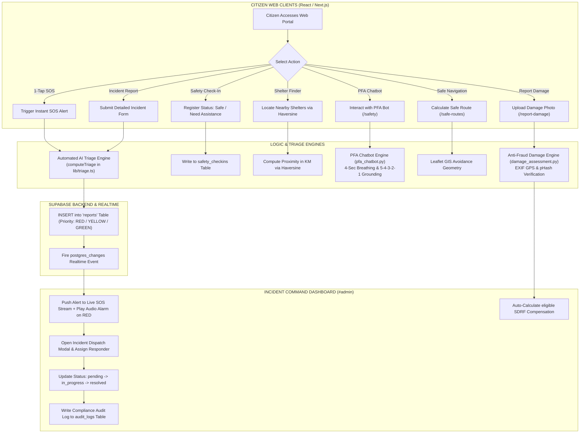
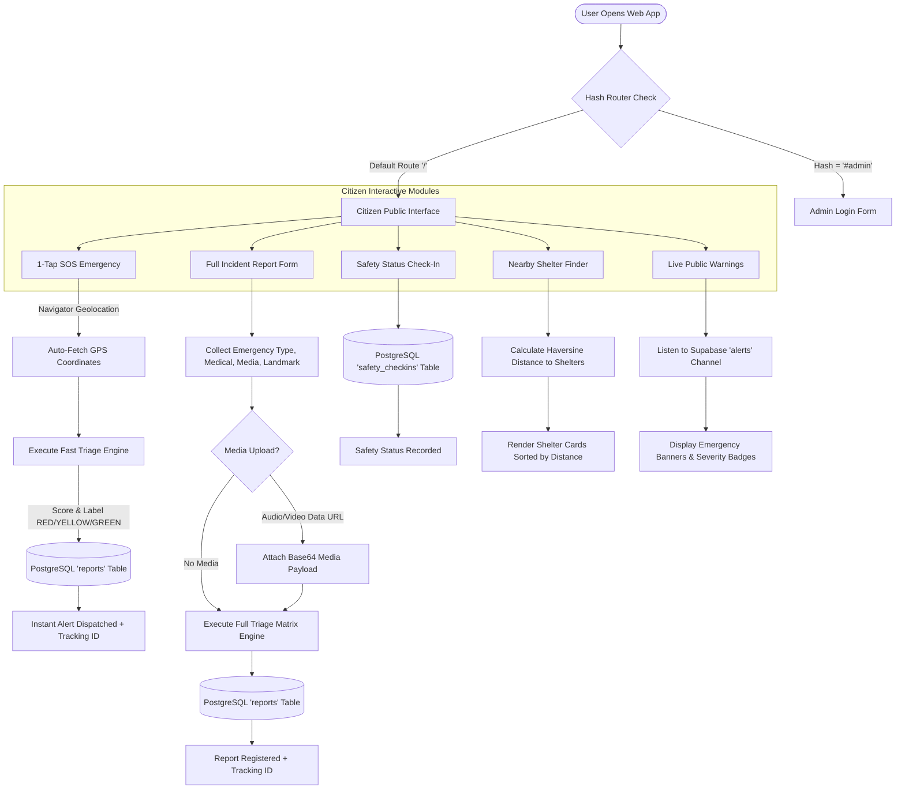
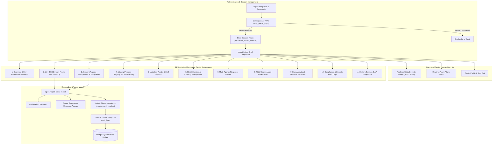
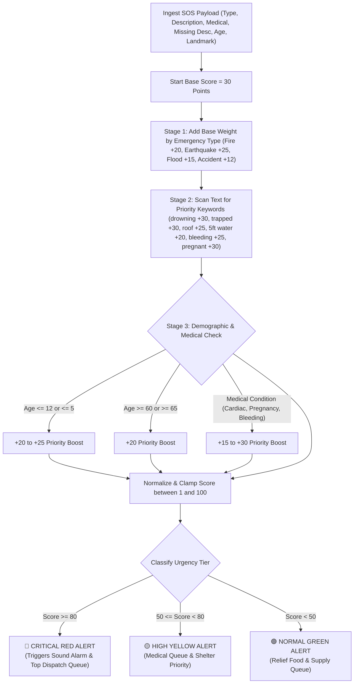
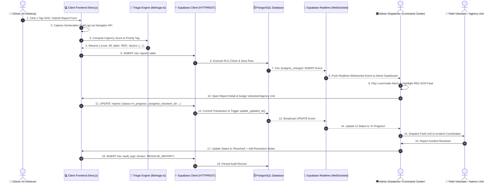
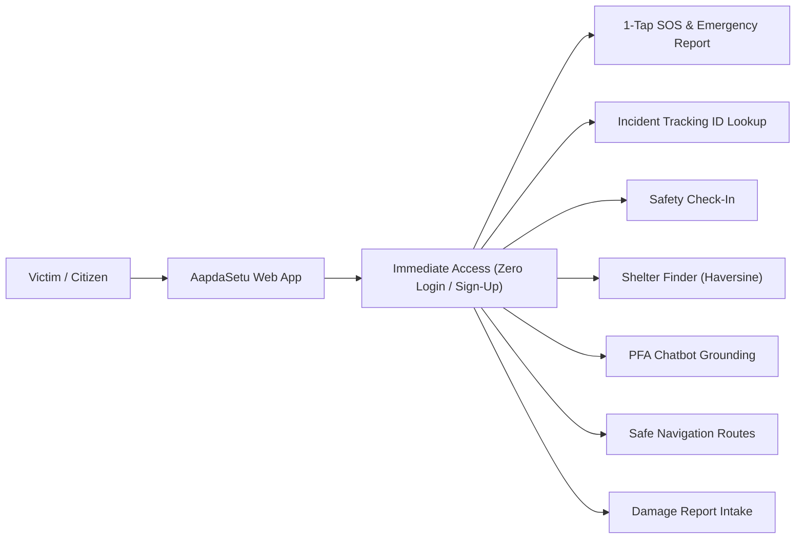

# 🔄 AapdaSetu System Flow and Architecture Diagrams

This document details the operational flows, client navigation routes, AI microservice pipelines, real-time WebSocket synchronization mechanics, and command center workflows across the AapdaSetu platform.

---

## 1. Global End-to-End Multi-Stack System Workflow

---

## 2. Citizen User Flow & Multi-Modal Routing

---

## 3. Admin Command Center Architecture & Modular Subsystems

---

## 4. AI Triage & Priority Scoring Flow (`triage.ts` & `triage.py`)

---

## 5. Supabase Real-Time Event Synchronization & Responding Sequence

---

## 6. Zero User-Side Authentication Access Flow

---

## 7. Python AI Engine Microservice Workflows (`apps/ai-engine`)

```mermaid
flowchart TD
    subgraph DamageAssessment["1. Anti-Fraud Damage Assessment (damage_assessment.py)"]
        PhotoInput["Photo Payload + Reported GPS"] --> EXIFCheck["Extract EXIF Geotag Metadata"]
        EXIFCheck --> DistanceCalc["Compute Distance Delta vs Reported Location"]
        PhotoInput --> pHashCalc["Compute Perceptual Hash (pHash SHA-256)"]
        pHashCalc --> DuplicateCheck{"pHash Match in Claim DB?"}
        DuplicateCheck -- "Yes" --> FlagDuplicate["Flag as Duplicate Fraud Claim"]
        DuplicateCheck -- "No" --> GradeDamage["Grade Damage (FULLY_DESTROYED, MAJOR, MINOR)"]
        GradeDamage --> Compensation["Auto-Calculate SDRF Compensation Amount"]
    end

    subgraph PFAEngine["2. Psychological First Aid Bot (pfa_chatbot.py)"]
        UserMsg["User Distress Message"] --> IntentCheck{"Identify Intent"}
        IntentCheck -- "Panic / Hyperventilation" --> Breathing["Guide 4-Second Box Breathing Protocol"]
        IntentCheck -- "Disorientation" --> Grounding["Guide 5-4-3-2-1 Sensory Grounding Technique"]
        IntentCheck -- "General Distress" --> Empathetic["Provide Empathetic Reassurance & Helpline Info"]
    end

    subgraph SARFloodMapping["3. SAR Satellite Flood Mapping (satellite_flood_mapping.py)"]
        SARMetadata["Sentinel-1 SAR Radar Metadata"] --> Thresholding["Apply Backscatter Thresholding"]
        Thresholding --> PolygonGen["Generate Water Extent GeoJSON Polygons"]
        PolygonGen --> PushGIS["Export GeoJSON to Leaflet Map Layer"]
    end
```

