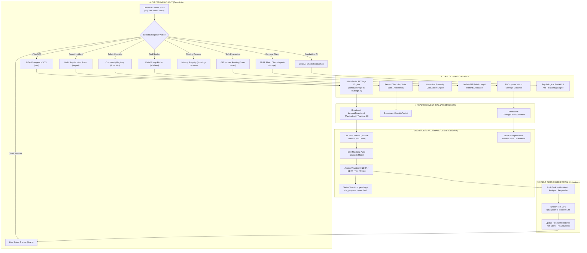
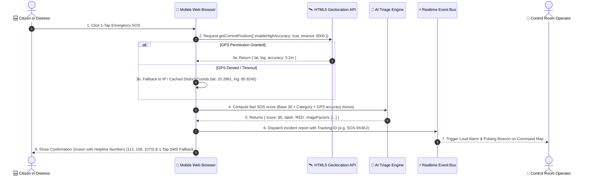
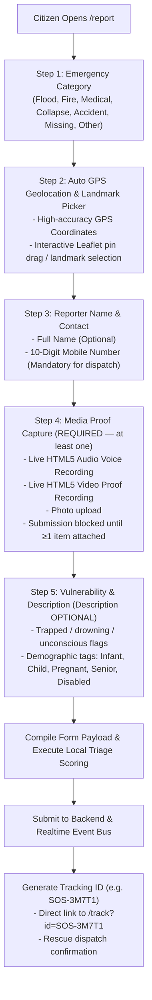
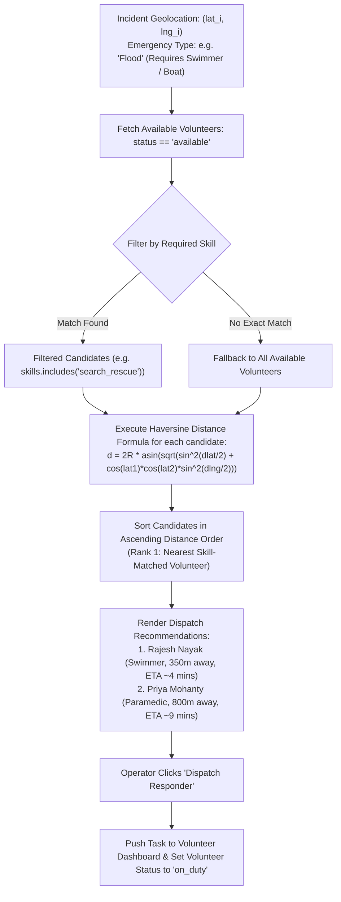
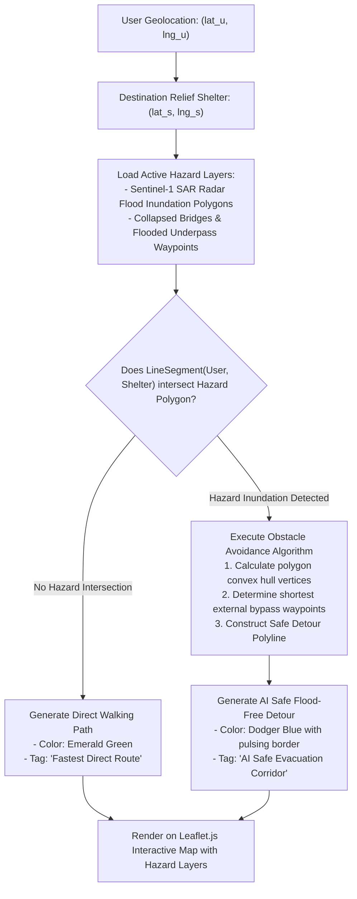
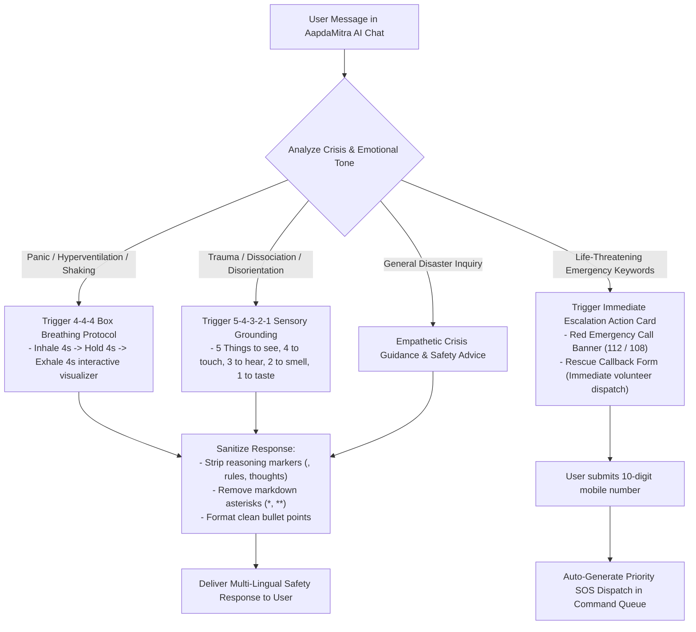
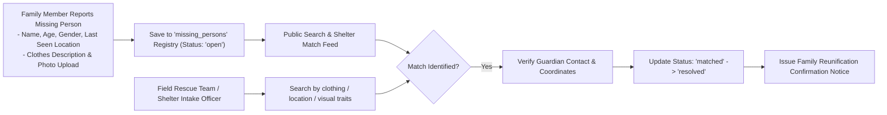
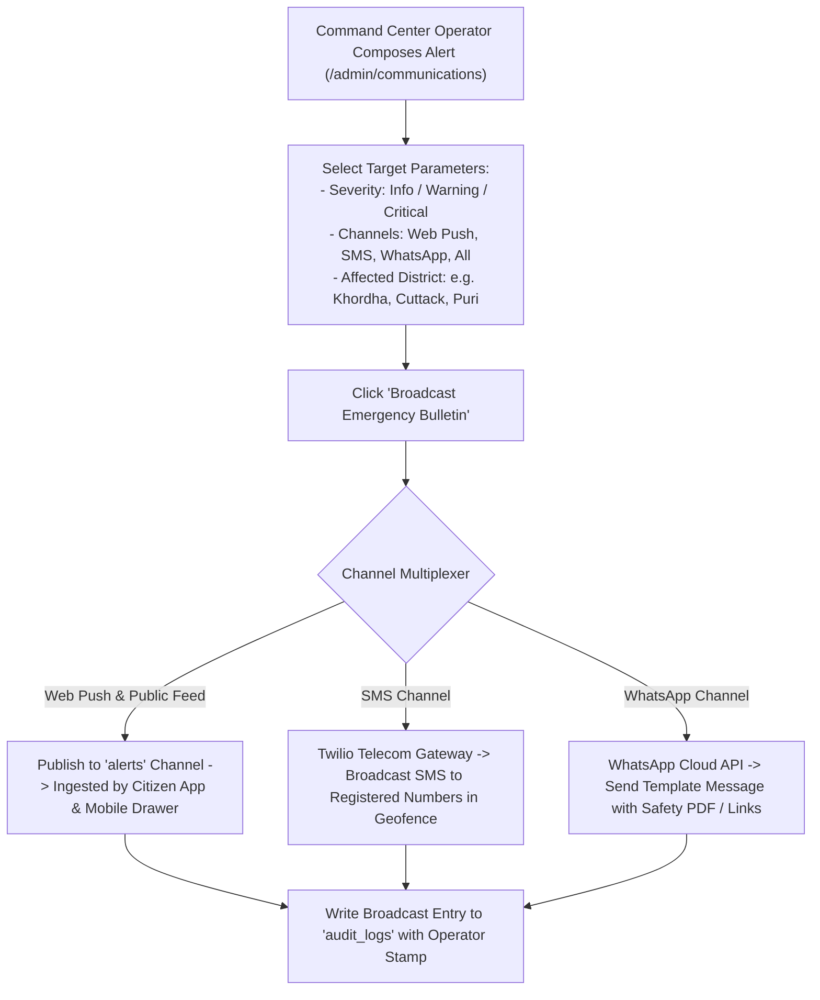
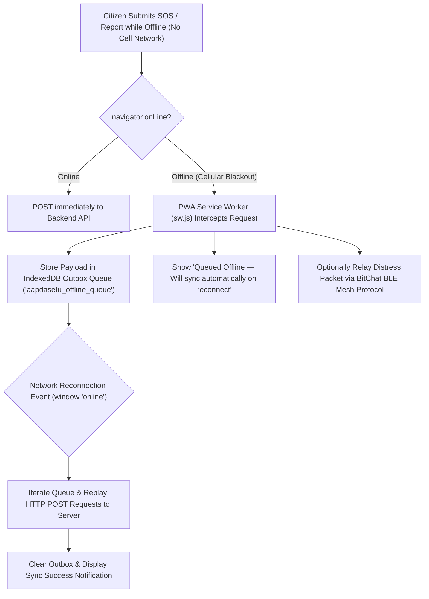

# 🔄 AapdaSetu — Comprehensive System Flow & Architecture Workflows

> **Exhaustive operational workflows, sequence diagrams, AI decision trees, real-time event streaming flows, and multi-agency command processes across the AapdaSetu platform.**

---

## 📑 Table of Contents
1. [Global End-to-End Multi-Stack System Workflow](#1-global-end-to-end-multi-stack-system-workflow)
2. [Citizen 1-Tap SOS & Geolocation Ingestion Flow](#2-citizen-1-tap-sos--geolocation-ingestion-flow)
3. [Multi-Step Intelligent Incident Reporting Flow](#3-multi-step-intelligent-incident-reporting-flow)
4. [AI Multi-Factor Urgency Triage & Scoring Decision Tree](#4-ai-multi-factor-urgency-triage--scoring-decision-tree)
5. [Command Center Real-Time Event Bus & Audio Alarm Pipeline](#5-command-center-real-time-event-bus--audio-alarm-pipeline)
6. [Rescuer Skill-Matching, Distance Calculation & Dispatch Flow](#6-rescuer-skill-matching-distance-calculation--dispatch-flow)
7. [Disaster-Aware GIS Pathfinding & Flood Hazard Avoidance](#7-disaster-aware-gis-pathfinding--flood-hazard-avoidance)
8. [Computer Vision Damage Assessment & SDRF Anti-Fraud Claim Flow](#8-computer-vision-damage-assessment--sdrf-anti-fraud-claim-flow)
9. [AapdaMitra AI Psychological First Aid & Emergency Escalation](#9-aapdamitra-ai-psychological-first-aid--emergency-escalation)
10. [Missing Persons Registry & AI Match Workflow](#10-missing-persons-registry--ai-match-workflow)
11. [Multi-Channel Emergency Alert Broadcast Pipeline](#11-multi-channel-emergency-alert-broadcast-pipeline)
12. [Offline PWA Service Worker & BLE Mesh Synchronization Flow](#12-offline-pwa-service-worker--ble-mesh-synchronization-flow)

---

## 1. Global End-to-End Multi-Stack System Workflow



---

## 2. Citizen 1-Tap SOS & Geolocation Ingestion Flow



---

## 3. Multi-Step Intelligent Incident Reporting Flow



---

## 4. AI Multi-Factor Urgency Triage & Scoring Decision Tree

```mermaid
flowchart TD
    Payload["Raw Incident Payload"] --> Init["Set Base Score: S = 30"]

    Init --> CatCheck{"Emergency Category Weight (W_cat)"}
    CatCheck -->|Earthquake / Collapse| W1["+25 pts"]
    CatCheck -->|Fire / Explosion| W2["+20 pts"]
    CatCheck -->|Flood / Water Rising| W3["+18 pts"]
    CatCheck -->|Critical Medical / Cardiac| W4["+18 pts"]
    CatCheck -->|Missing Person Search| W5["+15 pts"]
    CatCheck -->|Transit / Road Accident| W6["+12 pts"]
    CatCheck -->|Other / General| W7["+5 pts"]

    W1 & W2 & W3 & W4 & W5 & W6 & W7 --> NLPCheck{"Multi-Lingual Keyword Scanner (W_nlp)"}

    subgraph KeywordScorer["Multi-Lingual Keyword Weight Matrix"]
        K1["'drowning', 'trapped', 'pregnant', 'submerged', 'ଛାତ ଉପରେ', 'ଫସି ରହିଛି', 'डूब रहे हैं'"] -->|+30 pts each (Max +40)| SumK
        K2["'severe bleeding', 'infant', 'cardiac', 'explosion', 'heart attack', 'ରକ୍ତସ୍ରାବ'"] -->|+25 pts each| SumK
        K3["'water 5ft', 'unconscious', 'child', 'snakebite', 'electrocution', 'ବିଦ୍ୟୁତ'"] -->|+20 pts each| SumK
        K4["'elderly', 'senior citizen', 'diabetic', 'asthma', 'no food/water', 'ବୟସ୍କ'"] -->|+15 pts each| SumK
    end

    NLPCheck --> KeywordScorer
    SumK --> DemoMultiplier{"Demographic Multipliers (W_demo)"}

    DemoMultiplier -->|Infant / Child <= 12 yrs| D1["+20 to +25 pts"]
    DemoMultiplier -->|Senior Citizen >= 60 yrs| D2["+20 pts"]
    DemoMultiplier -->|Pregnancy / Cardiac / Bleeding| D3["+20 to +30 pts"]

    D1 & D2 & D3 & DemoMultiplier --> Clamp["Calculate Total Score:\nScore = Math.max(1, Math.min(100, S + W_cat + W_nlp + W_demo))"]

    Clamp --> PrioritySplit{"Score Range"}
    PrioritySplit -->|80 <= Score <= 100| RED["🔴 RED / CRITICAL ALERT\n- Command Center Siren Active\n- Immediate Boat / Heli / Ambulance Dispatch"]
    PrioritySplit -->|50 <= Score < 80| YELLOW["🟡 YELLOW / URGENT\n- High Priority Dispatch Queue\n- Field Volunteer Mobilization"]
    PrioritySplit -->|Score < 50| GREEN["🟢 GREEN / ADVISORY\n- Standard Queue\n- Scheduled Relief Supply Distribution"]
```

---

## 5. Command Center Real-Time Event Bus & Audio Alarm Pipeline

```mermaid
flowchart TD
    EventSource["Incident Event Ingested (Realtime Event Bus)"] --> PriorityCheck{"Incident Priority Label"}

    PriorityCheck -->|Priority == 'RED' (Score >= 80)| CriticalBranch["Critical Event Pipeline"]
    PriorityCheck -->|Priority == 'YELLOW' or 'GREEN'| StandardBranch["Standard Event Pipeline"]

    CriticalBranch --> AudioAlarm["Trigger Web Audio Context Alarm\n- Synthesized 880Hz / 440Hz dual-frequency alert siren\n- Browser notification trigger"]
    CriticalBranch --> VisualPulse["Flash Pulsing Red Banner & Pin on Leaflet Map"]
    CriticalBranch --> AutoQueue["Pre-select Top 3 Nearest Skill-Matched Volunteers"]

    StandardBranch --> UpdateCounters["Increment Active Incident Counter"]
    StandardBranch --> AddToFeed["Add Entry to Live Incident Table"]

    AudioAlarm & VisualPulse & AutoQueue --> OperatorAction{"Operator Action"}
    OperatorAction -->|Assign Volunteer| AssignAction["Update assigned_volunteer_id -> Broadcast Update"]
    OperatorAction -->|Re-route / Triage Adjust| ReTriage["Manually Adjust Priority Score"]
    OperatorAction -->|Mark Resolved| ResolveAction["Set status: resolved -> Log to Audit Trail"]
```

---

## 6. Rescuer Skill-Matching, Distance Calculation & Dispatch Flow



---

## 7. Disaster-Aware GIS Pathfinding & Flood Hazard Avoidance



---

## 8. Computer Vision Damage Assessment & SDRF Anti-Fraud Claim Flow

```mermaid
flowchart TD
    CitizenUpload["Citizen Uploads Damaged House/Building Photo (/report-damage)"] --> ClientHash["Compute 64-bit Perceptual Hash (pHash) & EXIF Geotag"]
    
    ClientHash --> DuplicateCheck{"pHash Hamming Distance < 5 against DB?"}
    
    DuplicateCheck -- "Yes (Duplicate / Stolen Photo)" --> FraudFlag["Flag as Duplicate Claim\n- Mark claim status: 'FLAGGED_DUPLICATE'\n- Notify Command Center Fraud Audit Queue"]
    
    DuplicateCheck -- "No (Unique Proof)" --> VisionML["Execute Computer Vision Damage Classifier"]

    VisionML --> GradeModel{"Model Classification Output"}
    GradeModel -->|Total Structural Destruction (Score > 0.85)| G1["Grade 1: Total Collapse\nEligible Grant: ₹1,20,000"]
    GradeModel -->|Severe Wall/Roof Cracking (Score 0.50 - 0.85)| G2["Grade 2: Severe Structural Damage\nEligible Grant: ₹65,000"]
    GradeModel -->|Minor Inundation / Superficial (Score < 0.50)| G3["Grade 3: Partial / Minor Damage\nEligible Grant: ₹25,000"]

    G1 & G2 & G3 --> ClaimReport["Generate SDRF Disaster Relief Claim Dossier\n- Unique Claim ID (e.g. SDRF-2026-8891)\n- Direct Bank Transfer (DBT) verification form"]

    ClaimReport --> AdminQueue["Command Center SDRF Disbursement Review"]
```

---

## 9. AapdaMitra AI Psychological First Aid & Emergency Escalation



---

## 10. Missing Persons Registry & AI Match Workflow



---

## 11. Multi-Channel Emergency Alert Broadcast Pipeline



---

## 12. Offline PWA Service Worker & BLE Mesh Synchronization Flow


