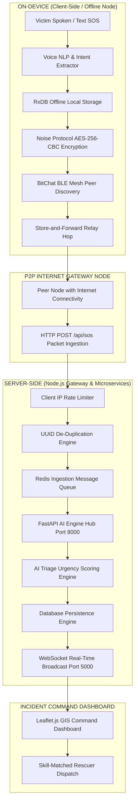
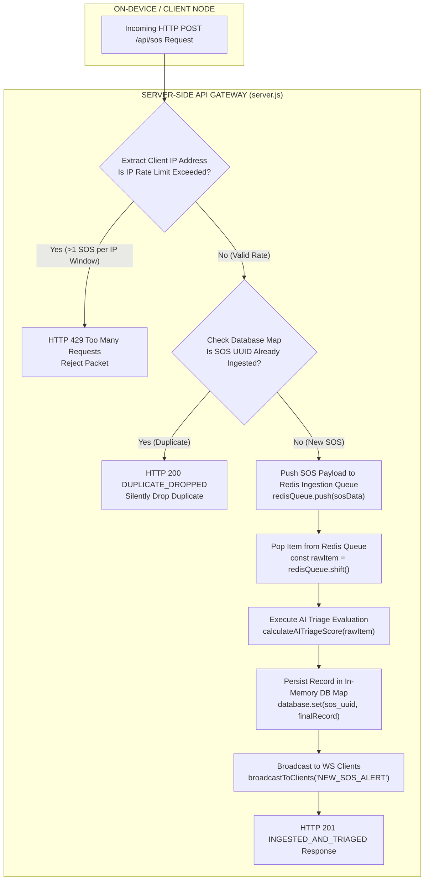
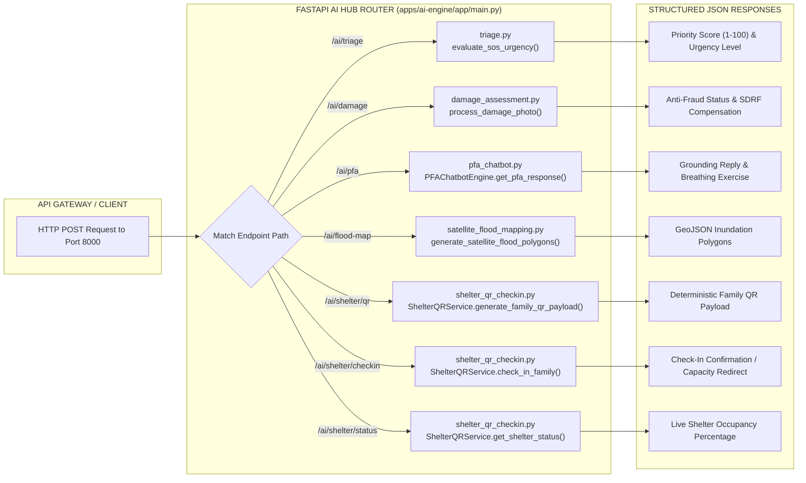
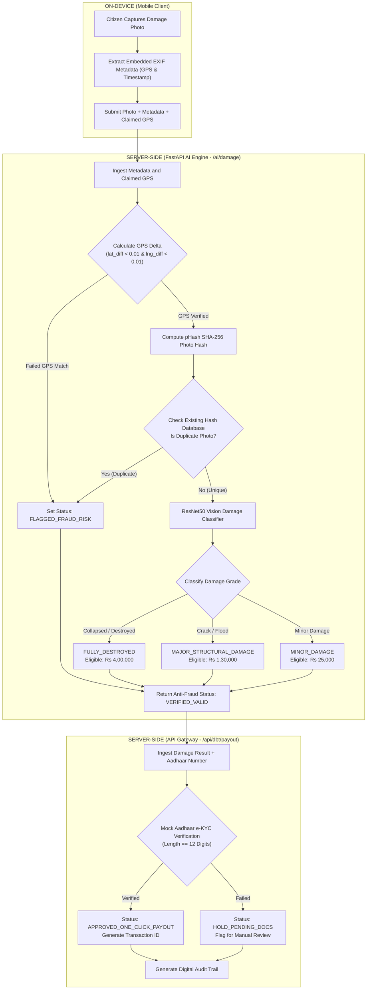
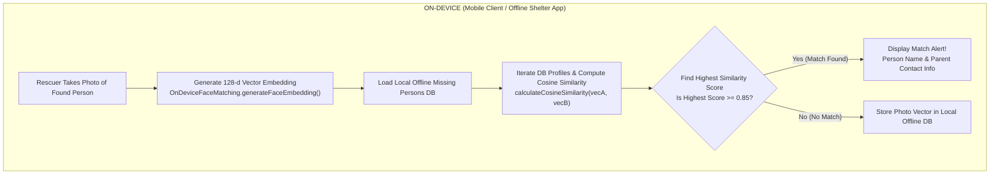
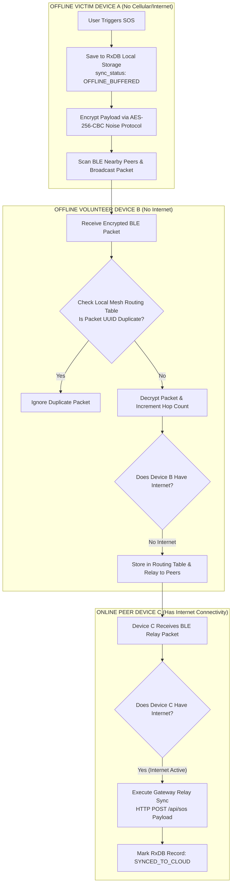
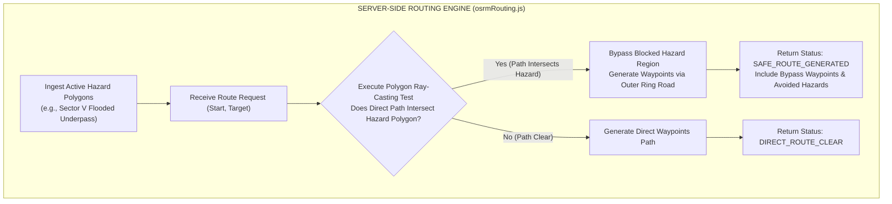
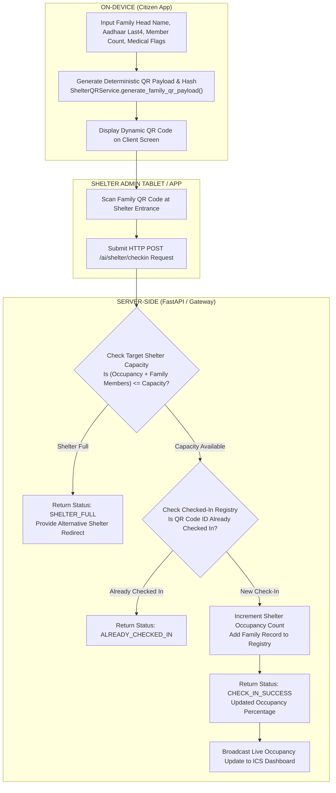

# AapdaSetu System Flow and Architecture Diagrams

This document details the operational flows, microservice interactions, data pipelines, and network routing mechanisms of the AapdaSetu platform. All diagrams use standard Mermaid notation and explicitly demarcate On-Device (Client-Side) execution versus Server-Side execution.

---

## 1. Global End-to-End System Workflow

The diagram below illustrates the end-to-end operational flow from an offline victim submitting an SOS packet to central command center dispatch.

---

## 2. One SOS Per IP Rate Limiting and Ingestion via Redis Queue

To prevent server overload and Denial of Service (DoS) floods during widespread panic, the API Gateway implements IP-based rate limiting, UUID de-duplication, and an asynchronous Redis message queue pipeline.

---

## 3. FastAPI AI Microservice Router and Endpoints

All artificial intelligence engines operate inside a single Python FastAPI hub on port 8000. Requests are routed based on endpoint paths:

---

## 4. AI Crowdsourced Damage Assessment and Direct Benefit Transfer (DBT) Flow

This workflow verifies damaged building photo claims, enforces anti-fraud checks, grades structural damage using AI vision logic, and routes valid claims to the automated monetary payout pipeline.

---

## 5. On-Device Missing Persons Facial Matching Flow

Facial recognition is executed entirely on-device to allow family matching in offline rescue shelters without cloud dependency.

---

## 6. Peer-to-Peer BLE Mesh Routing and Store-and-Forward Relay

When internet infrastructure fails, SOS packets travel hop-by-hop across nearby smartphones until an online peer is reached.

---

## 7. Disaster-Aware Dynamic Routing Flow (OSRM Polygon Avoidance)

The routing engine dynamically recalculates safe navigation routes around active flood zones or collapsed bridges.

---

## 8. Dynamic QR Code Shelter Check-In and Capacity Management Flow

This process manages family shelter registrations and occupancy tracking using offline-generated QR codes.

