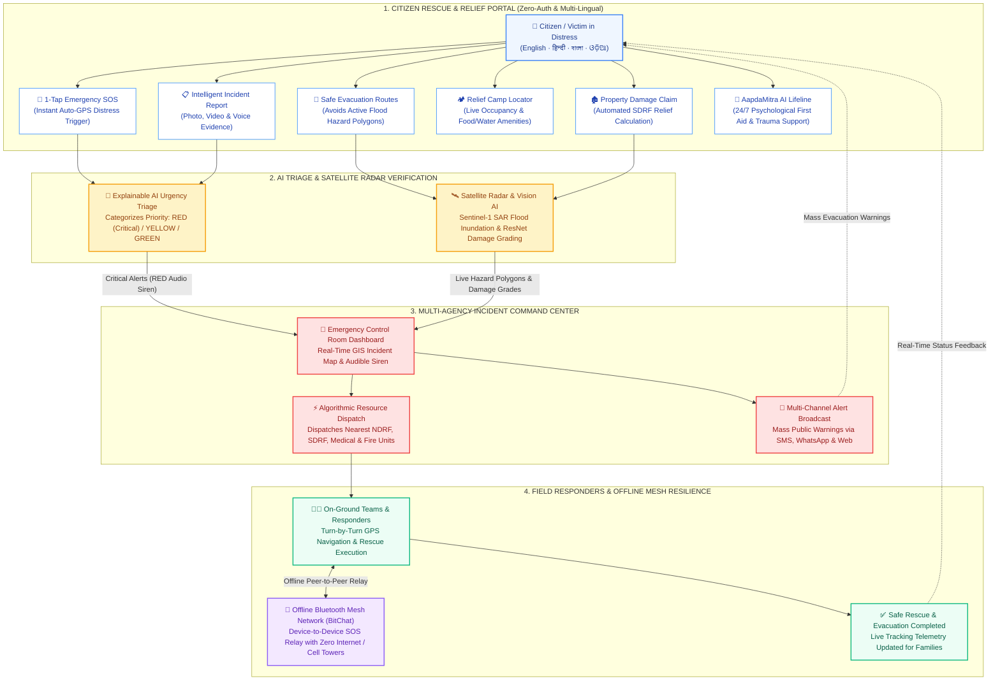

# AapdaSetu Frontend

Minimal, full-feature React (TypeScript + Vite + Tailwind) frontend covering every feature in
`projectrequirement.md`, `README.md`, and `tech.md` — **except** Low-Bandwidth WebRTC telemedicine.

**Stack:** React 19 · Vite 6 · TypeScript (strict) · Tailwind CSS 3 · React Router v6 (hash router) ·
Leaflet (safe-route maps) · Recharts (admin analytics) · custom i18n (EN / हिंदी / বাংলা / ଓଡ଼ିଆ)

## Quick start

```bash
npm install
cp .env.example .env.local   # fill in backend URLs (defaults already work)
npm run dev                  # http://localhost:5173  (admin: http://localhost:5173/#/admin)
```

The app runs out-of-the-box in **demo mode**: every API call falls back to in-memory mock data
(`src/api/mocks.ts`) when the backend is unreachable, and a yellow "demo data" pill appears.

---

## Features → routes

### Citizen (zero-login)
| Route | Feature |
| --- | --- |
| `/` | Landing + live public warnings |
| `/sos` | 1-Tap SOS (auto GPS → AI triage → report) |
| `/report` | Intelligent incident report form (7 types, media, triage) |
| `/track` | Incident tracking-ID lookup + status timeline |
| `/check-in` | Safety status check-ins (`safety_checkins`) |
| `/shelters` | Nearby shelter finder (Haversine distance + Leaflet) |
| `/alerts` | Live public warning alerts |
| `/pfa-chat` | Psychological First Aid chatbot |
| `/report-damage` | Crowdsourced anti-fraud damage assessment (SDRF calc) |
| `/missing-persons` | Missing persons & forensic registry |
| `/safe-routes` | Disaster-aware dynamic navigation (SAR flood polygons) |

### Admin Command Center (`/admin` — 11 views)
Overview & KPIs · Live SOS stream (RED audio alarm) · Incident reports & dispatch ·
Missing persons · Volunteers · Shelters · Agencies · Alert broadcaster (SMS/WhatsApp/Web) ·
Analytics (Recharts) · Audit logs · Settings & API integrations. Gated by `POST /api/admin/login`.

### Volunteer portal (`/volunteer`)
Dashboard · Assigned tasks · Check-in / availability.

---

## 🗺️ Website Flow & Disaster Operational Pipeline (PPT-Ready)



---

## Backend Services & API Integration

The frontend never knows whether a real backend exists. Two thin files define the contract;
every function falls back to mock data on failure.

### 1. Express REST backend — `src/api/endpoints.ts`
Build an Express server (suggested: `server/index.js`, port `4000`), then point `VITE_API_URL` at it.

| Method | Path | Function in endpoints.ts |
| --- | --- | --- |
| POST | `/api/reports` | `createReport` |
| GET | `/api/reports?status=&priority=&q=` | `listReports` |
| GET | `/api/reports/:id` | `getReport` |
| PATCH | `/api/reports/:id` | `updateReport` |
| GET | `/api/overview-kpis` | `getOverviewKPIs` |
| GET/POST | `/api/safety-checkins` | `listSafetyCheckins` / `createSafetyCheckin` |
| GET/PATCH | `/api/shelters` `/api/shelters/:id` | `listShelters` / `updateShelter` |
| GET/POST | `/api/alerts` | `listAlerts` / `createAlert` |
| GET/PATCH | `/api/volunteers` `/api/volunteers/:id` | `listVolunteers` / `updateVolunteer` |
| GET | `/api/agencies` | `listAgencies` |
| GET/POST | `/api/missing-persons` | `listMissingPersons` / `createMissingPerson` |
| PATCH | `/api/missing-persons/:id` | `updateMissingPerson` |
| GET | `/api/audit-logs` | `listAuditLogs` |
| POST | `/api/admin/login` | `adminLogin` (bcrypt compare → `{token,email,name}`) |
| POST | `/api/communications/broadcast` | `broadcastAlert` (Twilio SMS + WhatsApp Cloud API) |
| GET | `/api/analytics` | `getAnalytics` |

Response shapes must match `src/types.ts`. Each function has a JSDoc header with the exact
request/response contract.

### 2. FastAPI AI engine — `src/api/ai.ts`
The 4 scripts already exist in `apps/ai-engine/app/` but are standalone CLI scripts. Wrap them as
FastAPI routes and point `VITE_AI_URL` at `:8000`.

| Method | Path | Source module to wrap |
| --- | --- | --- |
| POST | `/ai/triage` | `triage.py` (`evaluate_sos_urgency`) |
| POST | `/ai/pfa-chat` | `pfa_chatbot.py` (`PFAChatbotEngine.get_pfa_response`) |
| POST | `/ai/damage-assessment` | `damage_assessment.py` (`process_damage_photo`) |
| POST | `/ai/satelliteflood-map` | `satellite_flood_mapping.py` (`generate_satellite_flood_polygons`) |

`/ai/triage` should mirror `src/lib/triage.ts` (the authoritative scoring matrix from
`projectrequirement.md` §2.1.4). `/ai/damage-assessment` is currently called with base64 JSON
(see the `@TODO BUILD (multipart)` comment in `ai.ts`).

### 3. Optional realtime (Supabase)
Realtime is implemented as polling (`src/hooks/useRealtime.ts`). To switch to `postgres_changes`
WebSockets, set `VITE_SUPABASE_URL` + `VITE_SUPABASE_ANON_KEY` and edit that one hook (instructions
inside).

---

## Credentials & where they are used

Everything is documented in **`.env.example`** (browser side) and the **admin Settings** view
(`src/pages/admin/Settings.tsx`, server side).

| Credential | Scope | Where used |
| --- | --- | --- |
| `VITE_API_URL` | browser | `src/api/client.ts` — every `/api/*` call |
| `VITE_AI_URL` | browser | `src/api/ai.ts` — `/ai/*` calls |
| `VITE_SUPABASE_URL` | browser (optional) | `src/hooks/useRealtime.ts` realtime swap |
| `VITE_SUPABASE_ANON_KEY` | browser (optional) | `useRealtime.ts` + admin RPC swap |
| `VITE_USE_MOCK_ONLY` | browser (optional) | forces mock data in `client.ts` / `ai.ts` |
| `VITE_MAP_TILE_URL` / `VITE_MAP_ATTRIBUTION` | browser (optional) | `src/components/map/LeafletMap.tsx` tile layer |
| Twilio Account SID + Auth Token | **server only** | `POST /api/communications/broadcast` (SMS channel) |
| WhatsApp Cloud API Token + Phone Number ID | **server only** | `POST /api/communications/broadcast` (WhatsApp) |
| `ADMIN_EMAIL` + `ADMIN_PASSWORD_BCRYPT_HASH` | **server only** | `POST /api/admin/login` (bcrypt compare) |

> Server-side credentials must never be placed in `VITE_*` vars — they would be bundled into the
> browser. Enter them in the Settings view for dev only; store them as env/secrets on the backend.

---

## 📚 Core References & Open-Source Foundations

AapdaSetu frontend and its companion modules are engineered using 4 primary open-source codebases, satellite systems, and humanitarian standards:

1. **BitChat Protocol & Apps (Permissionless Tech)**: [iOS Repo](https://github.com/permissionlesstech/bitchat) | [Android Repo](https://github.com/permissionlesstech/bitchat-android) | [Website](https://bitchat.free/) — Powers our offline P2P Bluetooth Low Energy (BLE) & Wi-Fi Aware disaster mesh (`bitchat-android/` and `bitchat/`).
2. **Project OSRM & OpenStreetMap (OSM)**: [OSRM Backend](https://github.com/Project-OSRM/osrm-backend) | [OSRM API](https://project-osrm.org/) | [OpenStreetMap](https://www.openstreetmap.org/) — High-performance road network routing avoiding active flood inundation zones (`src/lib/routing.ts` & `SafeRoutes.tsx`).
3. **ESA Copernicus Sentinel-1 SAR & UN-SPIDER**: [Copernicus Portal](https://dataspace.copernicus.eu/) | [UN-SPIDER Flood Guide](https://www.un-spider.org/advisory-support/recommended-practices/recommended-practice-flood-mapping) — All-weather, day-and-night radar satellite flood inundation mapping generating live GeoJSON hazard polygons.
4. **Hugging Face ResNet-50 Damage Classifier & NDMA/SDRF Norms / WHO PFA**: [HF Model](https://huggingface.co/Divyanshu-Kumar19/aapdasetu-damage-assessment) | [NDMA Portal](https://ndma.gov.in/) | [WHO PFA Guidelines](https://www.who.int/publications/i/item/9789241548205) — Deep CNN structural damage classification, Government of India SDRF disaster relief compensation calculation, and WHO Psychological First Aid crisis stabilization.

